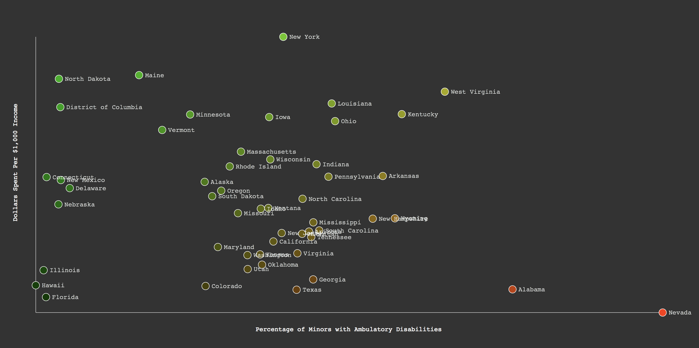

### Scatter Plot

Let's add a new dimension! 


Isn't [Mr. Div](http://mrdiv.tumblr.com/page/2) amazing?

We can add another dimension to the line plot, and more importantly, use an accessor function to eliminate our dependence on the clunky `for` loop we've used so far.

-----

Let's introduce another identically structured dataset on [monies spent by each state on disability-related issues collated by the University of Colorado](http://stateofthestates.org/index.php/view-state-profiles) anchored to gross income dollars. Though this particular dataset is not apples-to-apples with the ACS query — it includes cognitive and intellectural developmental disabilities as well as physical — studies have shown that [public expenditures track comparably](http://stateofthestates.org/images/cdevfin-disability-market.pdf).

-----



The full code is below. Accessor functions are used to define several reusable scales. Lines are drawn for axes and labeled with `<text>` svg tags. All this has already been covered. 

The only new stuff below is the following...

```js
var dots = d3.select('svg')
					.selectAll('.dots')
					.data(dataset)
					.enter()
					.append('circle')
					.attr('cx', function(d){
						//total minor population
						var minorPop = d[1] + d[3];
			
						//total population of minors with amb. disabilities
						var ambdisPop = d[2] + d[4];

						//percentage of minors with amb. disabilities
						var ambdisPercentage = ambdisPop / minorPop;

						return ambdisScale(ambdisPercentage);
					})
					.attr('cy', function(d,i){
						var moneySpent = moneyDataset[i][1];
						return moneyScale(moneySpent);
					})
					.attr('r',8)
					...
```					

`.data()` and `.enter` are the replacement for the `for` loop. We'll discuss these further in future weeks, but for now, simply assume that they allow us to loop through a dataset without worrying about tracking our position with an `i` index value. They also open up tremendous potential for interactivity and data manipulation, but we'll save that for next week. If this is too confusing, the same `for` logic can still be used with minor restructuring. More to come on this.

-----

```html
<html>
<head>
  <style> 
  </style>
</head>

<body>

	<script src="https://d3js.org/d3.v4.min.js"></script>

	<script>
		//dataset on ambulatory disabilities
		//state name, total male minors, male minors with amb.dis., total female minors, female minors with amb.dis., fips
		var dataset = [
			["Alabama","420777","5135","390632","2597","01"],
			["Alaska","72008","326","62336","513","02"],
			["Arizona","608401","4340","584463","2838","04"],
			["Arkansas","262159","2352","254280","1940","05"],
			["California","3363620","21012","3233739","18135","06"],
			["Colorado","477135","2174","445961","1736","08"],
			["Connecticut","289966","1729","276464","955","09"],
			["Delaware","74717","87","73746","635","10"],
			["District of Columbia","38279","359","38488","48","11"],
			["Florida","1540903","8963","1478070","8334","12"],
			["Georgia","943187","6826","908261","6532","13"],
			["Hawaii","111362","364","105493","129","15"],
			["Idaho","165845","984","155642","1098","16"],
			["Illinois","1095278","5722","1055095","5374","17"],
			["Indiana","591206","4328","562352","3016","18"],
			["Iowa","270610","1662","256900","1822","19"],
			["Kansas","263594","1559","252102","1006","20"],
			["Kentucky","377444","3565","359593","2227","21"],
			["Louisiana","417051","3211","391443","3094","22"],
			["Maine","97351","282","93431","414","23"],
			["Maryland","501912","2441","479781","2659","24"],
			["Massachusetts","518510","2820","496960","3583","25"],
			["Michigan","824712","5742","791179","5418","26"],
			["Minnesota","478164","1995","457097","2421","27"],
			["Mississippi","270272","1957","264094","1143","28"],
			["Missouri","520714","2793","494225","3002","29"],
			["Montana","87044","532","79444","753","30"],
			["Nebraska","174699","1557","165833","859","31"],
			["Nevada","251378","4008","241696","2149","32"],
			["New Hampshire","100831","879","94101","450","33"],
			["New Jersey","745905","4813","713873","2875","34"],
			["New Mexico","186274","1773","177198","977","35"],
			["New York","1540107","10001","1471660","10702","36"],
			["North Carolina","869233","6061","828746","4448","37"],
			["North Dakota","61181","55","58051","282","38"],
			["Ohio","974007","7581","939245","5457","39"],
			["Oklahoma","357707","2133","338047","2287","40"],
			["Oregon","321802","1592","310201","1588","41"],
			["Pennsylvania","999018","7611","958007","4538","42"],
			["Rhode Island","79161","408","74963","392","44"],
			["South Carolina","412283","3046","395191","2386","45"],
			["South Dakota","78840","372","73249","262","46"],
			["Tennessee","566520","4073","530214","3602","47"],
			["Texas","2689383","18356","2585811","15678","48"],
			["Utah","341253","1913","324296","1460","49"],
			["Vermont","44709","155","43178","410","50"],
			["Virginia","696311","4766","664759","3752","51"],
			["Washington","601231","3367","576129","3290","53"],
			["West Virginia","138725","1459","135404","1071","54"],
			["Wisconsin","484932","2992","464516","1708","55"],
			["Wyoming","51362","476","51229","297","56"]
		];

		//dollars spent per thousand people on disability care and SSI benefits
		var moneyDataset = [
			["Alabama",'2.20'],
			["Alaska",'5.12'],
			["Arizona",'3.77'],
			["Arkansas",'5.28'],
			["California",'3.50'],
			["Colorado",'2.29'],
			["Connecticut",'5.25'],
			["Delaware",'4.95'],
			["District of Columbia",'7.15'],
			["Florida",'1.99'],
			["Georgia",'2.47'],
			["Hawaii",'2.31'],
			["Idaho",'4.39'],
			["Illinois",'2.72'],
			["Indiana",'5.60'],
			["Iowa",'6.88'],
			["Kansas",'3.15'],
			["Kentucky",'6.96'],
			["Louisiana",'7.25'],
			["Maine",'8.02'],
			["Maryland",'3.35'],
			["Massachusetts",'5.94'],
			["Michigan",'3.71'],
			["Minnesota",'6.95'],
			["Mississippi",'4.02'],
			["Missouri",'4.27'],
			["Montana",'4.41'],
			["Nebraska",'4.51'],
			["Nevada",'1.57'],
			["New Hampshire",'4.12'],
			["New Jersey",'3.73'],
			["New Mexico",'5.17'],
			["New York",'9.06'],
			["North Carolina",'4.66'],
			["North Dakota",'7.92'],
			["Ohio",'6.77'],
			["Oklahoma",'2.87'],
			["Oregon",'4.88'],
			["Pennsylvania",'5.26'],
			["Rhode Island",'5.54'],
			["South Carolina",'3.80'],
			["South Dakota",'4.73'],
			["Tennessee",'3.62'],
			["Texas",'2.19'],
			["Utah",'2.75'],
			["Vermont",'6.53'],
			["Virginia",'3.18'],
			["Washington",'3.13'],
			["West Virginia",'7.57'],
			["Wisconsin",'5.73'],
			["Wyoming",'4.13']
		];

		//variables for svg container
		var width = 1500;
		var height = 750;

		// reusable value for uniform margins
		var margin = 80;

		//create svg container
		var svg = d3.select('body')
						.append('svg')
						.attr('width', width)
						.attr('height', height)
						;

		//draw a background rectangle 
		var background = d3.select('svg')
						.append('rect')
						.attr('width', width)
						.attr('height', height)
						.attr('x',0)
						.attr('y',0)
						.attr('fill','#333')
						;

		//draw a horizontal line
		var axisX = d3.select('svg')
						.append('line')
						.attr('x1' , margin)
						.attr('x2' , width - margin)
						.attr('y1' , height - margin)
						.attr('y2' , height - margin)
						.attr('stroke' , '#ccc')
						.attr('stroke-width' , '1px')
						;

		//draw x axis label
		var axisLabelY = d3.select('svg')
						.append('text')
						.attr('x' , width/2 - 200)
						.attr('y' , height - margin/2)
						.attr('fill' , 'white')
						.text('Percentage of Minors with Ambulatory Disabilities')
						.attr('font-family','courier')
						;

		//draw a vertical line
		var axisY = d3.select('svg')
						.append('line')
						.attr('x1' , margin)
						.attr('x2' , margin)
						.attr('y1' , margin)
						.attr('y2' , height - margin)
						.attr('stroke' , '#ccc')
						.attr('stroke-width' , '1px')
						;
		
		//draw y axis label
		var axisLabelY = d3.select('svg')
						.append('text')
						.attr('x' , margin/2 - 100)
						.attr('y' , height/2)
						.attr('fill' , 'white')
						.text('Dollars Spent Per $1,000 Income')
						//this rotates the text 90 degrees anticlockwise around a point margin/2,heigh/2
						.attr('transform','rotate(-90,' + margin/2 + "," + height/2 + ")")
						.attr('font-family','courier')
						;


		
		//find the highest and lowest ambulatory disabilities percentages
		var ambdisExtents = d3.extent(dataset, function(d){
								
								//total minor population
								var minorPop = d[1] + d[3];
								
								//total population of minors with amb. disabilities
								var ambdisPop = d[2] + d[4];

								//percentage of minors with amb. disabilities
								var ambdisPercentage = ambdisPop / minorPop;

								//evaluate the percentage of each state for ranking max and min
								return ambdisPercentage;
							});

		//create ambulatory disability placement scale
		var ambdisScale = d3.scaleLinear().domain(ambdisExtents).range([ margin, width - margin ]);
		
		//create ambulatory disability color scale
		var ambdisColorScale = d3.scaleLinear().domain(ambdisExtents).range([ 0, 255 ]);


		//find the highest and lowest monies spent
		var moneyExtents = d3.extent(moneyDataset, function(d){
								
								//evaluate the monies spent by each state for ranking max and min
								return d[1];

							});

		//create money placement scale
		var moneyScale = d3.scaleLinear().domain(moneyExtents).range([ height - margin, margin ]);

		//create money color scale
		var moneyColorScale = d3.scaleLinear().domain(moneyExtents).range([ 50, 200 ]);


		//let's draw some data points!
		var dots = d3.select('svg')
					.selectAll('.dots')
					.data(dataset)
					.enter()
					.append('circle')
					.attr('cx', function(d){
						//total minor population
						var minorPop = d[1] + d[3];
			
						//total population of minors with amb. disabilities
						var ambdisPop = d[2] + d[4];

						//percentage of minors with amb. disabilities
						var ambdisPercentage = ambdisPop / minorPop;

						return ambdisScale(ambdisPercentage);
					})
					.attr('cy', function(d,i){
						var moneySpent = moneyDataset[i][1];
						return moneyScale(moneySpent);
					})
					.attr('r',8)
					.attr('stroke','white')
					.attr('class','dots')
					.attr('fill', function(d,i){
						//total minor population
						var minorPop = d[1] + d[3];
			
						//total population of minors with amb. disabilities
						var ambdisPop = d[2] + d[4];

						//percentage of minors with amb. disabilities
						var ambdisPercentage = ambdisPop / minorPop;

						//money spent by each state
						var moneySpent = moneyDataset[i][1];

						//compose color -- red = +ambulatory disability and green = +money spent
						return 'rgb(' + parseInt(ambdisColorScale(ambdisPercentage)) + ',' + parseInt(moneyColorScale(moneySpent)) +',0)';
					})
					;

		//draw state name labels
		var labels = d3.select('svg')
					.selectAll('.labels')
					.data(dataset)
					.enter()
					.append('text')
					.attr('x', function(d){
						//total minor population
						var minorPop = d[1] + d[3];
			
						//total population of minors with amb. disabilities
						var ambdisPop = d[2] + d[4];

						//percentage of minors with amb. disabilities
						var ambdisPercentage = ambdisPop / minorPop;

						//offset text to the right of the bubbles
						return ambdisScale(ambdisPercentage) + 13;
					})
					.attr('y', function(d,i){
						var moneySpent = moneyDataset[i][1];
						return moneyScale(moneySpent) + 4;
					})
					.text(function(d){return d[0]})
					.attr('opacity',.8)
					.attr('class','labels')
					.attr('font-family','courier')
					.attr('fill','white')
					;
			

	</script>
  
</body>
</html>
```

