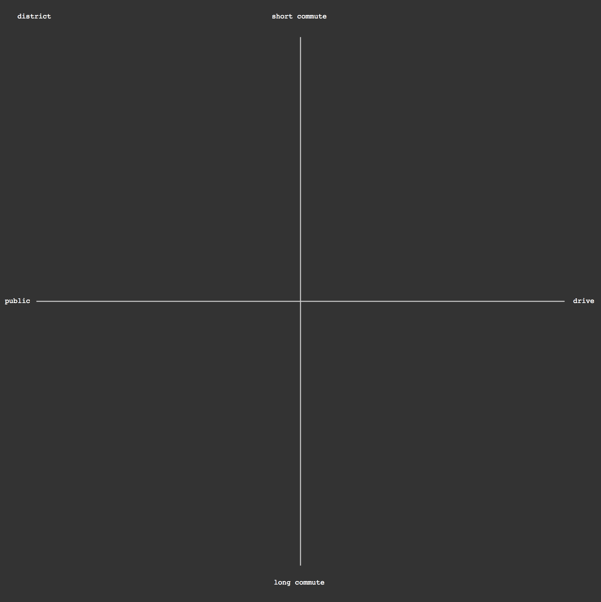

### SVG Container, Background, Labels, and Axes

With the data better structured, let's draw all of the non-data elements of our visualization.

All of this code should be placed above the `d3.text()` bit we previously added.

```js
		//variables for svg container
		var width = 1200;
		var height = 1200;

		// reusable value for uniform margins
		var margin = 75;

		//create svg container
		var svg = d3.select('body')
		.append('svg')
		.attr('width', width)
		.attr('height', height)
		;

		//draw a background rectangle 
		var background = d3.select('svg')
		.append('rect')
		.attr('width', width)
		.attr('height', height)
		.attr('x',0)
		.attr('y',0)
		.attr('fill','#333')
		;

		//draw a horizontal line
		var xAxis = d3.select('svg')
		.append('line')
		.attr('x1' , margin)
		.attr('x2' , width - margin)
		.attr('y1' , height/2)
		.attr('y2' , height/2)
		.attr('stroke' , '#ccc')
		.attr('stroke-width' , '2px')
		;

		//draw a vertical line
		var yAxis = d3.select('svg')
		.append('line')
		.attr('x1' , width/2)
		.attr('x2' , width/2)
		.attr('y1' , margin)
		.attr('y2' , height - margin)
		.attr('stroke' , '#ccc')
		.attr('stroke-width' , '2px')
		;

		//draw x r label
		var xRightLabel = d3.select('svg')
		.append('text')
		.text('drive')
		.attr('x' , width - margin/1.3)
		.attr('y' , height/2 + 3)
		.attr('font-family' , 'courier')
		.attr('font-size' , '14px')
		.attr('fill','white')
		.attr('id','xRight')
		;

		//draw x l label
		var xLeftLabel = d3.select('svg')
		.append('text')
		.text('public')
		.attr('x' , margin/6)
		.attr('y' , height/2 + 3)
		.attr('font-family' , 'courier')
		.attr('font-size' , '14px')
		.attr('fill','white')
		.attr('id','xLeft')
		;


		//draw y top label
		var yTopLabel = d3.select('svg')
		.append('text')
		.text('short commute')
		.attr('x' , width/2 - 57)
		.attr('y' , margin/2)
		.attr('font-family' , 'courier')
		.attr('font-size' , '14px')
		.attr('fill','white')
		.attr('id','yTop')
		;

		//draw y bottom label
		var yBottomLabel = d3.select('svg')
		.append('text')
		.text('long commute')
		.attr('x' , width/2 - 53)
		.attr('y' , height - margin/2)
		.attr('font-family' , 'courier')
		.attr('font-size' , '14px')
		.attr('fill','white')
		.attr('id','yBottom')
		;

		//draw key
		var key = d3.select('svg')
		.append('text')
		.text('')
		.attr('x' , margin/2)
		.attr('y' , margin/2)
		.attr('font-family' , 'courier')
		.attr('font-size' , '14px')
		.attr('fill','white')
		.attr('id','key')
		;
```

Nothing new here, just a set of SVG drawing actions, exectuted through D3 `select`s and `append`s. Note that the elements are each given an `id` for ease of finding that object later on.

All of those weird integers are just placement offsets, to help the text appear better centered.

The `#key` we're drawing won't do anything now, but will be used later for some dynamic text.



-----

With this background in place, let's actually [do some data visualization](plot.md).
