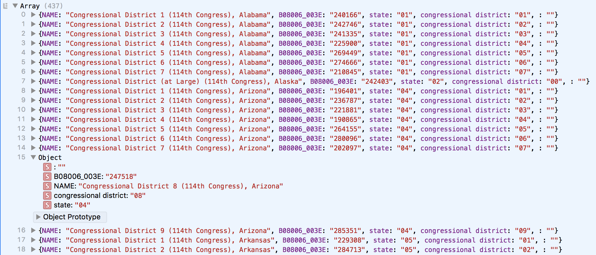

### Fetching Data with D3

Since the beginning of these exercises in data visualization, we've kept separate our API querying and our data visualization code. We've queried the API in our browers, and copied and pasted the result into our code.

Let's change that by querying the API directly with D3!

-----

D3 offers methods for pulling in data *asynchronously*, halting all programmatic drawing and processing actions until the download fully completes. These are available in the following D3 tools.

`d3.csv`, `d3.dsv`, `d3.json`, and `d3.text` all allow D3 to go out and fetch common data formats from an external file or URL, and potentially parse them.

`d3.csv` pulls in comma-separated-value files and parses the results into a javascript *object* (a fancier javascript array), and `d3.dsv` pulls in and parses files that delimit the data using a character other than a comma. `d3.json` does the same downloading and parsing for .json files. `d3.text` is the most flexible of the set, and is capable of pulling in any text file, though it cannot parse data.

The census provides data in an unusual, non-standard format. It is somewhat like a csv, in that it uses commas to separate values per row, which are in turn separated into new lines. However, it also uses brackets to break the data up into usable arrays. This has so far been great! The data has been flexible enough to load into Excel/Numbers, or use in Javascript, without too much extra work. That's why the census combines the standards of  two different standards into one unnamed monstrocity.

But, because D3 is very specific in its data parsing routines, none of these data fetchers will work without modification. As a result, we need to use `d3.text` to *fetch the file* first, then *manipulate the text* into a standard data format, and finally *parse* the text into usable data.

First, let's get into the API. This accesses the census API and grabs the text for us, and passes it into the braces as a variable called `data`, though this can be whatever you like

```js
//query the API
d3.text("https://api.census.gov/data/2015/acs/acs5?get=NAME,B08006_003E&for=congressional%20district", function(censusData) {
	
	//show the census response
	alert(censusData);

})
```

Placing this code within your script tags and loading the page in a browser should yield a pop-up with the census response! In this case, the data is 'how many people drive to work alone' per congressional district. But, it's a mess of formatting and whitespace, with brackets all over the place.

And in fact, the problem is those brackets! In particular, the beginning and final bracket cause D3's csv parser to fail. For this text to validate as a proper comma-separated-value file, we need to strip all the structural brackets out of the census API response. To do this, we need do use dreaded [regular expressions](https://regexr.com) — often called *regexes* — to filter the text for specific characters. This one, though, is pretty easy. After removing the brackets with that regex, evaluate the structured results in your web console.

```js
//query the API
d3.text("https://api.census.gov/data/2015/acs/acs5?get=NAME,B08006_003E&for=congressional%20district", function(censusData) {
	
	//remove brackets from the dataset
	var noBracketsData = censusData.replace(/[\[\]]+/g,'');

	//parse the data into a js object
	var dataset = d3.csvParse(noBracketsData);
	
	//print the dataset to the console for analysis
	console.log(dataset);

})
```

You should see a highly structured set of entries that can be expanded and collapsed inside of the console, one for each congressional district. This is a *javascript object*, which is kind of like an array, but with new abilities like customizable key:value pairings. 



-----

Let's [customize the data structure](structure.md) so that it is more legible and has all the info we need.

