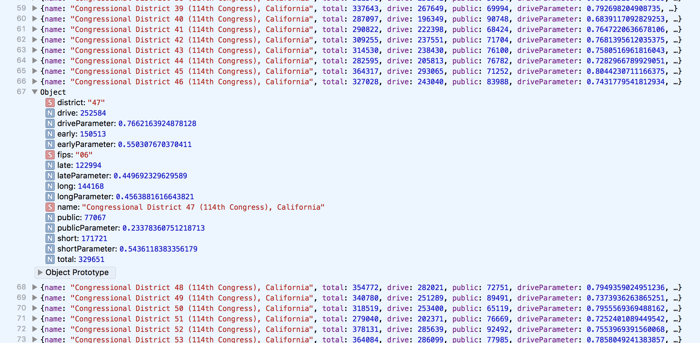

### Parameterized Matrix

The friendly 2x2 plot, or parameterized matrix, allows for an intuitive understanding of the interplay between two concepts mapped to spatial dimensions, with many others being possible through the shape and color of plotted elements. They naturally create a set of quadrants with articulable, counterpoised properties. We love them!

Fundamentally, each axis in a parameterized matrix communicating *relative weight between two poles*. The *parameterized* part of the name is significant — each pole concept for each axis should run a range from 0 to 1. This often means looking at *partitive* data, percentages of a whole, rather than raw values. The two poles are then compared (the left/bottom pole is subtracted from the right/top pole), so that each complete axis runs a potential domain from -1 to 1.

The axes of a parameterized matrix should only be used when dealing with meaningfully divergent, deviational, or categorical data. Distance from the origin refers to how *polar* that data point is, not necessarily correlating with any readable value.

The parameterized matrix is often misused by designers and data visualizers, and the results are easy to misinterpret. We often errantly map a natural range to an axis (for instance, having poles be "high" and "low" alternatives of the same concept), which is problematic because it encourages a *scalar* interpretation (magnitude, but not direction or categorical orientation). It's easy for viewers to accidentally see in a parameterized matrix — with its visual similarities to other more traditional scatter charts — actual values being plotted, rather than the parameterized comparison that is actually drawn.

Languaging is therefore very important. We don't want to label axes in our case "commuting 60 minutes" or something, which would imply an accuracy and spatial logic that the matrix doesn't possess. Instead, we should label with categorical titles like "early" and "late" departures, where that distinction is being drawn intentionally based on research and communicated elsewhere in the framing of the content. As a result of this nuance, many data visualization experts discourage the use of parameterized matrices except under appropriate circumstances. Yet, we use them all the time. ¯\_(ツ)_/¯

-----

For our plot, we are going to be comparing method of transit with both time of departure to work and length of commute. All of these datapoints are categorical in their census preparation, and we will further bucket them into poles using the techniques previously discussed. 

This code all goes underneath the svg injection stuff written earlier.

```js
		//query ACS
		d3.text("https://api.census.gov/data/2015/acs/acs5?get=NAME,B08006_003E,B08006_008E,B08006_014E,B08006_015E,B08006_016E,B08006_017E,B08006_004E,B08012_002E,B08012_003E,B08012_004E,B08012_005E,B08012_006E,B08012_007E,B08012_008E,B08012_009E,B08012_010E,B08012_011E,B08012_012E,B08012_013E,B08011_002E,B08011_003E,B08011_004E,B08011_005E,B08011_006E,B08011_007E,B08011_008E,B08011_009E,B08011_010E,B08011_011E,B08011_012E,B08011_013E,B08011_014E&for=congressional%20district", function(censusData) {
			
			//remove annoying brackets
			var noBracketsData = censusData.replace(/[\[\]]+/g,'')

			//parse the data based on csv logic
			var dataset = d3.csvParse(noBracketsData, function(d){

				//add up all applicable methods of public transit: bikes, walking, train, bus...
				var publicTotal = parseInt(d.B08006_008E) + parseInt(d.B08006_014E) + parseInt(d.B08006_015E) + parseInt(d.B08006_016E) + parseInt(d.B08006_017E) + parseInt(d.B08006_004E);

				//single drivers
				var driveTotal = parseInt(d.B08006_003E);

				//all commuters
				var commuteTotal = driveTotal + publicTotal;


				//commuters with commutes less than 30 minutes 
				var shortTravel = parseInt(d.B08012_002E) + parseInt(d.B08012_003E) + parseInt(d.B08012_004E) + parseInt(d.B08012_005E) + parseInt(d.B08012_006E) + parseInt(d.B08012_007E) ;

				//commuters with commutes more than 30 minutes 
				var longTravel = parseInt(d.B08012_008E) + parseInt(d.B08012_009E) + parseInt(d.B08012_010E) + parseInt(d.B08012_011E) + parseInt(d.B08012_012E) + parseInt(d.B08012_013E) ;

				//all people commuting as reported by travel duration
				var travelTotal = shortTravel + longTravel;


				//commuters who leave before 7:30am
				var earlyDepart = parseInt(d.B08011_002E) + parseInt(d.B08011_003E) + parseInt(d.B08011_004E) + parseInt(d.B08011_005E) + parseInt(d.B08011_006E) + parseInt(d.B08011_007E);

				//commuters who leave after 7:30am
				var lateDepart = parseInt(d.B08011_008E) + parseInt(d.B08011_009E) + parseInt(d.B08011_010E) + parseInt(d.B08011_011E) + parseInt(d.B08011_012E) + parseInt(d.B08011_013E);

				//all people commuting as reported by time of departure
				var departTotal = earlyDepart + lateDepart;

				return {
					name: d.NAME,
					
					drive: driveTotal,
					public: publicTotal,
					driveParameter: driveTotal / commuteTotal ,
					publicParameter: publicTotal / commuteTotal,
					
					short: shortTravel,
					long: longTravel,
					shortParameter: shortTravel / travelTotal,
					longParameter: longTravel / travelTotal,
					
					early: earlyDepart,
					late: lateDepart,
					earlyParameter: earlyDepart / departTotal,
					lateParameter: lateDepart / departTotal,
					
					fips: d.state,
					district: d["congressional district"]
				};
			});

			//scales for each axis, parameterized (percentage-based) domains
			var xScale = d3.scaleLinear().domain([-1,1]).range([margin,width-margin])
			var yScale = d3.scaleLinear().domain([-1,1]).range([margin,height-margin])

```

Note the scales. Since we are subtracting a *parameterized* value between 0 and 1 from another *parameterized* value between 0 and 1 for each data point, our domain is naturally -1 to 1.

The data as structured now looks like this:



-----

Let's finally [plot some data](plot.md)!