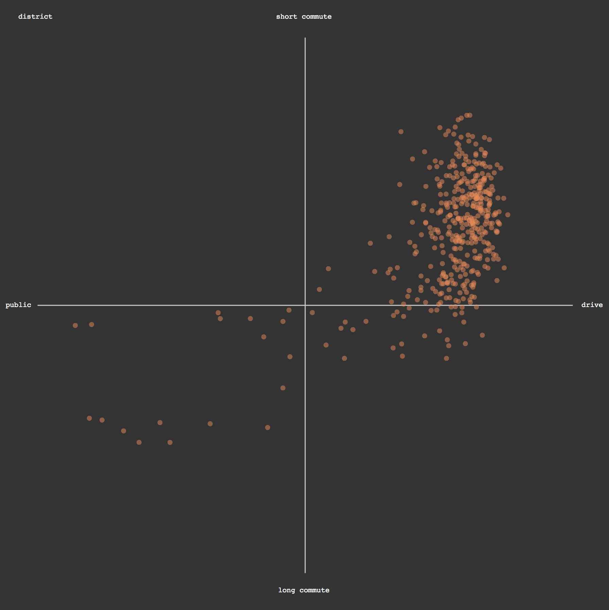
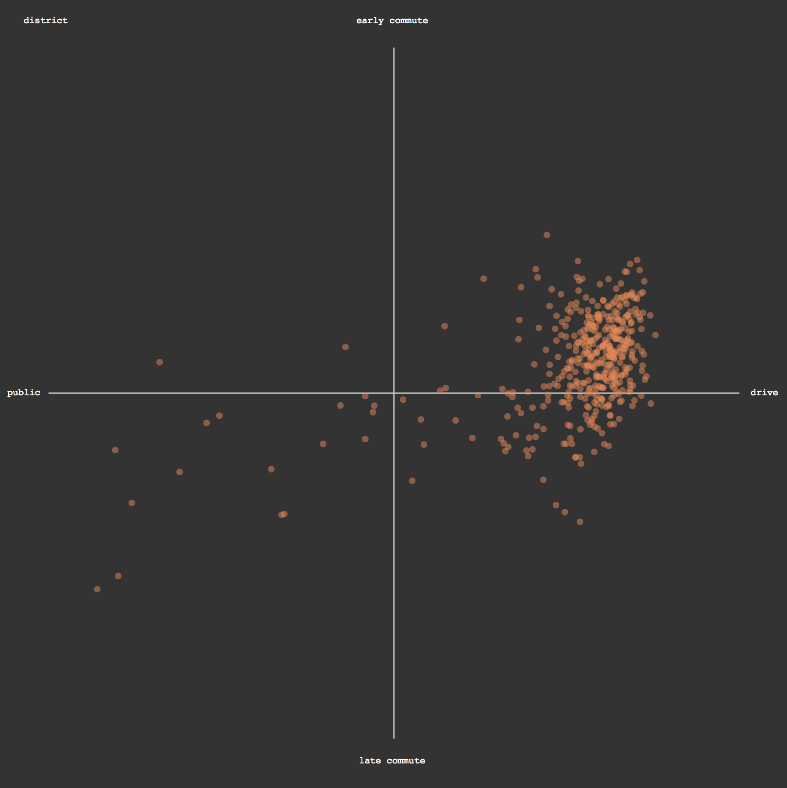

### Plotting Data

Our data is structured and ready to use. We'll map transit type to x and commute length to y.

Note that `.data()` and `.enter()` show up again, in combination with `.selectAll`. When we `.selectAll`, D3 finds nothing on the page. When we `.data()`, we compare that *empty* selection with the dataset variable. We then call `.enter()` to return all of the data points *that don't have a corresponding selected element*. This data (in our case all of the data points) then each trigger the following code block `.append('circle')...`.


Read from Mike Bostock, creator of D3, more about [this model of joining selected elements to data](https://bost.ocks.org/mike/join/).

This code goes within the `d3.text(){}` block, underneath the previous data structuring code. 

```js
			//find the svg container
			var dots = d3.select('svg')
				//look for a set of objects that aren't drawn yet
				.selectAll('.dots')
				//as d3 to compare that selection with a dataset
				.data(dataset)
				//for each item in the dataset unmatched by a selected element...
				.enter()
				//add a circle
				.append('circle')
				//place the circle at the scaled position on x
				.attr('cx', function(d){
					return xScale(d.driveParameter - d.publicParameter)
				})
				//place the circle at the scaled position on y (be careful to not invert it!)
				.attr('cy', function(d){
					return yScale(d.longParameter - d.shortParameter)
				})		
				//radius of circles 					
				.attr('r',5)
				//default stylings
				.attr('stroke','white')
				.style('stroke-width',0)
				.attr('opacity',.5)
				//label them so we can find them later
				.attr('class', 'dots')
				//fill color, soon to be expanded
				.attr('fill', '#f2844b');
			;
```

Again, nothing new here! 



What are some learnings we can tease out from this plot? Note the nearly linear relationship we're seeing, when commutes are longer, people tend to take public transit. Counterintuitive? What might explain what we're seeing?

We can also swap the parameters being visualized on the y axis, and change the y-axis labels, to view a different sets of parameterized comparison.

```
					.attr('cy',function(d){
						return yScale(d.lateParameter - d.earlyParameter);
					})
```



Again, another nice linear relationship, with a clear focus. Commuters leave earlier when they drive. Expected or unexpected?  

-----

Let's practice these models with some [homework](homework.md)
