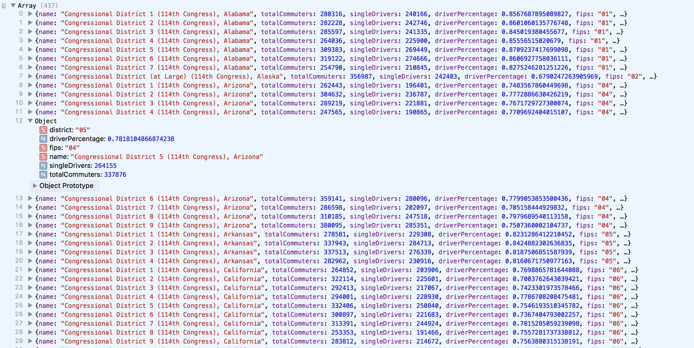

### Preprocessing Data

Now that we can get at the census data with D3 code, let's make it more usable by using an *accesor function* with `d3.csvParse` to edit the data that flows from the API.

```js
//access census API
d3.text("https://api.census.gov/data/2015/acs/acs5?get=NAME,B08006_003E,B08006_001E&for=congressional%20district", function(censusData) {
	
	//remove brackets
	var noBracketsData = censusData.replace(/[\[\]]+/g,'')

	//convert the text into a js object
	var dataset = d3.csvParse(noBracketsData, function(d){

		//single drivers variable 
		var drivers = parseInt(d.B08006_003E) ;

		//total commuters variable
		var total = parseInt(d.B08006_001E) ;

		//single drivers as percentage of commuters 
		var percentage = drivers / total ;

		//create the data object for visualization
		return {
			name: d.NAME,
			totalCommuters: total,
			singleDrivers: drivers,
			driverPercentage: percentage,
			fips: d.state,
			district: d["congressional district"]
		};
	});

//print the result to the console
console.log(dataset)

})
```

Here we are creating some variables for clarity, and then using those variables to define a data object for visualization. If you visit the console, you should see the structure created above. No more stupid census codes!

Note that we use the *dot syntax* ("d.") to pull different columns out of the dataset. D3 matches the column headers like `NAME` and `state`, for example, as well as the requested census encoded `B08006_003E` and `B08006_001E`. But, in creating our own data structure, we can give all of these things more consistent and human-legible names. We also can use mathematics to synthesize datapoints, to save redundant code later.

In the `return` section, we are building a model for how we want our data structured. The name to the left of the colon is the *key*, the name for the value (like a column or row header in excel). The data to the right of the colon is the *value*, what D3 will pass from the API response onto the rest of your code.

Because the `congressional district` column has a space in its name, we alternatively must use the *bracket notation* to pull that data-point, which is reminiscent of standard array syntax. It works exactly the same as *dot syntax* otherwise -- the two are mostly interchangeable (with the exception of wanting a variable interpolated, which requires bracket notation just like properties with a space in its name — we'll see that edge case later on).



-----


