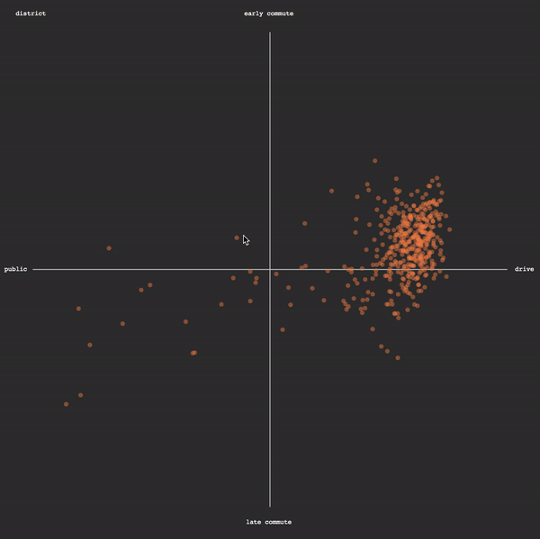

### Animating Elements and Handling Mouseover/Mouseout Events

Adding animation and interactivity is what D3 was designed for. All we have to do is identify an *event* to respond to, and then set up the new state we want our objects to transform into over time. This is the same as we did before to switch out text, but with one significant change.

To trigger all this functionality, all we need to do is elect which event to respond to with  `.on('event', function(d){})`, and call a new method `.transition()` inside the anonymous function — which tells D3 to animate changes. 

With `.transition()` called, D3 [tweens](https://en.wikipedia.org/wiki/Inbetweening) the initial state to the new state over a configurable period of time. Afterwards, we can set `.duration()` to determine how long the animation should last, measured in milliseconds. Additionally, D3 gives us the ability to optionally set an *easing* parameter in `.ease()`. This is a concept unique to animation: *how should the object accelerate with respect to time*. Should it start slow and speed up as it nears the end of its movement? Move normally at the start and then overshoot its target, bouncing around its final destination? Read more and [view the possible variations and settings here](https://bl.ocks.org/d3noob/1ea51d03775b9650e8dfd03474e202fe). Both `.ease()` and `.duration()` can only come after `.transition()` is called.

All this code gets added on to the bottom of the `var dots = ...` chunk of drawing code. It is part of the same code block that plots the svg circles.

```js
			//all the dot making stuff is above this line
			//this object should respond to mouse hovering
			.on('mouseover', function(d) {
				
				//find a thing on the page with id 'key'
				d3.select('#key')
				//and show the name of the rolled over element in it
				.text(d.name)
				;

				//'this' is a keyword that refers to the object that detected the event
				//select the rolled over dot
				d3.select(this)
				//turn on animation	
				.transition()
				//bouncey animation
				.ease(d3.easeElastic)
				//animate over 1 second
				.duration(1000)
				//increase stroke width
				.style('stroke-width',5)
				//increase radius
				.attr('r',20)
				//increase opacity
				.attr('opacity',1);
		
			})

			//this object should also respond to mouse moving away from it
			.on('mouseout', function(d) {

				//find a thing on the page with id 'key'
				d3.select('#key')
				//and empty its text
				.text('');

				//reverse of the mouseover, without the fancy animation
				d3.select(this)
				.transition()
				.style('stroke-width',0)
				.attr('r',5)
				.attr('opacity',.5);
			})
		;
```


Looks great! Any new learnings now that the experience is much better?

-----

We can now move on to another goal, adding a new data point [encoded in the radius of the circle](money.md)! 
