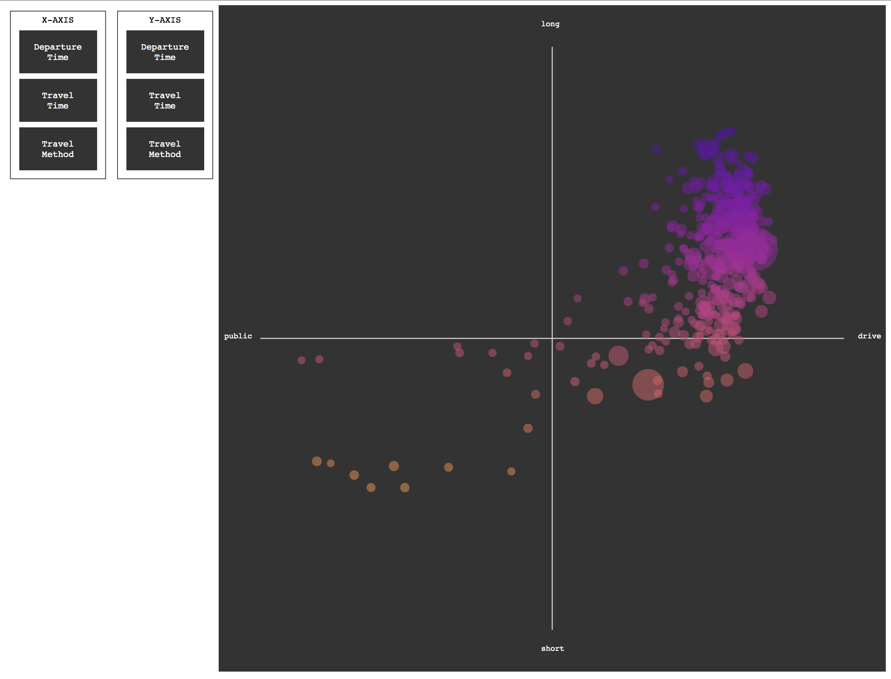

### Changing Plotted Data

We have a nice plot already, but it's only one way of seeing these ACS variables compared. 

Wouldn't it be great if viewers could plot the data how they wanted to see it?

Let's add a few buttons to our page first to allow viewers to specify which axis shows which data. This code goes at the very beginning of the `<body>` tag, so that the buttons show up before our visualization is drawn.

```html
<div class="axis">X-AXIS
	<div class="switch" id='departX'>Departure Time</div> 
	<div class="switch" id='lengthX'>Travel Time</div> 
	<div class="switch" id='methodX'>Travel Method</div>
</div>

<div class="axis">Y-AXIS
	<div class="switch" id='departY'>Departure Time</div>	
	<div class="switch" id='lengthY'>Travel Time</div> 
	<div class="switch" id='methodY'>Travel Method</div>
</div>

```

Note that each has a unique `id`. This will allow D3 to easily find each button and map specific behavior to each.

We can add some CSS code to make these look better. Put this in a `<style>` tag in the `<head>` of your page.

```
<style> 
	.axis{
		margin:10px; 
		padding:5px; 
		float:left;
		font-family:'courier';
		text-align:center;
		border:1px solid #333;
	}

	.switch{
		margin:10px; 
		clear:both; 
		background-color:#333;
		color:white;
		padding:20px;
		width:100px;
		cursor:hand;
	}
	
	.switch:hover {
		background-color:#999
	}

</style>

```

Though none of this code is necessary, it does help unify our HTML elements with our dynamnic data visualization aesthetic.



-----

We now need to find those buttons with D3, and attach behaviors to them.

This code looks complicated, but it is **nothing new**. All we're doing is changing `cx` and `cy` values depending on the button clicked. This all goes at the very bottom of your code, but before the final `})` that closes the `d3.text()` call. 

Each is a near duplicate block, moving the dots as needed and changing colors and axis labels to ensure legibility.

```js
		d3.select('#departX')
			.on('click', function(d){ 
			
				d3.selectAll('.dots')
				.transition()
				.duration(1500)
				.attr('cx',function(d){
					return xScale(d.lateParameter - d.earlyParameter);
				})

				d3.select('#xLeft').text('early')
				d3.select('#xRight').text('late')
			})
		;

		d3.select('#lengthX')
			.on('click', function(d){ 
			
				d3.selectAll('.dots')
				.transition()
				.duration(1500)
				.attr('cx',function(d){
					return xScale(d.longParameter - d.shortParameter);
				})

				d3.select('#xLeft').text('short')
				d3.select('#xRight').text('long')
			})
		;

		d3.select('#methodX')
			.on('click', function(d){ 
			
				d3.selectAll('.dots')
				.transition()
				.duration(1500)
				.attr('cx',function(d){
					return xScale(d.driveParameter - d.publicParameter);					
				})

				d3.select('#xLeft').text('public')
				d3.select('#xRight').text('drive')
			})
		;

		d3.select('#departY')
			.on('click', function(d){ 
			
				d3.selectAll('.dots')
				.transition()
				.duration(1500)
				.attr('cy',function(d){
					return yScale(d.lateParameter - d.earlyParameter);
				})
				.attr('fill', function(d){
					return d3.interpolatePlasma(colorScale(d.lateParameter - d.earlyParameter))
				})
		;


				d3.select('#yTop').text('early')
				d3.select('#yBottom').text('late')
			})
		;

		d3.select('#lengthY')
			.on('click', function(d){ 
			
				d3.selectAll('.dots')
				.transition()
				.duration(1500)
				.attr('cy',function(d){
					return yScale(d.longParameter - d.shortParameter);
				})
				.attr('fill', function(d){
					return d3.interpolatePlasma(colorScale(d.longParameter - d.shortParameter))
				})
		;

				d3.select('#yTop').text('short')
				d3.select('#yBottom').text('long')
			})
		;

		d3.select('#methodY')
			.on('click', function(d){ 
			
				d3.selectAll('.dots')
				.transition()
				.duration(1500)
				.attr('cy',function(d){
					return yScale(d.driveParameter - d.publicParameter);					
				})
				.attr('fill', function(d){
					return d3.interpolatePlasma(colorScale(d.driveParameter - d.publicParameter))
				})
		;

				d3.select('#yTop').text('public')
				d3.select('#yBottom').text('drive')
			})
		;
```


🎤⏬💥

-----

Phew, finished. 

Take a look at the [completed code](complete.md).

Onto some [homework](homework.md) for the break! 
