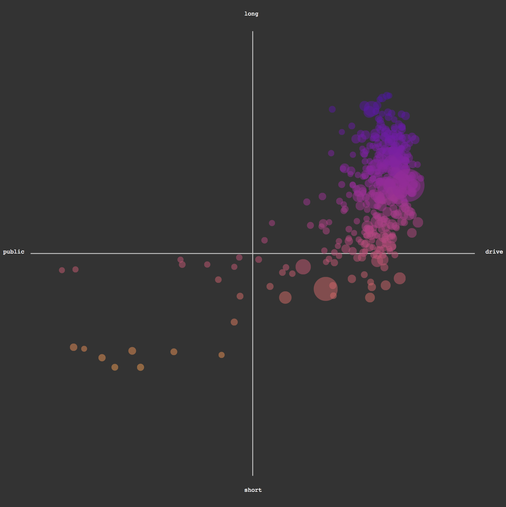
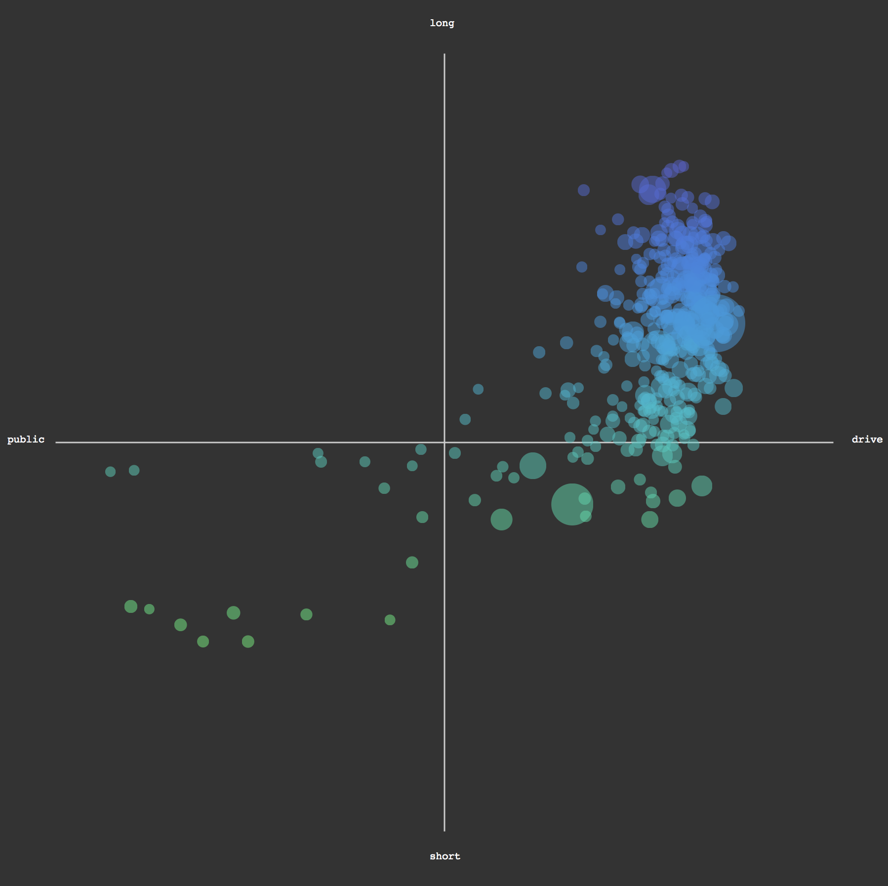

### Chromatic Color Scales

D3 has a lot of awesome color functionality built-in, but we are going to extend that with a lovely library also written by D3 inventor Mike Bostock: [D3 Scale Chromatic](https://github.com/d3/d3-scale-chromatic).

This library allows us to use the same `scale` logic that we have used formerly to map data to pixel dimensions to instead map data to categorical or continuous color scales. This is much more flexible than mapping data to the 0-255 range of `rgb()` colors.

Color scales require that we include this new library after we import D3 proper.

```html
<script src="https://d3js.org/d3.v4.min.js"></script>
<script src="https://d3js.org/d3-scale-chromatic.v1.min.js"></script>
```

Take a look at all the [cool color scale options](https://github.com/d3/d3-scale-chromatic) available! Many of them are based on the rigorously researched [ColorBrewer](http://colorbrewer2.org/#type=sequential&scheme=BuGn&n=3) presets for perceptual uniformity and color-blind-safeness. And, we can make our own too!

There are explicit color *schemes* for handling categorical, continuous, diverging, and sequential data. Ensure that you are using an appropriate color scheme based on your data quality.

-----

To use these scales, all we need to do is choose an appropriate scheme, and ensure we have a *parameterized* value between 0 and 1 to map. One end of the color scale is 0, and the other is 1, and all other values get plotted in the middle of the gradients. 

So, we often need to make another scale, just to map our data between the 0 and 1 necessary to use these cool color scales.

```js
	//make a parameterizing scale
	//we want a number between 0 and 1, so that's our range
	var colorScale = d3.scaleLinear().domain([dataMin,dataMax]).range([0,1]);

	//when we want to get a mapped color...
	//this is a scheme that goes from green to blue, used for continuous data	
	var color = d3.interpolateGnBu(colorScale(dataValueToMap));


```	

-----

Back to our plot, let's implement a color scale.

Since we have inherenly diverging data in our parameterized matrix, we should choose a diverging schema. Let's use the `d3.interpolatePlasma()` diverging scheme. It's dramatic, and doesn't artificially add any bias since orange and purple aren't universally associated with any particular sentiment. Feel free, though, to try out other colors schemes.


Let's add the necessary color scale first. Place this code near where the other scales, like `xScale` and `moneyScale`, are made. 

```js
	//this code maps our parameterized percentage domain, which will always be between -1 and 1, to 0 and 1.
	var colorScale = d3.scaleLinear().domain([-1,1]).range([0,1]);
```

Of course, it could have been just as easy to add 1 to our values and divide by 2, but this is more reusable should our data change meaningfully later.

Now, let's use `d3.interpolatePlasma()` to replace our boring orange fills.

```js
	//in our dot drawing code
	.attr('fill', function(d){
		return d3.interpolatePlasma(colorScale(d.longParameter - d.shortParameter));
	})
```

And the beautiful `d3.interpolatePlasma()` result!


Here it is in `d3.interpolateCool()` instead.


The color is not only more aesthetic and visually engaging, but more importantly, it significantly aids in data legibility by reinforcing the diverging nature of the parameterized matrix. We also now find that, despite the clumping dots, each individual dot is unique in color and easier to tease out from its neighbors. Problems solved.

-----

Our plot is where we want it to be. Any new insights? Was it worth designing and implementing all these fancy effects?

One more additional feature before we're done, and it's a big one: [let's let users choose what data sits on each axis](change_data.md).


