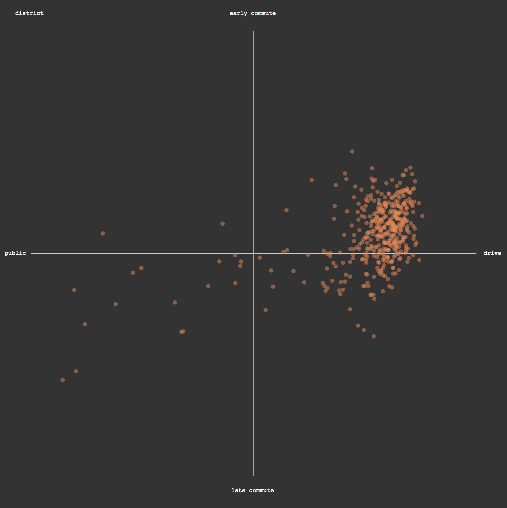
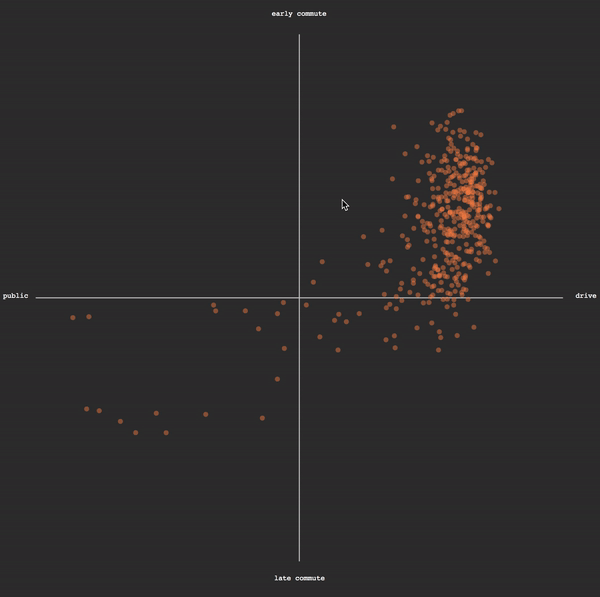

### Dynamic Text

Our plot looks good, but we still can't tell which district is which. So many indistinguishable orange dots!



Let's use an event handler to change an svg text element on the page with an id of `key`, created previously but unused, to show the congressional district name.

Add this code onto the end of the creation of your dots, as though it were just another `.attr()` or `.style()`.

```js
	//all the dot making stuff is above this line
	//when a dot is moused over...
	.on('mouseover', function(d) {
		//find a thing on the page with id 'key'
		d3.select('#key')
		//and show the name of the rolled over element in it
		.text(d.name)
		;

		//increase the visibility of the moused over dot 
		d3.select(this)
		.style('stroke-width',5)
		.attr('r',15)
		.attr('opacity',1)
		;
	})

	//when the mouse leaves the dot
	.on('mouseout', function(d) {
		//find a thing on the page with id 'key'
		d3.select('#key')
		//and empty its text
		.text('');

		//return the dot to its normal translucent style and size
		d3.select(this)
		.style('stroke-width',0)
		.attr('r',5)
		.attr('opacity',.5);

	})
;
```



When a viewer mouses over a dot, they can see which congressional district that dot represents in the `#key` area of the svg.

##### Important

A common point of confusion: `d` refers to the *data* bound to the object that is moused-over, whereas `this` refers to the *circle object* itself. 

So, we can `select` another object on the page such as `#key` and update it with the data of the moused-over dot with `d`, or adjust the moused-over circle object's appearence with `this`.

With our visualization more interactive, can we reach any new insights in exploring our plot?

-----

Mouseover is cool and all, but it is kind of jarring. Wouldn't it be nice if we could [animate](animation.md) that transition instead?
