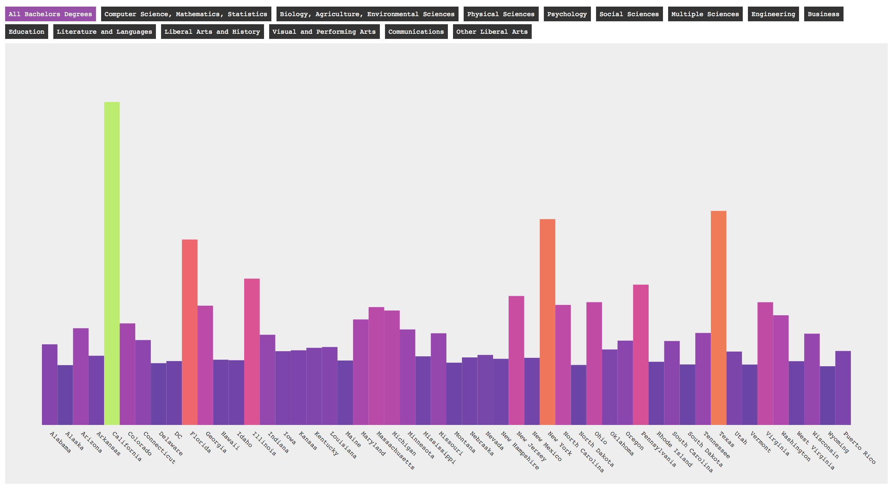

### Goal for the Day

No new content this week, just a challenge...

-----

Using census variables from the [`B15010` Group](https://api.census.gov/data/2016/acs/acs1/groups/B15010.html), construct a bar chart, displaying the values for each state. 

- Add interactive buttons to change the displayed variable
- Implement a diverging [d3 chromatic color scale](https://github.com/d3/d3-scale-chromatic)
- Show the actual census values on bar mouseover

