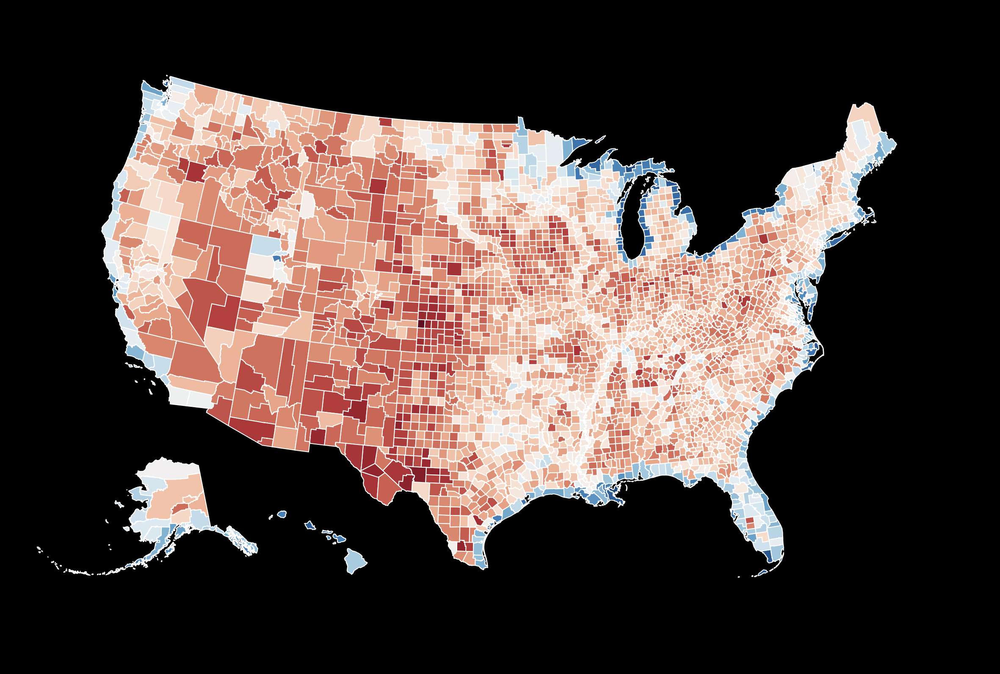

### Simple Choropleth 

Drawing maps is the same as drawing charts, and so too is the manipulation of a map's visual form and the manipulation of any other data-driven entity in D3.

When color or other visual variables are used to compare visual regions, often but not always geographic boundaries, the resulting form is called a [choropleth](https://en.wikipedia.org/wiki/Choropleth_map).

This code makes use of a chromatic scale to color the counties of America by their proportion of water area to land area. Since so many counties have either a very high ratio (littoral, lacustrine, and riverine counties), or a very low ratio (prarie, desert, and other landlocked counties), the normal linear scale `d3.scaleLinear` is not a good match. Instead, we could compress the dynamic range by taking a root of the ratios, rather than the raw ratio values. To do this, we can use `scalePow().exponent(.25)` to raise each ratio to the power of 1/4. This will flatten the extremes out, allowing us to better see subtle variation in the visualization.



```html
<!DOCTYPE html>
<html>
<head>
	<title>Simple Map</title>
</head>
<body>
	<script src="https://d3js.org/d3.v4.min.js"></script>
	<script src="https://d3js.org/d3-scale-chromatic.v1.min.js"></script>
	<script>
			//display variables
			var width = 1200;
			var height = 900;

			//svg container
			var svg = d3.select('body')
				.append('svg')
				.attr('height', height)
				.attr('width', width)
			;

			//background rectangle
			var background = svg
				.append('rect')
				.attr('x',0)
				.attr('y',0)
				.attr('width',width)
				.attr('height',height)
				.attr('fill','black')
			;

			//project with a centered Albers USA projection		
			var proj = d3.geoAlbersUsa()	
				.scale(1300)
				.translate( [width/2 , height/2 ] )
			;

			//use this path generator to build SVG drawing instructions from geo-coordinates
			var path = d3.geoPath()
				.projection(proj)
			;

			//load counties file
			d3.json('counties.json', function(err, geojson){

				//find highest and lowest water:total area ratios	
				var landExtent = d3.extent(geojson.features, function(d){return d.properties.AWATER / (d.properties.ALAND + d.properties.AWATER) });

				//build scale for conversion
				//since the data sits at the extremes, it is appropriate to compress the range of the values by taking a fourth root of each ratio
				var landScale = d3.scalePow().exponent(.25).domain(landExtent).range([0,1]);

				//draw counties
				var counties = 
					d3.select('svg')
					.selectAll('.counties')
					.data(geojson.features)
					.enter()
					.append('path')
					.attr('d', path)
					.attr('class','counties')
					.attr('stroke','white')
					.attr('fill', function(d){
						//color scale
						return d3.interpolateRdBu(landScale(d.properties.AWATER / (d.properties.ALAND + d.properties.AWATER)))
					})
			})

	</script>
</body>
</html>
```

-----

Now, practice with [some homework](homework.md)!