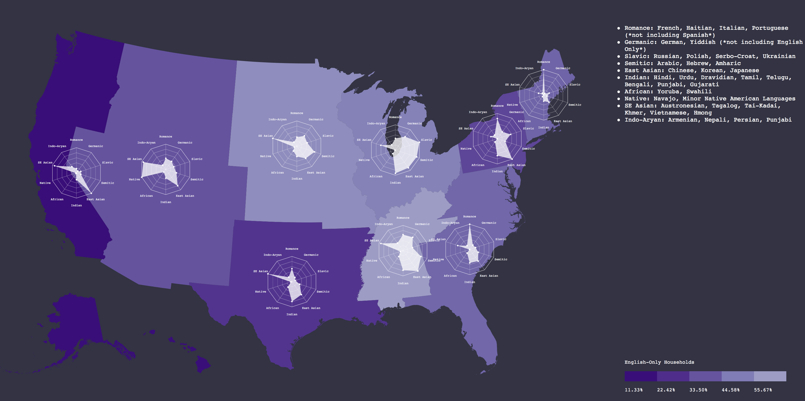

### Spider Chart Example

Spider charts are useful for showing subtle, highly *multivariate* difference between entities — as data-driven, unique fingerprints.

This example geographic visualization demonstrates the different linguistic characteristics of the [12 Census Divisions](https://www.census.gov/geo/reference/webatlas/divisions.html) of the United States. Spanish and English-Only language groups have been removed from the plotting, as they otherwise overwhelm the other language groups. The other tracked language are clustered roughly by geographic source and linguistic relation when possible, though the ACS doesn't track enough languages in the United States to be able to uniformly quantize them into [monophyletic language families](https://en.wikipedia.org/wiki/Language_family). Instead, this compromize clustering is the best that can be done, which nevertheless reveals some fascinating insights into the linguisitic topography of the contemporary USA. Each US Census Division has a characteristic spider plot shape, reflecting significant sociocultural and historical differences. These unique shapes make exploring these differences straightforward.

The spider plots are drawn atop a simple choropleth comparing the percentage of "English-Only" households.



Some specific learnings that come out of comparing the spider plots:
 
- The [Vietnamese diaspora](xhttps://en.wikipedia.org/wiki/Overseas_Vietnamese) skews the Pacific, West North Central, Mountain, and West South Central Divisions' linguistic fingerprints towards the South-East Asian languages, even though Vietnamese is fascinatingly [not a language](https://en.wikipedia.org/wiki/Vietnamese_language#History), but rather the pidginized, codified result of many intersecting Austronesian and Tai-Kadai languages.

- Amharic and Arabic elevate the Semitic polygon points in the West North Central, East North Central, and East South Central divisions due to various recent migrations from the Horn of Africa, specifically [Somalia](https://en.wikipedia.org/wiki/Somali_diaspora) and [Ethiopia](https://en.wikipedia.org/wiki/Ethiopian_Americans).

- Contact with the neighboring [Francophone Maritime Canadian Provinces and Quebec](https://en.wikipedia.org/wiki/French_language_in_Canada) likely results in New England's Romance skew. [Haitian Ex-Pats](https://en.wikipedia.org/wiki/French_language_in_the_United_States) likely drive the French dominance in the South Atlantic Division as well.

- The East North Central division is the most linguistically diverse, with an almost equal portion of Slavic, Semitic, East Asian, and Indian languages.

- Remnant Native populations, as well as many [reservations](https://en.wikipedia.org/wiki/Indian_reservation) and [enforced](https://en.wikipedia.org/wiki/Long_Walk_of_the_Navajo) [migrations](https://en.wikipedia.org/wiki/Trail_of_Tears) have led nearly all of the Native American langauge speakers to be clustered within the Mountain Division.

- Northern Texas, and specifically Dallas, hosts a [large and growing Indian community](https://www.dallasnews.com/news/news/2012/01/11/asian-indian-population-booming-in-dallas-fort-worth), leading to a high proportion in the West South Central Division.

- East Asian language-speaking households, mostly Chinese speakers, dominate the spider plots in both the Pacific and Middle Atlantic Divisions, reflecting [two distinct migration periods](https://en.wikipedia.org/wiki/Chinese_Americans), divided by one of [America's most shameful episodes](https://en.wikipedia.org/wiki/Chinese_Exclusion_Act).

[Download all of the code and assets zipped.](fingerprint.zip)

The visualization makes use of [this technique](https://www.safaribooksonline.com/library/view/svg-essentials/0596002238/ch05s06.html) for scaling the spider plots from their centers.

-----

```html
<html>
<head>
	<title>
		Language at Home Diversity Map 
	</title>
	<style>
		#langs{font-family:courier; background-color:#334;box-sizing:border-box;height:700px;padding-top:40px;color:white;font-size:12px;}

		#legend{font-family: courier; font-size:10px; fill:white;}
	</style>
</head>

<body>
	
	<script src="https://d3js.org/d3.v4.min.js"></script>
	<script src="https://d3js.org/d3-scale-chromatic.v1.min.js"></script>
	<script src="https://d3js.org/d3-geo-projection.v2.min.js"></script>

	<script>

		//display variables
		var width = 1200;
		var height = 800;

		//svg container
		var svg = d3.select('body')
			.append('svg')
			.style('float','left')
			.attr('height',height)
			.attr('width',width)
			.call(d3.zoom()
				.scaleExtent([1, 2])
				.translateExtent([[-width/2, -height/2 ], [width*1.5,height*1.5]])
				.on("zoom", function () {
					g.attr("transform", d3.event.transform)
				})
			);
		;

		//rectangular background for map svg
		var background = svg
			.append('rect')
			.attr('x',0)
			.attr('y',0)
			.attr('width',width)
			.attr('height',height)
			.attr('fill','#334')
		;

    	//decide how to project spherical coordinates to cartesian coordinates
		var proj = d3.geoAlbersUsa()
  			.scale(1500)
  			.translate([width/2, height/2]);
  		;

		//set up path projector. this converts the coordinates to svg path drawing instructions
    	var path = d3.geoPath()
    		.projection(proj);

    	//add svg group for zooming
    	var g = svg.append('g');

		//ask census for population statistics
	    d3.text('https://api.census.gov/data/2016/acs/acs1?get=NAME,B01001_001E,B16001_003E,B16001_006E,B16001_009E,B16001_012E,B16001_015E,B16001_018E,B16001_021E,B16001_024E,B16001_027E,B16001_030E,B16001_033E,B16001_002E,B16001_036E,B16001_039E,B16001_042E,B16001_045E,B16001_048E,B16001_051E,B16001_054E,B16001_057E,B16001_060E,B16001_063E,B16001_066E,B16001_069E,B16001_072E,B16001_075E,B16001_078E,B16001_081E,B16001_084E,B16001_087E,B16001_090E,B16001_093E,B16001_096E,B16001_099E,B16001_102E,B16001_105E,B16001_108E,B16001_111E,B16001_114E,B16001_117E,B16001_120E,B16001_123E,B16001_126E&for=division:*',function(census){

	    	//remove brackets from census response
	    	var noBrackets = census.replace(/[\[\]]+/g,'')

	    	//convert census into usable js object, with relevant data precomputed
	    	var censusDataset = d3.csvParse(noBrackets, function(d){
				return {
					division: d.division,
					name: d.NAME,
					total: +d.B01001_001E,
					onlyEnglish: +d.B16001_002E,
					spanish: +d.B16001_003E,

					// language pseudo-families by geographic region
					romance: +d.B16001_006E + +d.B16001_009E + +d.B16001_012E + +d.B16001_015E,
					germanic: +d.B16001_018E + +d.B16001_021E,
					slavic: +d.B16001_027E + +d.B16001_030E + +d.B16001_033E + +d.B16001_036E,
					semitic: +d.B16001_105E + +d.B16001_108E + +d.B16001_111E,
					macroaltaic: +d.B16001_081E + +d.B16001_078E,
					eastAsian: +d.B16001_081E + +d.B16001_078E + +d.B16001_075E,
					indian: +d.B16001_072E + +d.B16001_069E + +d.B16001_066E + +d.B16001_057E + +d.B16001_048E + +d.B16001_045E+ +d.B16001_051E,
					african: +d.B16001_117E + +d.B16001_114E,
					nativeAmerican: +d.B16001_123E + +d.B16001_120E,
					southEastAsian: +d.B16001_099E + +d.B16001_093E + +d.B16001_090E + +d.B16001_087E + +d.B16001_084E,
					indoAryan: +d.B16001_039E + +d.B16001_042E + +d.B16001_054E + +d.B16001_060E
		      	};
	    	})

	    	//ensure census data loads properly in the web inspector
	    	//console.log(censusDataset);

	    	//expose census division data by the division number
	    	var censusMap = d3.map(censusDataset, function(d){ return d.division });

	    	//find high and low English-Only divisions 
	    	var englishExtent = d3.extent(censusDataset, function(d){ return d.onlyEnglish / d.total});

	    	//get color values
	    	var englishScale = d3.scalePow().exponent(1).nice().domain(englishExtent).range([1,.5]);

	    	//access geojson file, err is if we get any errors in reading the file, geojson is the data
	   		d3.json('division.json', function(err, geojson) {
	   		
				//draw all of the regions included in the 'features' child array
				var divisions = g
					.selectAll('.divisions')
					.data(geojson.features)
					.enter()
					.append("path")
					.attr("d", path)
					.attr("class","divisions")
					.attr('stroke-width',0)
					.attr('stroke','white')
					.attr('fill', function(d){
						var match = censusMap.get(d.properties.GEOID);

						if(match){
							return d3.interpolatePurples(englishScale( match.onlyEnglish / match.total ));
						}
						else{
							console.log(d.properties.GEOID);
							return 'black';
						}

					})
					.attr('opacity', 1)
					.on('mouseover', function(d){
						var match = censusMap.get(d.properties.GEOID);
						var spiderGroup = (match.name).replace(/ /g,"-");

						centerX = path.centroid(d)[0]
						centerY = path.centroid(d)[1]
						factor = 1.5;

						d3.select('#' + spiderGroup).transition().duration(500).ease(d3.easeQuad).attr('transform', 'translate(' + -centerX * (factor-1) + ',' + -centerY*(factor-1) + ') scale(' + factor + ')');

					})
					.on('mouseout', function(d){
						var match = censusMap.get(d.properties.GEOID);
						var spiderGroup = (match.name).replace(/ /g,"-");

						d3.select('#' + spiderGroup).transition().attr('transform', '');
					})
						
				;


				(geojson.features).forEach(function(div){
					var match = censusMap.get(div.properties.GEOID);
					
					if(match){
 
						var langs = [match.romance / match.total, match.germanic / match.total, match.slavic / match.total,match.semitic / match.total,match.eastAsian / match.total, match.indian / match.total, match.african / match.total, match.nativeAmerican / match.total, match.southEastAsian / match.total, match.indoAryan / match.total];
						
						var args = {
							dataArray: langs,
							labelArray: ["Romance","Germanic","Slavic","Semitic", "East Asian", "Indian", "African", "Native","SE Asian","Indo-Aryan"],
							groupID: (match.name).replace(/ /g,"-"),
							maxOverride: "none",
							x: path.centroid(div)[0],
							y: path.centroid(div)[1],
							radius: 50,
							strokeWidth: .5,
							strokeColor: "#fff",
							pointSize: 1.5,
							spiderColor: '#fff',
							spiderOpacity: .75,
							curvetype: d3.curveLinearClosed,
							textOffset: 1.3,
							textSize: 6,
							typeface: "courier",
							containerShape: "polygon",
							ringShape: "polygon",
							ringCount: 5,
							spokeRingOpacity:.5,
							drawCenter: false,
							drawContainer: true,
							drawSpokes: true,
							drawMarks: true,
							drawText: true,
							drawRings: true
						}

						//make our plot! 
						spider(args);
					}

				})


				d3.select('body').append('div').style('float','left').style('width','400px').attr('id','langs').html(
					'<ul>' +
						'<li>Romance: French, Haitian, Italian, Portuguese (*not including Spanish*)</li>' + 
						'<li>Germanic: German, Yiddish (*not including English Only*)</li>' + 
						'<li>Slavic: Russian, Polish, Serbo-Croat, Ukrainian</li>' + 
						'<li>Semitic: Arabic, Hebrew, Amharic</li>'  +
						'<li>East Asian: Chinese, Korean, Japanese</li>' + 
						'<li>Indian: Hindi, Urdu, Dravidian, Tamil, Telugu, Bengali, Punjabi, Gujarati</li>'  +
						'<li>African: Yoruba, Swahili</li>' +
						'<li>Native: Navajo, Minor Native American Languages</li>' +
						'<li>SE Asian: Austronesian, Tagalog, Tai-Kadai, Khmer, Vietnamese, Hmong</li>' +
						'<li>Indo-Aryan: Armenian, Nepali, Persian, Punjabi, </li>' 
						+ '</ul>'

					)

			//create legend at bottom of container
	   		var legendTicks = [1,.875,.75,.625,.5];
	   		var legendHeight = 100;
	   		var legendWidth = 400;
	   		var legendPadding = 40;
	   		var legendBlockWidth = (legendWidth - (2*legendPadding)) / (legendTicks.length); 
	   		var legendBlockHeight = 20;
	    	var englishMax = d3.max(censusDataset, function(d){ return d.onlyEnglish / d.total});

	   		//add svg group for legend content
	   		var legendGroup = d3.select('body').append('svg').attr('width',legendWidth).attr('height',legendHeight).append('g').attr('id','legend');

	   		//background for legend region
	   		var legendBackground = legendGroup
				.append('rect')
				.attr('y', 0)
				.attr('x', 0)
				.attr('height', legendHeight)
				.attr('width', legendWidth)
				.attr('fill','#334')

			//title for legend
			var legendTitle = legendGroup
				.append('text')
				.attr('id','legendTitle')
				.attr('y', (legendHeight * .25))
				.attr('x', legendPadding)
				.text("English-Only Households")
			
			//legend color squares
			var legendBlocks = legendGroup
				.selectAll('.blocks')
				.data(legendTicks)
				.enter()
				.append('rect')
				.attr('class','blocks')
				.attr('x', function(d,i){ return (i * legendBlockWidth) + legendPadding})
				.attr('y', (legendHeight * .5) - legendBlockHeight/2)
				.attr('width', legendBlockWidth)
				.attr('height', legendBlockHeight)
				.attr('fill', function(d){return d3.interpolatePurples(d)})
			;

			//legend text ticks
			var legendLabels = legendGroup
				.selectAll('.ticks')
				.data(legendTicks)
				.enter()
				.append('text')
				.attr('class','ticks')
				.attr('x', function(d,i){ return (i * legendBlockWidth) + legendPadding})
				.attr('y', (legendHeight * .8))
				.text(function(d){return ((1 - (d * englishMax))*100).toFixed(2) + "%" })
			;

			})
		
	})

		//reusable function
		function spider(args) {	
			//container group with specified id
			g
				.append('g')
				.attr('id', args.groupID)
				.attr('class','spider')
				.attr('pointer-events', 'none')

			//draw center point
			if(args.drawCenter==true){
				d3.select('svg')
					.select("#"+args.groupID)
					.append('circle')
				    .attr('id','center')
					.attr("cx",args.x)
					.attr("cy",args.y)
					.attr("r",args.pointSize)
					.attr('fill',args.strokeColor)				
				;
			}

			//draw outermost container
			if(args.drawContainer == true){
				//outer container shape (ring or polygon)
				if(args.containerShape == "ring")	{
					d3.select('svg')
						.select("#"+args.groupID)
						.append("circle")
					    .attr('id','ring')
						.attr("cx",args.x)
						.attr("cy",args.y)
						.attr("r",args.radius)
						.attr('fill','none')
						.attr('stroke',args.strokeColor)				
						.attr('stroke-width',args.strokeWidth)				
					;
				}
				
				else if (args.containerShape == "polygon"){
					//empty array to hold points
					var points = [];
					//loop through based on dataset length and parameters of of tau
					for(var i = 0, j=0; j<(args.dataArray).length; i = i + ((2*Math.PI)/(args.dataArray).length), j++ ) {
						//populate array 
						points.push([ (Math.sin(i)*args.radius) + args.x, (-Math.cos(i)*args.radius) + args.y]);
					}

					//this line, kind of like a scale, converts data into svg drawing directions
					var polygonGen = d3.line().x(function(d){return d[0]}).y(function(d){return d[1]}).curve(d3.curveLinearClosed);

					//generate svg directions for our data
					var polygonPath = polygonGen(points);

					//draw polygon
					d3.select('svg')
						.select("#"+args.groupID)
						.append('path')
						.attr("d", polygonPath)
						.attr('stroke',args.strokeColor)
						.attr('stroke-width',args.strokeWidth)
						.attr('fill','none')
					;	
				}
				//don't draw any container
				else if (args.containerShape == "none"){return}
			}
			
			//draw radiating lines
			if(args.drawSpokes == true){
				//loop through based on dataset length and parameters of of tau
				for (var i = 0; i < 2*Math.PI ; i = i + (2*Math.PI)/(args.dataArray).length) {
					d3.select('svg')
						.select("#"+args.groupID)
						.append('line')
						.attr('x1',args.x)
						.attr('y1',args.y)
						.attr('x2',(Math.sin(i)*args.radius) + args.x)
						.attr('y2',(-Math.cos(i)*args.radius) + args.y)
						.attr('stroke',args.strokeColor)
						.attr('stroke-width',args.strokeWidth)
						.attr('opacity',args.spokeRingOpacity)
				}
			}

			//draw concentric rings with same shape options as container
			if(args.drawRings == true){
				if(args.ringShape == "polygon"){
					for ( var k=0; k < args.ringCount; k++){
						
						var ringPoints = [];
						
						//loop through based on dataset length and parameters of of tau
						for(var i = 0, j=0; j<(args.dataArray).length; i = i + ((2*Math.PI)/(args.dataArray).length), j++ ) {
							//populate array 
							ringPoints.push([ (Math.sin(i) * (args.radius / args.ringCount)*k) + args.x, (-Math.cos(i) * (args.radius / args.ringCount)*k) + args.y]);
						}

						//this line, kind of like a scale, converts data into svg drawing directions
						var polygonGen = d3.line().x(function(d){return d[0]}).y(function(d){return d[1]}).curve(d3.curveLinearClosed);

						//generate svg directions for our data
						var polygonPath = polygonGen(ringPoints);

						//draw polygon
						d3.select('svg')
							.select("#"+args.groupID)
							.append('path')
							.attr("d", polygonPath)
							.attr('stroke',args.strokeColor)
							.attr('stroke-width',args.strokeWidth)
							.attr('fill','none')
							.attr('opacity', args.spokeRingOpacity)
						;
					}
				}

				//simple circle
				else if(args.ringShape == "ring"){
					for (var k=0; k < args.ringCount; k++){
						d3.select('svg')
							.select("#"+args.groupID)
							.append('circle')
							.attr('cx',args.x)
							.attr('cy',args.y)
							.attr('r', (args.radius / args.ringCount)*k)
							.attr('fill','none')
							.attr('stroke',args.strokeColor)
							.attr('opacity', args.spokeRingOpacity)
							.attr('strokeWidth',args.strokeWidth)
						
					}
				}
			}

			//draw text labels
			if(args.drawText == true){
				d3.select('svg')
					.select("#"+args.groupID)
					.selectAll('.labels')
					.data(args.labelArray)
					.enter()
					.append("text")
				    .attr('class','labels')
					.attr("x", function(d,i){
						var step = Math.PI*2/args.labelArray.length;
						return (Math.sin(i*step)*args.radius*args.textOffset + args.x);
					})
					.attr("y", function(d,i){
						var step = Math.PI*2/args.labelArray.length;
						return (-Math.cos(i*step)*args.radius*args.textOffset + args.y + args.textSize / 5);
					})
					.attr('fill', args.strokeColor)
					.text(function(d){return d})
					.attr('font-family', args.typeface)
					.attr('font-size',args.textSize)
					.attr('text-anchor','middle')
				;
			}	

			//moving into the main spider polygon drawing
			
			//if a number should override the max value of the dataset for the domain of the data
			if(typeof args.maxOverride == "number"){
				var spiderMax = args.maxOverride;
			}
			else {
				var spiderMax = d3.max(args.dataArray, function(d){return d});
			}

			//scale for plotting radial points
			var spiderScale = d3.scalePow().exponent(1).domain([0,spiderMax]).range([0,args.radius]);

			//empty array for holding polygon points
			var points = [];

			//main loop to generate spider
			for(var i = 0, j=0; j<(args.dataArray).length; i = i + ((2*Math.PI)/(args.dataArray).length), j++ ) {
				//populate array 
				points.push([ (Math.sin(i)*spiderScale(args.dataArray[j])) + args.x, (-Math.cos(i)*spiderScale(args.dataArray[j])) + args.y])
				
				//draw points on spider
				if (args.drawMarks == true) {
					d3.select('svg')
						.select("#"+args.groupID)
						.append("circle")
					    .attr('id','marks')
						.attr("cx", (Math.sin(i) * spiderScale(args.dataArray[j])) + args.x)
						.attr("cy", (-Math.cos(i)* spiderScale(args.dataArray[j])) + args.y)
						.attr("r",args.pointSize)
						.attr('fill', args.spiderColor)

					;
				}
			}

			//this line, kind of like a scale, converts data into svg drawing directions
			var lineGen = d3.line().x(function(d){return d[0]}).y(function(d){return d[1]}).curve(args.curvetype);

			//generate svg directions for our data
			var linePath = lineGen(points);

			//add spider plot
			d3.select('svg')
				.select("#"+args.groupID)
				.append('path')
				.attr("d", linePath)
				.attr('fill',args.spiderColor)	
				.attr('opacity', args.spiderOpacity)
			;

		}


	</script>
</body>

</html>
```