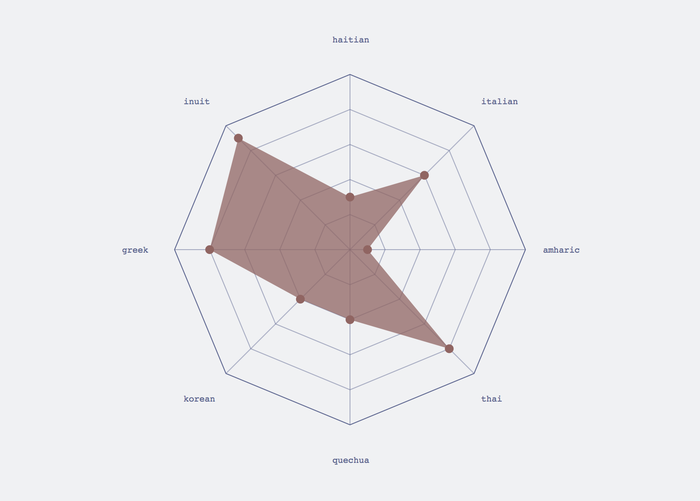

### Spider Charts

This radial visualization — sometimes called [polar or radar charts](https://en.wikipedia.org/wiki/Radar_chart) — is an ideal choice for giving viewers an intuitive sense of the relative differences amongst a set of objects to be compared across many different axes (that is to say, the data is *multivariate*). A circle is evenly divided amongst a set of data points per object, and the data is plotted in [polar coordinates](https://en.wikipedia.org/wiki/Polar_coordinate_system) through the circular. The emergent polygon becomes a *fingerprint* of the object — a single shape that identifies the object with respect to its data. Multiple polygons can be layered, though spider charts are at their most communcative when a population of objects can be simultaneously compared. 

The data visualization works of Italian designers Federica Fragapane and Valerio Pelligrini, both designing for the news journal *Corriere della Sera* which includes a prolific and significant [data visualization section](http://www.corriere.it/la-lettura/), have pushed the spider chart into contemporary data visualization preeminance.


[A World of Drugs - La Lettura #28 - Corriere della Sera](https://www.behance.net/FedericaFragapane) by Federica Fragapane]


[Opera - La Lettura #24 - Corriere della Sera](https://www.behance.net/valeriopellegrini) by Valerio Pelligrini


-----

Because of the circular nature of spider charts, which is a poor match to the cartesian nature of SVG, the code this week is significantly more complex than the D3 logic used in other visualizations. We need to rely on sine and cosine to plot our points in polar space, and run many loops to handle all of the data. 



You will also see in the code below a JS object being passed as an argument to our *spider()* function, which allows easy customization of the output. This is an emergent pattern in javascript culture, which is highly dynamic in its norms and conventions.

```js
<html>
<head>
	<style> 
	input{display:block;}
	body{font-family:courier;}
	</style>
	<title>spider</title>
</head>

<body>
	<script src="https://d3js.org/d3.v4.min.js"></script>
  
	<script>

		//display variables
		var width = 800;
		var height = 800;

		//make an svg container
		var svg = d3.select('body')
			.append('svg')
			.attr('width',width)
			.attr('height',height)
		;

		//black background
		var background = svg
			.append('rect')
			.attr('x',0)
			.attr('y',0)
			.attr('width',width)
			.attr('height',height)
			.attr('fill',"rgb(240, 241, 243)")
		;

		//some sample datasets to play with
		var dataset1 = [10,5,2,7,6,2,4,1];
		var dataset2 =[3,6,1,8,4,4,8,9];
		var dataset3 =[7,9,6,3,8,3,4,5];

		//the labels for the above datasets. if the count is mismatched between labels and data points, they won't align well
		var labels = ["haitian","italian","amharic","thai","quechua","korean","greek","inuit"]

		//this is an object containing all of the options for our visualization
		var args = {
			//which dataset and labels to render
			dataArray: dataset1,
			labelArray: labels,
			//all elements of visualizations are appended into an svg group with this id
			groupID: "illinois",
			//if this number is specced, the max of dataset is ignored. useful for prettier clamping
			maxOverride: 10,
			//center point of the visualzation
			x: width/2,
			y: height/2,
			//overall size
			radius: 200,
			//visualization chrome settings
			strokeWidth: 1,
			strokeColor: "#5A6592",
			//size for the dots at the polygon discontinuities
			pointSize: 3,
			//display settings for polygon
			spiderColor: '#976360',
			spiderOpacity: .75,
			//what kind of curve to draw. for best results, options include curveBasisClosed, curveCardinalClosed, curveCatmullRomClosed, curveLinearClosed 
			curvetype: d3.curveLinearClosed,
			//parameter relative to radius for text placement
			textOffset: 1.2,
			//text settings 
			textSize: 10,
			//what shape to make the overall viz. options include 'polygon', 'circle', and 'none'
			containerShape: "polygon",
			ringShape: "polygon",
			//how many tick rings
			ringCount: 5,
			//visibility of spokes
			spokeRingOpacity:.5,
			//booleans for drawing different parts of the plot
			drawCenter: false,
			drawContainer: true,
			drawSpokes: true,
			drawMarks: true,
			drawText: true,
			drawRings: true
		}
		
		//make our plot! 
		spider(args);


		//reusble function
		function spider(args) {	
			
			//container group with specified id
			svg
				.append('g')
				.attr('id', args.groupID)

			//draw center point
			if(args.drawCenter==true){
				d3.select('svg')
					.select("#"+args.groupID)
					.append('circle')
				    .attr('id','center')
					.attr("cx",args.x)
					.attr("cy",args.y)
					.attr("r",args.pointSize)
					.attr('fill',args.strokeColor)				
				;
			}

			//draw outermost container
			if(args.drawContainer == true){
				//outer container shape (ring or polygon)
				if(args.containerShape == "ring")	{
					d3.select('svg')
						.select("#"+args.groupID)
						.append("circle")
					    .attr('id','ring')
						.attr("cx",args.x)
						.attr("cy",args.y)
						.attr("r",args.radius)
						.attr('fill','none')
						.attr('stroke',args.strokeColor)				
						.attr('stroke-width',args.strokeWidth)				
					;
				}
				
				else if (args.containerShape == "polygon"){
					//empty array to hold points
					var points = [];
					//loop through based on dataset length and parameters of of tau
					for(var i = 0, j=0; j<(args.dataArray).length; i = i + ((2*Math.PI)/(args.dataArray).length), j++ ) {
						//populate array 
						points.push([ (Math.sin(i)*args.radius) + args.x, (-Math.cos(i)*args.radius) + args.y]);
					}

					//this line, kind of like a scale, converts data into svg drawing directions
					var polygonGen = d3.line().x(function(d){return d[0]}).y(function(d){return d[1]}).curve(d3.curveLinearClosed);

					//generate svg directions for our data
					var polygonPath = polygonGen(points);

					//draw polygon
					d3.select('svg')
						.select("#"+args.groupID)
						.append('path')
						.attr("d", polygonPath)
						.attr('stroke',args.strokeColor)
						.attr('stroke-width',args.strokeWidth)
						.attr('fill','none')
					;	
				}
				//don't draw any container
				else if (args.containerShape == "none"){return}
			}
			
			//draw radiating lines
			if(args.drawSpokes == true){
				//loop through based on dataset length and parameters of of tau
				for (var i = 0; i < 2*Math.PI ; i = i + (2*Math.PI)/(args.dataArray).length) {
					d3.select('svg')
						.select("#"+args.groupID)
						.append('line')
						.attr('x1',args.x)
						.attr('y1',args.y)
						.attr('x2',(Math.sin(i)*args.radius) + args.x)
						.attr('y2',(-Math.cos(i)*args.radius) + args.y)
						.attr('stroke',args.strokeColor)
						.attr('stroke-width',args.strokeWidth)
						.attr('opacity',args.spokeRingOpacity)
				}
			}

			//draw concentric rings with same shape options as container
			if(args.drawRings == true){
				if(args.ringShape == "polygon"){
					for ( var k=0; k < args.ringCount; k++){
						
						var ringPoints = [];
						
						//loop through based on dataset length and parameters of of tau
						for(var i = 0, j=0; j<(args.dataArray).length; i = i + ((2*Math.PI)/(args.dataArray).length), j++ ) {
							//populate array 
							ringPoints.push([ (Math.sin(i) * (args.radius / args.ringCount)*k) + args.x, (-Math.cos(i) * (args.radius / args.ringCount)*k) + args.y]);
						}

						//this line, kind of like a scale, converts data into svg drawing directions
						var polygonGen = d3.line().x(function(d){return d[0]}).y(function(d){return d[1]}).curve(d3.curveLinearClosed);

						//generate svg directions for our data
						var polygonPath = polygonGen(ringPoints);

						//draw polygon
						d3.select('svg')
							.select("#"+args.groupID)
							.append('path')
							.attr("d", polygonPath)
							.attr('stroke',args.strokeColor)
							.attr('stroke-width',args.strokeWidth)
							.attr('fill','none')
							.attr('opacity', args.spokeRingOpacity)
						;
					}
				}

				//simple circle
				else if(args.ringShape == "ring"){
					for (var k=0; k < args.ringCount; k++){
						d3.select('svg')
							.select("#"+args.groupID)
							.append('circle')
							.attr('cx',args.x)
							.attr('cy',args.y)
							.attr('r', (args.radius / args.ringCount)*k)
							.attr('fill','none')
							.attr('stroke',args.strokeColor)
							.attr('opacity', args.spokeRingOpacity)
							.attr('strokeWidth',args.strokeWidth)
						
					}
				}
			}

			//draw text labels
			if(args.drawText == true){
				d3.select('svg')
					.select("#"+args.groupID)
					.selectAll('.labels')
					.data(args.labelArray)
					.enter()
					.append("text")
				    .attr('class','labels')
					.attr("x", function(d,i){
						var step = Math.PI*2/args.labelArray.length;
						return (Math.sin(i*step)*args.radius*args.textOffset + args.x) - args.textSize*2;
					})
					.attr("y", function(d,i){
						var step = Math.PI*2/args.labelArray.length;
						return (-Math.cos(i*step)*args.radius*args.textOffset + args.y) + args.textSize/3;
					})
					.attr('fill', args.strokeColor)
					.text(function(d){return d})
					.attr('font-size',args.textSize);
				;
			}	

			//moving into the main spider polygon drawing
			
			//if a number should override the max value of the dataset for the domain of the data
			if(typeof args.maxOverride == "number"){
				var spiderMax = args.maxOverride;
			}
			else {
				var spiderMax = d3.max(args.dataArray, function(d){return d});
			}

			//scale for plotting radial points
			var spiderScale = d3.scalePow().exponent(1).domain([0,spiderMax]).range([0,args.radius]);

			//empty array for holding polygon points
			var points = [];

			//main loop to generate spider
			for(var i = 0, j=0; j<(args.dataArray).length; i = i + ((2*Math.PI)/(args.dataArray).length), j++ ) {
				//populate array 
				points.push([ (Math.sin(i)*spiderScale(args.dataArray[j])) + args.x, (-Math.cos(i)*spiderScale(args.dataArray[j])) + args.y])
				
				//draw points on spider
				if (args.drawMarks == true) {
					d3.select('svg')
						.select("#"+args.groupID)
						.append("circle")
					    .attr('id','marks')
						.attr("cx", (Math.sin(i) * spiderScale(args.dataArray[j])) + args.x)
						.attr("cy", (-Math.cos(i)* spiderScale(args.dataArray[j])) + args.y)
						.attr("r",args.pointSize)
						.attr('fill', args.spiderColor)

					;
				}
			}


			//this line, kind of like a scale, converts data into svg drawing directions
			var lineGen = d3.line().x(function(d){return d[0]}).y(function(d){return d[1]}).curve(args.curvetype);

			//generate svg directions for our data
			var linePath = lineGen(points);

			//add spider plot
			d3.select('svg')
				.select("#"+args.groupID)
				.append('path')
				.attr("d", linePath)
				.attr('fill',args.spiderColor)	
				.attr('opacity', args.spiderOpacity)
			;

		}

	</script>
</body>

</html>
```

-----

Let's talk about some basic [statistics stuff](stats.md) too!
