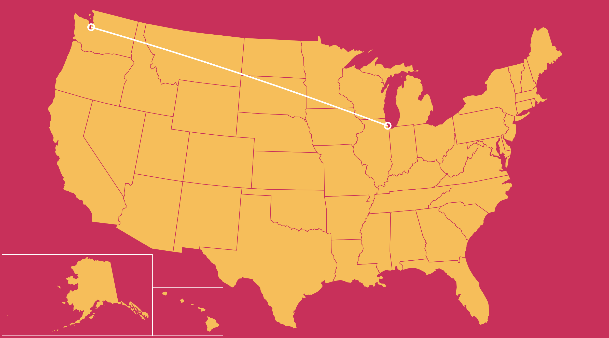
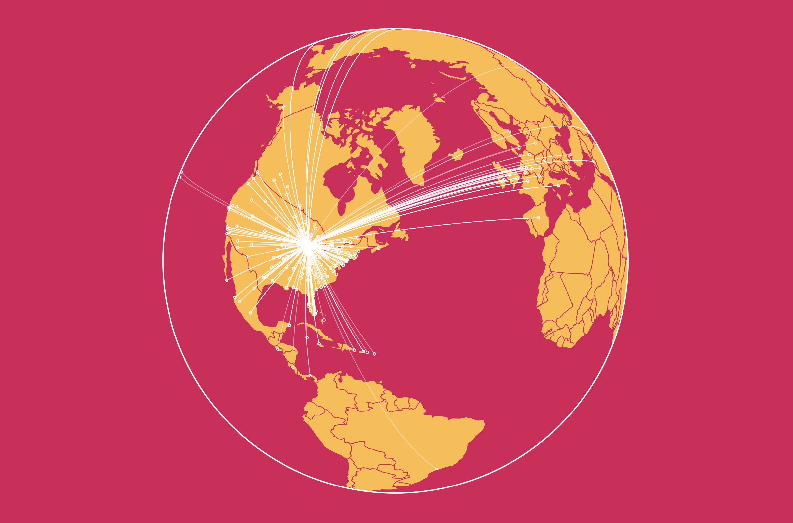

### GeoCircles and GeoArcs

Let's learn to programmatically draw some other sorts of geo-entities.

-----

##### GeoCircles

GeoCircles are circles placed on geographic visualizations that, unlike SVG circles, *are deformed by projection math*. This means that GeoCircles of the same size placed at different places on the globe will appear totally different from one another, depending on how the chosen projection distorts the sphere of the Earth. GeoCircles are [small circles](https://en.wikipedia.org/wiki/Circle_of_a_sphere), an intersection between a sphere and a plane which is [normal](https://en.wikipedia.org/wiki/Normal_(geometry)) to a line starting at the center of the earth and directed at some specific surface point on the sphere. The plane is made non-tangent, moved towards the center of the Earth, by setting a `radius` measured in degrees of longitude, and *not pixels*.

```
//construct circle
var circle = d3.geoCircle()
	.center( [lon,lat] )
	.radius(.25)()
;

//draw circle
g.append("path")
	.attr("d", path(circle) )
	.attr('fill', "none")
	.attr('stroke','white')
	.attr('stroke-width',3)
	.attr('class', 'circle')
;
```

##### GeoArcs

GeoArcs are [geodesic](https://en.wikipedia.org/wiki/Geodesic) segments of [Great Circles](https://en.wikipedia.org/wiki/Great_circle), the intersection between a plane which has its origin at the center of the Earth and a sphere. This will always bisect the sphere into two hemispheres, and GeoArcs will always be the shortest path between two points on the globe — approximating the routes that planes would ideally fly were wind and weather systems not a factor.

```
//construct arc
var connection = {type: "LineString", coordinates: [ [start.lon, start.lat] , [end.lon, end.lat] ] };

//draw arc
g.append("path")
	.attr("d", path(connection) )
	.attr('fill', "none")
	.attr('stroke','white')
	.attr('stroke-width',3)
	.attr('class', 'arc')
;
```

-----

This simple demo draws some GeoCircles and a GeoArc. Note the slight bend in the arc (the AlbersUSA projection minimally distorts over the continental US).



```html
<html>
<head>
	<style> 
	
	</style>
</head>

<body>
	<script src="https://d3js.org/d3.v4.min.js"></script>

	<script>

		//display variables
		var width = 1200;
		var height = width/1.5;
	
		//make an svg container for map
		var svg = d3.select('body')
			.append('svg')
			.attr('height',height)
			.attr('width',width)
		;

		//rectangular background for map svg
		var background = svg
			.append('rect')
			.attr('x',0)
			.attr('y',0)
			.attr('width',width)
			.attr('height',height)
			.attr('fill','#D81159')


		//append an svg group, into which we'll draw map stuff to keep our svg structure neat
   		var g = svg.append('g');

    	//setting up map projection
		var proj = d3.geoAlbersUsa()
  			.scale(1400)
  			.translate([width/2, height/2])
  			//to smooth drawn arcs -- default is .7
  			.precision(.1)
  		;

		//setting up path projector
	    var path = d3.geoPath()
	    	.projection(proj);
			
		//draw states
   		d3.json('us-states.json', function(err, geojson) {
			//disregard -- draw all of the states 
			g.selectAll('.states')
				.data(geojson.features)
				.enter()
				.append("path")
				.attr("d", path)
				.attr("class","states")
				.attr('fill', '#FFBC42')
				.attr('stroke','#D81159')
			; 

			//city coordinates
		    var chicago = {lon:-87.6298, lat:41.8781, name:"chicago"};
		    var dc = {lon:-77.0369, lat:38.9072, name:"washington dc"};
		    var honolulu = {lon:-157.8583, lat:21.3069, name:"honolulu"};
		    var anchorage = {lon:-149.9003, lat:61.2181, name:"anchorage"};
		    var seattle = {lon:-122.3321,lat:47.6062, name:"seattle"};
			
			//construct first circle
			var firstCircle = d3.geoCircle()
							.center([chicago.lon, chicago.lat])
							.radius(.25)()
			;

			//construct second circle
			var secondCircle = d3.geoCircle()
							.center([anchorage.lon, anchorage.lat])
							.radius(.25)()
			;

			//draw first circle
			g.append("path")
				.attr("d", path(firstCircle) )
				.attr('fill', "none")
				.attr('stroke','white')
				.attr('stroke-width',3)
				.attr('class', 'city')
			;

			//draw second circle
			g.append("path")
				.attr("d", path(secondCircle) )
				.attr('fill', "none")
				.attr('stroke','white')
				.attr('stroke-width',3)
				.attr('class', 'city')
			;
			
			//construct great arc
			var connection = {type: "LineString", coordinates: [ [chicago.lon, chicago.lat] , [anchorage.lon, anchorage.lat] ] };

			//draw arc
			g.append("path")
				.attr("d", path(connection) )
				.attr('fill', "none")
				.attr('stroke','white')
				.attr('stroke-width',3)
				.attr('class', 'arc')
			;
			
			//draw world outline (if needed)
			g.append("path")
	   			.datum({type: "Sphere"})
	    		.attr("id", "sphere")
	    		.attr("d", path)
	    		.attr('fill','none')
	    		.attr('stroke','white')
	    		.attr('stroke-width',1);

		})
			
	</script>
</body>
</html>
```

Switching the target city to Anchorage reveals the obvious effect of the AlbersUSA projection. Note how the Anchorage circle is smaller (AlbersUSA shows Alaska at 35% its real size), and the arc breaks across the interruptions in the projection.


-----

A more complex example demonstrates how to serially generate GeoCircles and GeoArcs by visualizing airplane routes from O'Hare Airport logged by [OpenFlights Data](https://openflights.org). Note in particular how the GeoCircles near the edges of the globe become highly elliptical, and the GeoArcs bend realistically. Importantly, projections take an optional `.precision()` setting that allows use to smooth out any kinks in the lines. By default, that number is set at .7, lower numbers (to a min of .01) mean higher precision and smoother lines at the cost of rendering time.



```html
<html>
<head>
	<style> 
	
	</style>
</head>

<body>
	<script src="https://d3js.org/d3.v4.min.js"></script>

	<script>

		//display variables
		var width = 1200;
		var height = width/1.5;
	
		//make an svg container for map
		var svg = d3.select('body')
			.append('svg')
			.attr('height',height)
			.attr('width',width)
		;

		//rectangular background for map svg
		var background = svg
			.append('rect')
			.attr('x',0)
			.attr('y',0)
			.attr('width',width)
			.attr('height',height)
			.attr('fill','#D81159')


		//append an svg group, into which we'll draw map stuff to keep our svg structure neat
   		var g = svg.append('g');

    	//setting up map projection
		var proj = d3.geoOrthographic()
  			.scale(350)
  			.rotate([57.6298, -41.8781])
  			.translate([width/2, height/2])
  			//to smooth drawn arcs -- default is .7
  			.precision(.1)
  		;

		//setting up path projector
	    var path = d3.geoPath()
	    	.projection(proj);
		
		//load airports lookup table
		d3.csv('airports.csv', function(err, airports){

			//expose airports by their 3 letter iata code
			var airportMap = d3.map(airports, function(d){return d.iata})

			//load routes from ORD data
			d3.csv('routes.csv', function(err, routes){

				//empty arrays for later population
				var arcs = [];
				var destinations = [];

				//evaluate each route
				routes.forEach(function(route){
					//get source airport (will always be ORD)
					var source = airportMap.get(route.SRCIATA);
					//get destination airport
					var destination = airportMap.get(route.DESTIATA);

					//ensure we have a match
					if(source && destination){
						//create linestring geo entity with coordinates
						arcs.push({type: "LineString", coordinates: [ [+source.lon, +source.lat] , [+destination.lon, +destination.lat] ] });
						//create simple lon-lat pair
						destinations.push([+destination.lon, +destination.lat]);
					}
				}) 

				//console.log(arcs);
				//console.log(destinations)

				//draw countries
		   		d3.json('world-110m.json', function(err, geojson) {
					//disregard -- draw all of the states 
					g.selectAll('.countries')
						.data(geojson.features)
						.enter()
						.append("path")
						.attr("d", path)
						.attr("class","countries")
						.attr('fill', '#FFBC42')
						.attr('stroke','#D81159')
					; 

				// Draw arcs
				g.selectAll(".arc")
				    .data(arcs)
				    .enter()
				    .append("path")
				    .attr('class','arc')
				    .attr('fill','none')
				    .attr('stroke', 'white')
				    .attr('stroke-width', 1)
				    .attr('d',path)
				    .attr('opacity', .5)
				    ;

				destCircles = [];

				//loop through all destination coordinates
				destinations.forEach(function(destination){
					//construct geoCircle
					destCircles.push( d3.geoCircle()
										.center(destination)
										.radius(.35)() 
					)
				})

				//draw destination circles
				g.selectAll(".destinations")
				    .data(destCircles)
				    .enter()
				    .append("path")
				    .attr('class','destinations')
				    .attr('stroke','white')
				    .attr('fill', 'none')
				    .attr('d',path)
				    ;

				//draw world outline
				g.append("path")
		   			.datum({type: "Sphere"})
		    		.attr("id", "sphere")
		    		.attr("d", path)
		    		.attr('fill','none')
		    		.attr('stroke','white')
		    		.attr('stroke-width',2);

				})
			})
		})				
	</script>
</body>
</html>
```

-----

Let's now take a look at how we can calculate if coordinates are [inside of](geocontents.md) other geo-objects.
