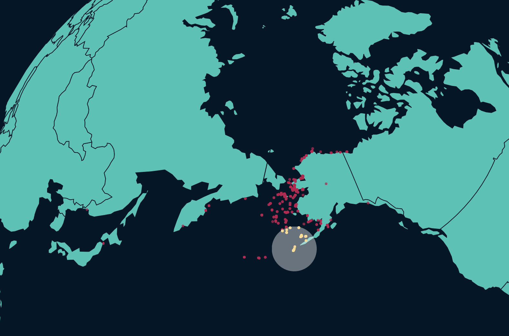
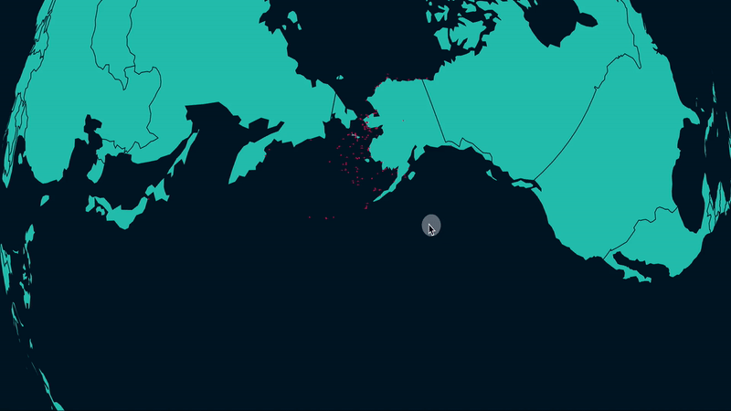

### Geo-Contents

Very often, we need to calculate if some geo-coordinate is *inside* of a *closed* geographic area — whether that be a county boundary, a territorial border, a simple geoCircle, or an algorithmic hull.

```
d3.geoContains( geoEntity, [longitude,latitude] )
```

The code above returns `true` if `[longitude,latitude]` is inside of feature `geoEntity` and `false` if not. `geoEntity` must be a geoJSON object. D3 leverages a super-fast instantiation of the [PiP Winding Number (Angle Subtension) Algorithm](https://en.wikipedia.org/wiki/Point_in_polygon), enabling the `geoContains()` function to run on thousands of elements per seconds without any meaningful slow down.

-----



Here, we visualize a dataset from the amazing [GBIF](https://www.gbif.org) on the Spotted Seal (*Phoca largha*). 


A geoCircle is drawn centered on [Unalaska, Alaska](https://en.wikipedia.org/wiki/Unalaska,_Alaska), the location of the [University of Alaska Fairbanks](https://en.wikipedia.org/wiki/University_of_Alaska_Fairbanks) remote zoological research center. We check and see if the seals are within that Unalaska geoCircle, and if so, change the seal fill to a brighter color.

Note the commented discussion about whether or not precomputing the results of `geoContains()` is appropriate.

```html
<html>
<head>
	<style> 
	
	</style>
</head>

<body>
	<script src="https://d3js.org/d3.v4.min.js"></script>

	<script>
		//display variables
		var width = 800;
		var height = 800;
		
		//look-at coordinate for projection
		var target = [-166.5332, 53.8844]

		//make an svg container for map
		var svg = d3.select('body')
			.append('svg')
			.attr('height',height)
			.attr('width',width)
						.call(d3.zoom()
				.scaleExtent([1, 5])
				.translateExtent([[-width/2, -height/2 ], [width*1.5,height*1.5]])
				.on("zoom", function () {
					g.attr("transform", d3.event.transform)
				})
			);
		;
		
		//rectangular background for map svg
		var background = svg
			.append('rect')
			.attr('x',0)
			.attr('y',0)
			.attr('width',width)
			.attr('height',height)
			.attr('fill','#011627')

		//append an svg group, into which we'll draw map stuff to keep our svg structure neat
   		var g = svg.append('g');

    	//setting up map projection
		var proj = d3.geoOrthographic()
			.rotate([-target[0],-target[1]])
  			.scale(500)
  			.translate([width/2, height/2]);
  			;

		//setting up path projector
	    var path = d3.geoPath()
	    	.projection(proj);
		
		//load seal sightings data
	    d3.csv('spotted-seal.csv',function(seals){

			//load geo data
	   		d3.json('world-110m.json', function(err, geojson) {
				//draw all of the countries 
				g.selectAll('.countries')
					.data(geojson.features)
					.enter()
					.append("path")
					.attr("d", path)
					.attr("class","countries")
					.attr('fill', '#2EC4B6')
					.attr('stroke','#011627')
				;
				
				//visualization	variables	
				var sealRad = .25;
				var cityRad = 4;

				//construct geo circle centered on target point
				var targetCircle = d3.geoCircle()
								.center(target)
								.radius(cityRad)()
				;

				//draw target geo circle
				g.append("path")
					.attr("d", path(targetCircle) )
					.attr('fill', "white")
					.attr('opacity', .4)
					.attr('id', 'city')
				;

				//here we precompute if the seals are in the target circle and store it in the seals data structure
				//if we do this, when we're making the seal dots, we can just ask for d.target -- easy!
				//we would definitely want to precompute if we needed the geoContains data many times and the data is static
				//but, if there was some interactivity, we would not want to precompute!
				//instead the contents of the forEach loop would be go inside of an anonymous function
				//during the construction of the objects
				seals.forEach(function(seal){
					//check if seal sighting is within target geoCircle radius...
					var inCircle = d3.geoContains( targetCircle, [seal.lon,seal.lat] )
					//add the geoContains results to each seal data object
					if(inCircle == true){
						seal.inside = true;
					}
					else{
						seal.inside = false;
					}
				})
				console.log(seals)


				//draw geo circles for seal sightings
				g.selectAll(".seals")
					.data(seals)
					.enter()
					.append("path")
					.attr('class', 'seals')
					.attr("d", function(d) { 
						var circle = d3.geoCircle()
							.center([d.lon,d.lat])
							.radius(sealRad)()
						;
						//generate circles
						return path(circle); 
					})
					.attr('fill', function(d){
						//choose color based on closeness to target
						if(d.inside == true){
							return '#ffda8e'
						}
						else{
							return "#bd1550"
						}
					})
					.attr('opacity', .75)
				;	
			})
		})

	</script>
</body>
</html>
```

-----

With a few tweaks, we can make `geoContains` dynamic. Here, precomputing the results is impossible since the geoCircle is constantly recalculating.



```html
<html>
<head>
	<style> 
	
	</style>
</head>

<body>
	<script src="https://d3js.org/d3.v4.min.js"></script>

	<script>
		//display variables
		var width = 1200;
		var height = 600;

		//look-at coordinate for projection
		var target = [-166.5332,53.8844]

		//make an svg container for map
		var svg = d3.select('body')
			.append('svg')
			.attr('height',height)
			.attr('width',width)
		;
		
		//rectangular background for map svg
		var background = svg
			.append('rect')
			.attr('x',0)
			.attr('y',0)
			.attr('width',width)
			.attr('height',height)
			.attr('fill','#011627')
		;

		//append an svg group, into which we'll draw map stuff to keep our svg structure neat
   		var g = svg.append('g');

    	//setting up map projection
		var proj = d3.geoOrthographic()
			.rotate([-target[0],-target[1]])
  			.scale(600)
  			.translate([width/2, height/2]);
  		;

		//setting up path projector
	    var path = d3.geoPath()
	    	.projection(proj)
	    ;
		
		//load seal sightings data
	    d3.csv('spotted-seal.csv',function(seals){

			//load us state geo data
	   		d3.json('world-110m.json', function(err, geojson) {
				//draw all of the states 
				g.selectAll('.states')
					.data(geojson.features)
					.enter()
					.append("path")
					.attr("d", path)
					.attr("class","states")
					.attr('fill', '#2EC4B6')
					.attr('stroke','#011627')
				;
				
				//visualization variables
				var sealRad = .1;
				var spotRad = 1.5;

				//draw geo circles for seal sightings
				g.selectAll(".seals")
					.data(seals)
					.enter()
					.append("path")
					.attr('class', 'seals')
					.attr("d", function(d) { 
						var circle = d3.geoCircle()
									.center([d.lon,d.lat])
									.radius(sealRad)()

						return path(circle); 
					})
					.attr('fill', "#bd1550")
					.attr('opacity', .75)
				;

				//grab the whole svg, and have it pay attention to mousemovement
				d3.select('svg')
					.on('mousemove', function(d){
						//get mouse coordinates in pixels
						var place = d3.mouse(this)

						//remove old geocircle spotlight
						g.select('#spot').remove()

						//construct new geo circle centered on mouse
						var spot = d3.geoCircle()
										.center(proj.invert(place))
										.radius(spotRad)()
						;

						//draw target geo circle
						g.append("path")
							.attr("d", path(spot) )
							.attr('fill', "white")
							.attr('opacity', .4)
							.attr('id', 'spot')
						;

						//check which seals are in new geocircle
						g.selectAll(".seals")
							.attr('fill', function(d){
							//check if seal sighting is within geoCircle...
							var inCircle = d3.geoContains( spot, [d.lon,d.lat] )

							//choose color based on bounds of spotlight
							if(inCircle == true){
								return '#ffda8e'
							}
							else{
								return "#bd1550"
							}
						})
					})
				;
			})
		})

	</script>
</body>
</html>
```

-----

Let's now take a look at some [projection-related utilities](reproj.md) to solve specific geo-data problems.
