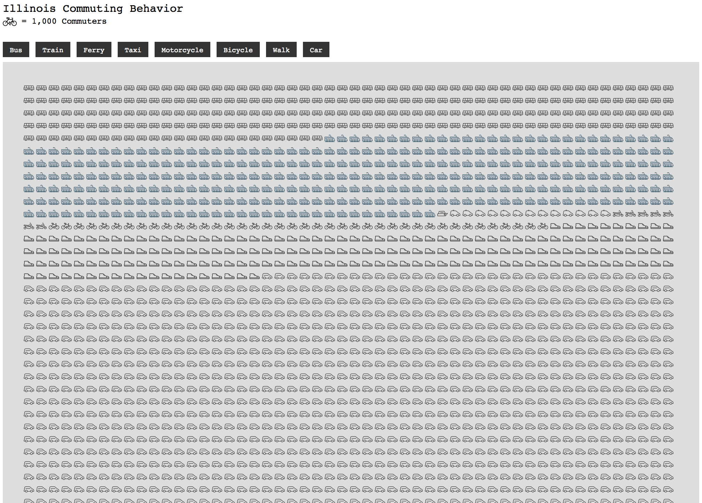

### Matrix Plot with Precomposed SVG Content

Same plot and logic as before, but with icons prepared in Adobe Illustrator.



-----

Each icon was pulled from the [Noun Project](https://thenounproject.com), from user [DinoSoft Labs](https://thenounproject.com/dinosoftlabs/collection/transport-line-icons/). 

In Adobe Illustrator, artboards scaled to 100 x 100 pixels were used so that later scaling is straighforward. 

- Make 100x100 pixel artboard
- Paste vector artwork (from a source or better yet, of your own design!) and size it to fit. The styles will be ignored, so black fills are fine.
- `Object -> Ungroup` everything until left with only paths and compound paths.
- `Selection -> Select All` and use the `Window -> Pathfinder` palette to `Unite` everything
- `File -> Save As` and under format select `SVG`. 
- Click `Save`
- In the window that pops up, click `SVG Code...` and a text window will open.
- Copy everything and paste into Sublime for easier editing. It will look something like this, though the amount of svg code will vary with the complexity of your assets.

```html
<?xml version="1.0" encoding="utf-8"?>
<!-- Generator: Adobe Illustrator 16.0.0, SVG Export Plug-In . SVG Version: 6.00 Build 0)  -->
<!DOCTYPE svg PUBLIC "-//W3C//DTD SVG 1.1//EN" "http://www.w3.org/Graphics/SVG/1.1/DTD/svg11.dtd">
<svg version="1.1" id="Layer_1" xmlns="http://www.w3.org/2000/svg" xmlns:xlink="http://www.w3.org/1999/xlink" x="0px" y="0px"
	 width="100px" height="100px" viewBox="0 0 100 100" enable-background="new 0 0 100 100" xml:space="preserve">
<g>
	<path fill="#010101" d="M98.509,62.176c-1.189-8.246-8.297-14.611-17.018-14.611c-8.709,0-17.052-3.225-23.491-9.081l-3.489-3.172
		l0.493-0.329l-2.701-4.052l-1.506,1.004l-7.133-6.484c-1.588-1.441-3.646-2.238-5.791-2.238H8.726
		c-1.331,0-2.617,0.558-3.527,1.532c-0.909,0.974-1.379,2.293-1.288,3.624l0.584,8.623l0.088,0.504
		c0.913,3.194,0.596,6.591-0.89,9.564l-0.214,0.432c-1.427,2.859-2.182,6.056-2.182,9.252v5.432v4.87v6.303
		c0,1.897,1.541,3.438,3.438,3.438h90.529c1.897,0,3.438-1.541,3.438-3.438v-6.303v-2.435v-2.436H98.509z M6.167,56.744
		c0-2.444,0.577-4.89,1.671-7.072l0.214-0.432c1.994-3.989,2.447-8.535,1.285-12.833l-0.608-8.323h29.145
		c0.933,0,1.826,0.346,2.513,0.969l6.234,5.667l-1.624,1.083l2.701,4.052l2.638-1.758l0.922,0.838l-6.261,4.173l2.702,4.052
		l7.281-4.854c7.307,6.532,16.706,10.128,26.679,10.128c5.879,0,10.802,4.189,11.929,9.74h-41.15V50h-4.871v12.176H6.167V56.744z
		 M93.833,71.917H6.167v-4.871h87.666V71.917z"/>
	<path fill="#010101" d="M25.667,39.94c-2.545,0.077-0.925,6.134-5.439,7.754s-9.607,3.819-4.861,5.556s11.227-4.746,11.227-6.655
		S29.486,39.824,25.667,39.94z"/>
</g>
</svg>
```

- Note that, if your svg code includes elements other than `<path>`s, like `<circle>`s or `<rect>`s, you'll want to move some of the control points *a little bit* in AI on those geometric elements to make them somewhat irregular, so that AI exports *only paths*.
- We are only interested in the `<path>` elements, and specifically their `d="..."` attributes. Delete everything before and after, leaving only the contents of the `d=""` parts. Don't forget to remove the closing brackets — `"/>` — of the `<path>` tags.

```
M98.509,62.176c-1.189-8.246-8.297-14.611-17.018-14.611c-8.709,0-17.052-3.225-23.491-9.081l-3.489-3.172
		l0.493-0.329l-2.701-4.052l-1.506,1.004l-7.133-6.484c-1.588-1.441-3.646-2.238-5.791-2.238H8.726
		c-1.331,0-2.617,0.558-3.527,1.532c-0.909,0.974-1.379,2.293-1.288,3.624l0.584,8.623l0.088,0.504
		c0.913,3.194,0.596,6.591-0.89,9.564l-0.214,0.432c-1.427,2.859-2.182,6.056-2.182,9.252v5.432v4.87v6.303
		c0,1.897,1.541,3.438,3.438,3.438h90.529c1.897,0,3.438-1.541,3.438-3.438v-6.303v-2.435v-2.436H98.509z M6.167,56.744
		c0-2.444,0.577-4.89,1.671-7.072l0.214-0.432c1.994-3.989,2.447-8.535,1.285-12.833l-0.608-8.323h29.145
		c0.933,0,1.826,0.346,2.513,0.969l6.234,5.667l-1.624,1.083l2.701,4.052l2.638-1.758l0.922,0.838l-6.261,4.173l2.702,4.052
		l7.281-4.854c7.307,6.532,16.706,10.128,26.679,10.128c5.879,0,10.802,4.189,11.929,9.74h-41.15V50h-4.871v12.176H6.167V56.744z
		 M93.833,71.917H6.167v-4.871h87.666V71.917z

M25.667,39.94c-2.545,0.077-0.925,6.134-5.439,7.754s-9.607,3.819-4.861,5.556s11.227-4.746,11.227-6.655
		S29.486,39.824,25.667,39.94z
```

- Remove any line breaks and tabs and combine the path directions for all paths. Spaces are fine to separate the paths, but they should all be on one line.

```
M98.509,62.176c-1.189-8.246-8.297-14.611-17.018-14.611c-8.709,0-17.052-3.225-23.491-9.081l-3.489-3.172l0.493-0.329l-2.701-4.052l-1.506,1.004l-7.133-6.484c-1.588-1.441-3.646-2.238-5.791-2.238H8.726c-1.331,0-2.617,0.558-3.527,1.532c-0.909,0.974-1.379,2.293-1.288,3.624l0.584,8.623l0.088,0.504c0.913,3.194,0.596,6.591-0.89,9.564l-0.214,0.432c-1.427,2.859-2.182,6.056-2.182,9.252v5.432v4.87v6.303c0,1.897,1.541,3.438,3.438,3.438h90.529c1.897,0,3.438-1.541,3.438-3.438v-6.303v-2.435v-2.436H98.509z M6.167,56.744c0-2.444,0.577-4.89,1.671-7.072l0.214-0.432c1.994-3.989,2.447-8.535,1.285-12.833l-0.608-8.323h29.145c0.933,0,1.826,0.346,2.513,0.969l6.234,5.667l-1.624,1.083l2.701,4.052l2.638-1.758l0.922,0.838l-6.261,4.173l2.702,4.052l7.281-4.854c7.307,6.532,16.706,10.128,26.679,10.128c5.879,0,10.802,4.189,11.929,9.74h-41.15V50h-4.871v12.176H6.167V56.744zM93.833,71.917H6.167v-4.871h87.666V71.917z M25.667,39.94c-2.545,0.077-0.925,6.134-5.439,7.754s-9.607,3.819-4.861,5.556s11.227-4.746,11.227-6.655S29.486,39.824,25.667,39.94z
```

- We can now set a variable in JS equal to that path direction string, and use it in our D3 code!

```js
var shoe = "M98.509,62.176c-1.189-8.246-8.297-14.611-17.018-14.611c-8.709,0-17.052-3.225-23.491-9.081l-3.489-3.172l0.493-0.329l-2.701-4.052l-1.506,1.004l-7.133-6.484c-1.588-1.441-3.646-2.238-5.791-2.238H8.726c-1.331,0-2.617,0.558-3.527,1.532c-0.909,0.974-1.379,2.293-1.288,3.624l0.584,8.623l0.088,0.504c0.913,3.194,0.596,6.591-0.89,9.564l-0.214,0.432c-1.427,2.859-2.182,6.056-2.182,9.252v5.432v4.87v6.303c0,1.897,1.541,3.438,3.438,3.438h90.529c1.897,0,3.438-1.541,3.438-3.438v-6.303v-2.435v-2.436H98.509z M6.167,56.744c0-2.444,0.577-4.89,1.671-7.072l0.214-0.432c1.994-3.989,2.447-8.535,1.285-12.833l-0.608-8.323h29.145c0.933,0,1.826,0.346,2.513,0.969l6.234,5.667l-1.624,1.083l2.701,4.052l2.638-1.758l0.922,0.838l-6.261,4.173l2.702,4.052l7.281-4.854c7.307,6.532,16.706,10.128,26.679,10.128c5.879,0,10.802,4.189,11.929,9.74h-41.15V50h-4.871v12.176H6.167V56.744zM93.833,71.917H6.167v-4.871h87.666V71.917z M25.667,39.94c-2.545,0.077-0.925,6.134-5.439,7.754s-9.607,3.819-4.861,5.556s11.227-4.746,11.227-6.655S29.486,39.824,25.667,39.94z
"

svg.append('path').attr('d', shoe).attr('fill','red');
```

- Because the drawing directions are relative to the 0,0 upper-left origin point and fit in a 100x100 square, we can use the svg `transform()` attribute [to move, scale, and rotate the vectors](https://developer.mozilla.org/en-US/docs/Web/SVG/Tutorial/Basic_Transformations) into desired or data-driven positions.

```js
svg.append('path')
	.attr('d', ...)
	.attr('transform', function(d,i){ 

		//desired upper left hand corner position
		var x = 300;
		var y = 500;
		//desired width / height of icon
		var size = 24;

		//placement and scaling based on 100x100 illustrator artboard, so we multiply the desired size by .01
		return "translate(" + x + "," + y + ") scale(" + size * .01 + ")";
})
```

- The logic above is placing and scaling relative to the upper-left origin corner, so some additional tweaks (add or subtract a few pixels) may be necessary to the `x` and `y` values. The code below plots the *center* of the icon at the desired position.

```js
svg.append('path')
	.attr('d', ...)
	.attr('transform', function(d,i){ 

		//desired upper left hand corner position
		var x = 300;
		var y = 500;
		//desired width / height of icon
		var size = 24;

		//placement and scaling based on 100x100 illustrator artboard, so we multiply the desired size by .01
		return "translate(" + (x - (size *.01))/2 + "," + (y - (size *.01))/2 + ") scale(" + size * .01 + ")";
})
```

-----

Compared to the last simple matrix plot example, the big difference is that the elements are generated with a standard D3 `.selectAll(...).data(...).enter()` loop. The icons are placed with logic based on the [modulo](https://en.wikipedia.org/wiki/Modulo_operation) — which is represented by the `%` sign — an arithmetic operation that is rarely encountered outside of computer science and 2nd grade mathematics. It returns the *remainder* of a division problem, which enables grid plotting without nested loops.

```html
<html>
<head>
	<title>
		Illinois Commuting Behavior
	</title>

	<meta charset="utf-8">
	<style>
		.switch{
			padding-top: 5px;
			padding-bottom: 5px;
			padding-left: 10px;
			padding-right: 10px;
			background-color: #333;
			color:white;	
			text-align: center;
			margin-right:5px;
			display:inline;
			font-family: courier;
			box-sizing:border-box;
			font-size:10px;
			cursor: pointer;
		}

		.switch:hover{background-color:#ccc;}

		#controls {margin-top:20px; margin-bottom:10px;}

		#title{font-family: courier; margin-top:20px;}

		#subtitle{font-family: courier; font-size:12px;}
}
	</style>

</head>

<body>
	<div id='title'>Illinois Commuting Behavior</div>
	<div id='subtitle'><svg style="vertical-align: middle" width="20" height="20"><path transform="scale(.2)" d="M81.307,43.723c-2.477,0-4.836,0.493-7.003,1.368l-1.376-2.557V24.939c0-1.153-0.934-2.087-2.088-2.087h-7.594v4.175h5.508v6.261H41.489v-1.533h2.348c2.925,0,5.303-2.38,5.303-5.305v-0.346c0-2.868-2.289-5.214-5.133-5.303l-14.219-2.067c-0.597-0.089-1.208,0.091-1.666,0.487c-0.458,0.396-0.721,0.973-0.721,1.578v8.87c0,1.153,0.933,2.086,2.087,2.086h7.825v3.354L28.473,46.5c-2.853-1.75-6.194-2.777-9.779-2.777c-10.357,0-18.783,8.426-18.783,18.784S8.336,81.29,18.694,81.29c9.651,0,17.618-7.318,18.661-16.695h4.571c0.894,3.453,3.94,6.039,7.621,6.237l1.314,6.688l4.096-0.806L53.64,70.01c2.783-1.355,4.71-4.204,4.71-7.503c0-1.729-0.527-3.335-1.43-4.669l13.316-11.495l0.393,0.729c-4.893,3.394-8.107,9.043-8.107,15.435c0,10.357,8.426,18.783,18.785,18.783c10.357,0,18.783-8.426,18.783-18.783S91.664,43.723,81.307,43.723z M31.575,23.211l11.962,1.739c0.098,0.014,0.199,0.022,0.299,0.022c0.622,0,1.129,0.508,1.129,1.131v0.346c0,0.624-0.507,1.131-1.129,1.131H31.575V23.211z M18.694,77.117c-8.055,0-14.609-6.556-14.609-14.61s6.554-14.61,14.609-14.61c2.622,0,5.078,0.704,7.208,1.918l-8.856,11.412l3.298,2.56l8.854-11.409c2.537,2.629,4.106,6.197,4.106,10.13C33.304,70.562,26.749,77.117,18.694,77.117z M41.926,60.419h-4.571c-0.494-4.438-2.539-8.407-5.579-11.365l8.996-11.592h27.982v4.649L53.755,55.06c-1-0.506-2.114-0.813-3.294-0.878l-1.559-6.166l-4.047,1.023l1.507,5.965C44.187,56.062,42.543,58.032,41.926,60.419z M50,66.681c-2.301,0-4.174-1.873-4.174-4.174c0-2.302,1.873-4.173,4.174-4.173c2.301,0,4.174,1.871,4.174,4.173C54.174,64.808,52.301,66.681,50,66.681z M81.307,77.117c-8.055,0-14.609-6.556-14.609-14.61c0-4.802,2.34-9.059,5.929-11.723l6.841,12.711l3.678-1.977L76.3,48.799c1.564-0.574,3.246-0.903,5.007-0.903c8.055,0,14.607,6.556,14.607,14.61S89.361,77.117,81.307,77.117z" /></svg> = 1,000 Commuters</div>

	<div id="controls">
		<div id="bus" class="switch">Bus</div>
		<div id="train" class="switch">Train</div>
		<div id="ferry" class="switch">Ferry</div>
		<div id="taxi" class="switch">Taxi</div>
		<div id="motorcycle" class="switch">Motorcycle</div>
		<div id="bicycle" class="switch">Bicycle</div>
		<div id="walk" class="switch">Walk</div>
		<div id="car" class="switch">Car</div>
	</div>

	<script src="https://d3js.org/d3.v4.min.js"></script>
	<script src="https://d3js.org/d3-scale-chromatic.v1.min.js"></script>
	<script src="https://d3js.org/d3-geo-projection.v2.min.js"></script>

	<script>
			//paths from 100x100 artboard AI, sourced from Noun Project user DinoSoft Labs https://thenounproject.com/dinosoftlabs/collection/transport-line-icons/
			var bicycle = 'M81.307,43.723c-2.477,0-4.836,0.493-7.003,1.368l-1.376-2.557V24.939c0-1.153-0.934-2.087-2.088-2.087h-7.594v4.175h5.508v6.261H41.489v-1.533h2.348c2.925,0,5.303-2.38,5.303-5.305v-0.346c0-2.868-2.289-5.214-5.133-5.303l-14.219-2.067c-0.597-0.089-1.208,0.091-1.666,0.487c-0.458,0.396-0.721,0.973-0.721,1.578v8.87c0,1.153,0.933,2.086,2.087,2.086h7.825v3.354L28.473,46.5c-2.853-1.75-6.194-2.777-9.779-2.777c-10.357,0-18.783,8.426-18.783,18.784S8.336,81.29,18.694,81.29c9.651,0,17.618-7.318,18.661-16.695h4.571c0.894,3.453,3.94,6.039,7.621,6.237l1.314,6.688l4.096-0.806L53.64,70.01c2.783-1.355,4.71-4.204,4.71-7.503c0-1.729-0.527-3.335-1.43-4.669l13.316-11.495l0.393,0.729c-4.893,3.394-8.107,9.043-8.107,15.435c0,10.357,8.426,18.783,18.785,18.783c10.357,0,18.783-8.426,18.783-18.783S91.664,43.723,81.307,43.723z M31.575,23.211l11.962,1.739c0.098,0.014,0.199,0.022,0.299,0.022c0.622,0,1.129,0.508,1.129,1.131v0.346c0,0.624-0.507,1.131-1.129,1.131H31.575V23.211z M18.694,77.117c-8.055,0-14.609-6.556-14.609-14.61s6.554-14.61,14.609-14.61c2.622,0,5.078,0.704,7.208,1.918l-8.856,11.412l3.298,2.56l8.854-11.409c2.537,2.629,4.106,6.197,4.106,10.13C33.304,70.562,26.749,77.117,18.694,77.117z M41.926,60.419h-4.571c-0.494-4.438-2.539-8.407-5.579-11.365l8.996-11.592h27.982v4.649L53.755,55.06c-1-0.506-2.114-0.813-3.294-0.878l-1.559-6.166l-4.047,1.023l1.507,5.965C44.187,56.062,42.543,58.032,41.926,60.419z M50,66.681c-2.301,0-4.174-1.873-4.174-4.174c0-2.302,1.873-4.173,4.174-4.173c2.301,0,4.174,1.871,4.174,4.173C54.174,64.808,52.301,66.681,50,66.681z M81.307,77.117c-8.055,0-14.609-6.556-14.609-14.61c0-4.802,2.34-9.059,5.929-11.723l6.841,12.711l3.678-1.977L76.3,48.799c1.564-0.574,3.246-0.903,5.007-0.903c8.055,0,14.607,6.556,14.607,14.61S89.361,77.117,81.307,77.117z';

			var train = 'M82.653,76.766h16.77v-2.059c0-20.885-16.445-37.997-37.067-39.072v-8.254h-4.118v8.199H0.577v41.185h14.972c0.418,1.621,1.315,3.049,2.536,4.123H4.689v4.119h90.609v-4.119H80.117C81.337,79.814,82.234,78.387,82.653,76.76M15.551,72.648H4.695V39.699h53.542h2.06c18.612,0,33.878,14.601,34.947,32.949H82.65c-0.919-3.545-4.136-6.175-7.966-6.175c-3.829,0-7.046,2.63-7.965,6.175h-9.653c-0.919-3.545-4.136-6.175-7.966-6.175c-3.829,0-7.045,2.63-7.964,6.175h-9.654c-0.919-3.545-4.136-6.175-7.965-6.175C19.688,66.474,16.47,69.104,15.551,72.648z M78.805,74.711c0,2.271-1.849,4.119-4.12,4.119c-2.27,0-4.117-1.849-4.117-4.119c0-2.269,1.848-4.117,4.117-4.117C76.956,70.594,78.805,72.442,78.805,74.711z M49.101,78.83c-2.269,0-4.118-1.849-4.118-4.119c0-2.269,1.849-4.117,4.118-4.117c2.271,0,4.119,1.849,4.119,4.117C53.22,76.981,51.371,78.83,49.101,78.83z M27.636,74.711c0,2.271-1.849,4.119-4.119,4.119s-4.119-1.849-4.119-4.119c0-2.269,1.848-4.117,4.119-4.117S27.636,72.442,27.636,74.711z M31.484,76.766h9.649c0.418,1.621,1.316,3.049,2.536,4.123H28.949C30.169,79.814,31.065,78.387,31.484,76.766z M54.533,80.889c1.22-1.074,2.118-2.502,2.536-4.123h9.648c0.418,1.621,1.316,3.049,2.535,4.123H54.533z M82.943,60.296c0-7.948-6.468-14.415-14.415-14.415H10.867v16.475h72.076V60.296z M14.986,58.237V50h53.542c4.972,0,9.132,3.543,10.088,8.238H14.986z M39.931,21.785l4.634,2.478c0.927,0.497,2.074,0.211,2.669-0.653l2.438-3.564c1.789,1.305,4.238,2.695,6.15,2.371c0.34,0.11,1.024,1.072,1.359,1.909c0.317,0.81,1.094,1.307,1.916,1.307c0.25,0,0.502-0.044,0.748-0.141c1.06-0.413,1.583-1.607,1.171-2.667c-0.913-2.349-2.98-4.93-5.747-4.473c-0.004,0-0.011,0-0.018,0c-0.729,0-2.982-1.376-4.669-2.85c-0.444-0.388-1.031-0.565-1.614-0.495c-0.586,0.074-1.11,0.394-1.442,0.88l-2.648,3.872l-3.005-1.607c-1.005-0.535-2.252-0.159-2.787,0.844C38.549,20.001,38.927,21.248,39.931,21.785z';

			var motorcycle = 'M19.583,58.272l2.77-6.269c0.725,0.033,1.45,0.066,2.175,0.066h10.86c3.492,0,6.333-2.841,6.333-6.333c0-3.355-2.729-6.085-6.085-6.085H24.528c-3.526,0-7.05-0.435-10.477-1.291l-6.163-1.54c-1.827-0.463-3.732-0.057-5.22,1.106c-1.489,1.159-2.341,2.909-2.341,4.795c0,2.8,1.896,5.228,4.609,5.904l8.111,2.028c1.634,0.408,3.292,0.713,4.958,0.944l-2.211,5.004c-0.978-0.248-1.996-0.395-3.05-0.395c-6.848,0-12.418,5.57-12.418,12.419c0,6.848,5.57,12.418,12.418,12.418c6.848,0,12.418-5.57,12.418-12.418C25.164,64.307,22.941,60.497,19.583,58.272z M5.939,44.614c-0.867-0.219-1.473-0.995-1.473-1.891c0-0.604,0.272-1.161,0.749-1.534c0.347-0.271,0.764-0.411,1.192-0.411c0.158,0,0.319,0.02,0.478,0.059l6.163,1.54c3.754,0.939,7.617,1.414,11.48,1.414h11.107c1.073,0,1.947,0.875,1.947,1.947c0,1.208-0.985,2.194-2.194,2.194h-10.86c-3.526,0-7.05-0.436-10.476-1.29L5.939,44.614z M12.745,76.907c-4.565,0-8.279-3.714-8.279-8.278c0-4.566,3.714-8.279,8.279-8.279c0.458,0,0.905,0.047,1.343,0.119l-3.235,7.322c-0.462,1.046,0.011,2.268,1.056,2.731c0.272,0.119,0.556,0.175,0.836,0.175c0.794,0,1.552-0.458,1.894-1.232l3.235-7.323c1.916,1.518,3.15,3.858,3.15,6.487C21.024,73.193,17.31,76.907,12.745,76.907z M87.255,54.141c-1.157,0-2.272,0.171-3.336,0.469l-11.35-24.118c-0.486-1.035-1.719-1.477-2.754-0.993c-1.033,0.488-1.478,1.721-0.991,2.755l11.35,24.116c-3.222,2.246-5.338,5.973-5.338,10.188c0,6.848,5.57,12.418,12.419,12.418c6.848,0,12.418-5.57,12.418-12.418S94.103,54.141,87.255,54.141z M87.255,74.838c-4.565,0-8.278-3.713-8.278-8.279c0-2.559,1.167-4.849,2.995-6.368l3.411,7.248c0.353,0.752,1.097,1.19,1.873,1.19c0.295,0,0.596-0.062,0.881-0.197c1.032-0.485,1.478-1.72,0.99-2.755l-3.411-7.249c0.499-0.094,1.013-0.148,1.539-0.148c4.565,0,8.278,3.713,8.278,8.279S91.82,74.838,87.255,74.838z M70.697,54.285H37.582c-1.143,0-2.07,0.926-2.07,2.07c0,1.144,0.927,2.069,2.07,2.069h29.92l-6.38,14.245l-26.24-1.876l-3.658-9.144c-0.424-1.061-1.624-1.579-2.69-1.153c-1.062,0.424-1.578,1.629-1.154,2.69l4.14,10.347c0.295,0.736,0.984,1.24,1.774,1.297L62.271,76.9c0.05,0.006,0.1,0.007,0.148,0.007c0.811,0,1.552-0.475,1.888-1.224l8.28-18.481c0.286-0.642,0.229-1.383-0.152-1.973C72.053,54.642,71.398,54.285,70.697,54.285z M58.934,25.057l4.709-1.568l3.264,4.893c0.398,0.599,1.055,0.922,1.724,0.922c0.394,0,0.793-0.113,1.146-0.348c0.951-0.635,1.208-1.918,0.574-2.871l-4.141-6.209c-0.518-0.778-1.489-1.115-2.376-0.814 l-6.209,2.07c-1.084,0.36-1.67,1.532-1.309,2.618C56.677,24.833,57.848,25.418,58.934,25.057zM48.397,52.07h13.161c3.913,0,7.221-2.801,7.862-6.661l0.402-2.415c0.312-1.867-0.211-3.766-1.435-5.21c-1.225-1.443-3.011-2.272-4.903-2.272h-7.742c-6.591,0-11.951,5.362-11.951,11.952C43.791,50.005,45.857,52.07,48.397,52.07z M55.742,39.652h7.742c0.684,0,1.304,0.286,1.745,0.809c0.441,0.521,0.623,1.18,0.511,1.855l-0.403,2.412c-0.309,1.856-1.898,3.203-3.779,3.203H48.397c-0.257,0-0.467-0.21-0.467-0.468C47.93,43.157,51.435,39.652,55.742,39.652z';

			var bus = 'M99.787,47.958c-0.001-0.006-0.002-0.013-0.004-0.02c-0.01-0.045-0.01-0.092-0.023-0.137L93.53,27.035c-0.264-0.878-1.073-1.48-1.99-1.48H10.606l-4.17-0.105c-1.17,0.026-2.1,0.876-2.128,2.024c-0.029,1.146,0.877,2.099,2.022,2.13l1.186,0.03L0.432,47.344c-0.172,0.302-0.278,0.647-0.278,1.02v16.613c0,1.148,0.93,2.078,2.077,2.078h10.424c0.409,4.201,3.959,7.496,8.265,7.496c4.307,0,7.856-3.295,8.266-7.496h39.537c0.409,4.201,3.958,7.496,8.266,7.496c4.306,0,7.855-3.295,8.265-7.496h12.5c1.147,0,2.076-0.93,2.076-2.078V48.538C99.842,48.345,99.829,48.151,99.787,47.958zM11.96,29.708h13.112v16.58H5.328L11.96,29.708z M52.067,46.288v-16.58h18.689v16.58H52.067z M47.915,46.288H29.226v-16.58h18.689V46.288z M94.968,46.288H74.91v-16.58h15.085L94.968,46.288z M20.919,70.396c-2.291,0-4.153-1.863-4.153-4.152s1.863-4.152,4.153-4.152s4.153,1.863,4.153,4.152S23.21,70.396,20.919,70.396z M76.987,70.396c-2.291,0-4.154-1.863-4.154-4.152s1.863-4.152,4.154-4.152c2.29,0,4.152,1.863,4.152,4.152S79.277,70.396,76.987,70.396z M84.585,62.9c-1.29-2.919-4.208-4.963-7.598-4.963c-3.392,0-6.31,2.044-7.599,4.963H28.518c-1.289-2.919-4.208-4.963-7.598-4.963c-3.39,0-6.309,2.044-7.598,4.963H4.307V50.473h91.369V62.9H84.585zM63.49,54.262H34.417c-1.147,0-2.077,0.93-2.077,2.076c0,1.148,0.93,2.076,2.077,2.076H63.49c1.146,0,2.074-0.928,2.074-2.076C65.564,55.191,64.637,54.262,63.49,54.262z';
		
			var car = "M0.83,60.484v4.824c0,2.857,2.322,5.18,5.178,5.18h7.832c1.692,4.768,6.234,8.195,11.576,8.195c5.341,0,9.883-3.428,11.575-8.195H63.01c1.693,4.768,6.235,8.195,11.575,8.195c5.341,0,9.883-3.428,11.576-8.195h10.961c1.132,0,2.048-0.918,2.048-2.051V56.146c0-0.211-0.031-0.42-0.096-0.619c-2.406-7.608-14.63-12.49-17.29-13.472l-17.389-15c-4.289-3.702-9.819-5.738-15.568-5.738H19.814c-6.123,0-11.39,4.237-12.517,10.076L4.966,43.465c-0.026,0.128-0.038,0.258-0.038,0.389V54.93C3.324,55.902,0.83,57.836,0.83,60.484z M66.39,66.391c0-4.52,3.676-8.195,8.195-8.195c4.521,0,8.195,3.676,8.195,8.195c0,0.547-0.056,1.1-0.166,1.643v0.002c-0.764,3.732-4.073,6.549-8.029,6.549c-3.953,0-7.26-2.812-8.027-6.539c-0.001-0.006,0-0.012-0.001-0.018C66.446,67.49,66.39,66.938,66.39,66.391z M17.22,66.391c0-4.52,3.676-8.195,8.196-8.195c4.519,0,8.194,3.676,8.194,8.195c0,0.547-0.057,1.1-0.167,1.643c-0.001,0.002,0,0.006-0.001,0.008c-0.766,3.73-4.072,6.543-8.026,6.543c-3.953,0-7.261-2.812-8.028-6.539c-0.002-0.006,0-0.012-0.002-0.018C17.276,67.49,17.22,66.938,17.22,66.391z M4.928,60.484c0-0.477,1.38-1.746,2.932-2.488c0.71-0.342,1.165-1.062,1.165-1.85V44.048l2.295-11.879c0.756-3.914,4.33-6.754,8.495-6.754h29.013c4.766,0,9.346,1.685,12.892,4.741l17.674,15.248c0.192,0.166,0.417,0.297,0.656,0.38c3.582,1.272,13.127,5.626,15.024,10.705v9.902h-8.195c0-6.779-5.514-12.293-12.293-12.293c-6.778,0-12.292,5.514-12.292,12.293H37.708c0-6.779-5.514-12.293-12.292-12.293c-6.779,0-12.294,5.514-12.294,12.293H6.008c-0.596,0-1.08-0.484-1.08-1.082V60.484z M19.269,39.755h43.024c1.132,0,2.048,0.917,2.048,2.049c0,1.133-0.916,2.05-2.048,2.05H19.269c-1.133,0-2.049-0.917-2.049-2.05C17.22,40.672,18.136,39.755,19.269,39.755z";

			var taxi = "M0.83,60.484v4.824c0,2.857,2.322,5.18,5.178,5.18h7.832c1.692,4.768,6.234,8.195,11.576,8.195c5.341,0,9.883-3.428,11.575-8.195H63.01c1.693,4.768,6.235,8.195,11.575,8.195c5.341,0,9.883-3.428,11.576-8.195h10.961c1.132,0,2.048-0.918,2.048-2.051V56.146c0-0.211-0.031-0.42-0.096-0.619c-2.406-7.608-14.63-12.49-17.29-13.472l-17.389-15c-4.289-3.702-9.819-5.738-15.568-5.738H19.814c-6.123,0-11.39,4.237-12.517,10.076L4.966,43.465c-0.026,0.128-0.038,0.258-0.038,0.389V54.93C3.324,55.902,0.83,57.836,0.83,60.484z M66.39,66.391c0-4.52,3.676-8.195,8.195-8.195c4.521,0,8.195,3.676,8.195,8.195c0,0.547-0.056,1.1-0.166,1.643v0.002c-0.764,3.732-4.073,6.549-8.029,6.549c-3.953,0-7.26-2.812-8.027-6.539c-0.001-0.006,0-0.012-0.001-0.018C66.446,67.49,66.39,66.938,66.39,66.391z M17.22,66.391c0-4.52,3.676-8.195,8.196-8.195c4.519,0,8.194,3.676,8.194,8.195c0,0.547-0.057,1.1-0.167,1.643c-0.001,0.002,0,0.006-0.001,0.008c-0.766,3.73-4.072,6.543-8.026,6.543c-3.953,0-7.261-2.812-8.028-6.539c-0.002-0.006,0-0.012-0.002-0.018C17.276,67.49,17.22,66.938,17.22,66.391z M4.928,60.484c0-0.477,1.38-1.746,2.932-2.488c0.71-0.342,1.165-1.062,1.165-1.85V44.048l2.295-11.879c0.756-3.914,4.33-6.754,8.495-6.754h29.013c4.766,0,9.346,1.685,12.892,4.741l17.674,15.248c0.192,0.166,0.417,0.297,0.656,0.38c3.582,1.272,13.127,5.626,15.024,10.705v9.902h-8.195c0-6.779-5.514-12.293-12.293-12.293c-6.778,0-12.292,5.514-12.292,12.293H37.708c0-6.779-5.514-12.293-12.292-12.293c-6.779,0-12.294,5.514-12.294,12.293H6.008c-0.596,0-1.08-0.484-1.08-1.082V60.484zM29.049,15.63h10.309c1.132,0,2.048,0.917,2.048,2.049c0,1.133-0.916,2.05-2.048,2.05H29.049c-1.133,0-2.049-0.917-2.049-2.05C27,16.547,27.916,15.63,29.049,15.63z";

			var ferry = "M99.576,47.016c-0.367-0.727-1.106-1.209-1.946-1.139L78.025,46.76L65.703,25.077l-50.478,2.028L9.19,49.861l-7.007,0.315c-1.108,0.05-1.981,0.962-1.981,2.073v20.6c0,1.145,0.929,2.074,2.074,2.074h75.2c0.625,0,1.218-0.283,1.61-0.766l20.246-24.899C99.849,48.625,99.944,47.747,99.576,47.016z M18.452,31.129l44.893-1.806l9.859,17.352L13.539,49.65L18.452,31.129z M76.49,70.773H4.352V54.232l3.724-0.168l-0.003,0.014l2.737-0.137l82.386-3.709L76.49,70.773z M70.749,68.699c4.576,0,8.301-3.723,8.301-8.299c0-4.578-3.725-8.301-8.301-8.301s-8.3,3.723-8.3,8.301C62.449,64.977,66.173,68.699,70.749,68.699z M70.749,56.248c2.289,0,4.149,1.863,4.149,4.152c0,2.285-1.86,4.148-4.149,4.148S66.6,62.686,66.6,60.4C66.6,58.111,68.46,56.248,70.749,56.248z M58.3,37.575H29.25c-1.146,0-2.074,0.929-2.074,2.075c0,1.147,0.928,2.075,2.074,2.075H58.3c1.146,0,2.075-0.928,2.075-2.075C60.375,38.503,59.446,37.575,58.3,37.575z";

			var walk = "M98.306,62.125c-1.185-8.213-8.261-14.55-16.946-14.55c-8.673,0-16.98-3.21-23.394-9.043L43.691,25.553c-1.582-1.436-3.632-2.229-5.768-2.229H8.898c-1.326,0-2.606,0.555-3.514,1.526c-0.905,0.969-1.372,2.283-1.282,3.608l0.582,8.587l0.087,0.501c0.91,3.18,0.594,6.564-0.886,9.525l-0.213,0.429C2.252,50.35,1.5,53.533,1.5,56.715v5.41v4.85v6.276c0,1.89,1.534,3.425,3.424,3.425h90.151c1.89,0,3.425-1.535,3.425-3.425v-6.276v-2.424v-2.426H98.306z M81.525,52.425c5.854,0,10.756,4.174,11.879,9.7H76.676v-9.998C78.273,52.318,79.891,52.425,81.525,52.425z M6.35,56.715c0-2.433,0.575-4.867,1.664-7.042l0.213-0.43c1.986-3.972,2.437-8.499,1.28-12.779L8.9,28.174h29.023c0.928,0,1.818,0.345,2.501,0.965l3.642,3.311l-5.117,3.412l2.69,4.035l6.125-4.084l3.996,3.633l-5.537,3.692l2.69,4.035l6.567-4.377c4.735,4.088,10.315,6.962,16.342,8.449v10.881H6.35V56.715z M93.65,71.824H6.35v-4.85H93.65V71.824z";

		//display variables
		var width = 1000;
		var height = 2050;
		var margin = 30;

		//make an svg container 
		var svg = d3.select('body')
			.append('svg')
			.attr('height',height)
			.attr('width',width)
		;

		//rectangular background 
		var background = svg
			.append('rect')
			.attr('x',0)
			.attr('y',0)
			.attr('width',width)
			.attr('height',height)
			.attr('fill','#ddd')
		;

		//ask census for population statistics
	    d3.text('https://api.census.gov/data/2016/acs/acs5?get=NAME,B08301_011E,B08301_012E,B08301_013E,B08301_014E,B08301_015E,B08301_016E,B08301_017E,B08301_018E,B08301_019E,B08301_002E&for=state:17',function(census){

	    	//remove brackets from census response
	    	var noBrackets = census.replace(/[\[\]]+/g,'')

	    	//convert census into usable js object, with relevant data precomputed
	    	var censusDataset = d3.csvParse(noBrackets, function(d){
				return {
					name: d.NAME,
					bus: +d.B08301_011E + +d.B08301_012E,
					train: +d.B08301_013E + +d.B08301_014E,
					ferry: +d.B08301_015E,
					taxi: +d.B08301_016E,
					motorcycle: +d.B08301_017E,
					bicycle: +d.B08301_018E,
					walk: +d.B08301_019E,
					car: +d.B08301_002E
		      	};
	    	})

	    	//console.log(censusDataset);

	    	//empty array to populate
			var flat = [];

			//iterate through census data and flatten to single object
	    	for (prop in censusDataset[0]){
	    		for(var i = 0; i < censusDataset[0][prop]/1000; i++){
	    			flat.push({ type: prop });
	    		}
	    	}

	    	//layout variables
	    	var size = 15;
	    	var spacing = 1.2;
	    	var columns = (width - (2*margin)) / (size*spacing);
	    	var rows = (height - (2*margin)) / (size*spacing);

	    	columns = Math.round(columns);
	    	rows = Math.round(rows);

	    	//make the paths, and attach data to them and specific class names
	    	var dots = svg
	    			.selectAll('.dot')
	    			.data(flat)
	    			.enter()
	    			.append('path')
	    			.attr('transform', function(d,i){ 
	    				//2d matrix logic
	    				var x = (i % columns) * (size * spacing) + margin;
	    				var y = Math.floor(i/columns) * (size*spacing) + margin;
	    				//placement and scaling based on 100x100 illustrator artboard
	    				return "translate(" + x + "," + y + ") scale(" + size*.01+ ")";

	    			})
	    			.attr('d', function(d){
	    				//pass right path directions through
	    				if (d.type == "bicycle"){return bicycle}
	    				else if (d.type == "motorcycle"){return motorcycle}
	    				else if (d.type == "train"){return train}
	    				else if (d.type == "taxi"){return taxi}
	    				else if (d.type == "bus"){return bus}
	    				else if (d.type == "car"){return car}
	    				else if (d.type == "ferry"){return ferry}
	    				else if (d.type == "walk"){return walk}
	    			})
					.attr('opacity',1)
					.attr('class', function(d){return "dot " + d.type})
					.attr('fill','#333')  
			;	

			//attach actions to buttons
			d3.selectAll('.switch')
				.on('click', function(d){
					var choice = "." + this.id;

					if (choice == ".bus"){
						var choiceColor = "#7B85EF";
					}
					else if (choice == ".train"){
						var choiceColor = "#1D4D64";
					}
					else if (choice == ".ferry"){
						var choiceColor = "#5A6592";
					}
					else if (choice == ".taxi"){
						var choiceColor = "#F5A82B";
					}
 					else if (choice == ".motorcycle"){
						var choiceColor = "#EC3323";
					}					
 					else if (choice == ".bicycle"){
						var choiceColor = "#B24575";
					}					
 					else if (choice == ".walk"){
						var choiceColor = "#528231";
					}					
 					else if (choice == ".car"){
						var choiceColor = "#966756";
					}					
					
					//reset every icon
					d3.selectAll('.dot').transition().duration(750).attr('fill','#333');
					
					//highlight specific icons
					d3.selectAll(choice).transition().duration(750).attr('fill', choiceColor);
			})
	    })

	</script>
</body>
</html>
```

-----

Let's now look at how we can capture [scroll events to transition content](scroller.md).