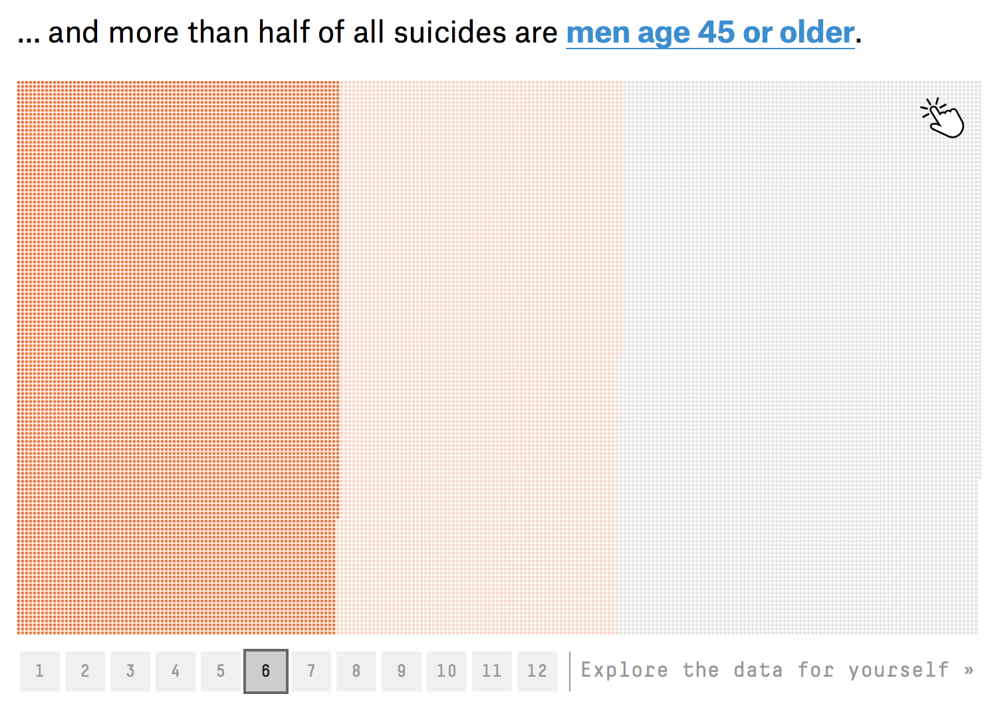
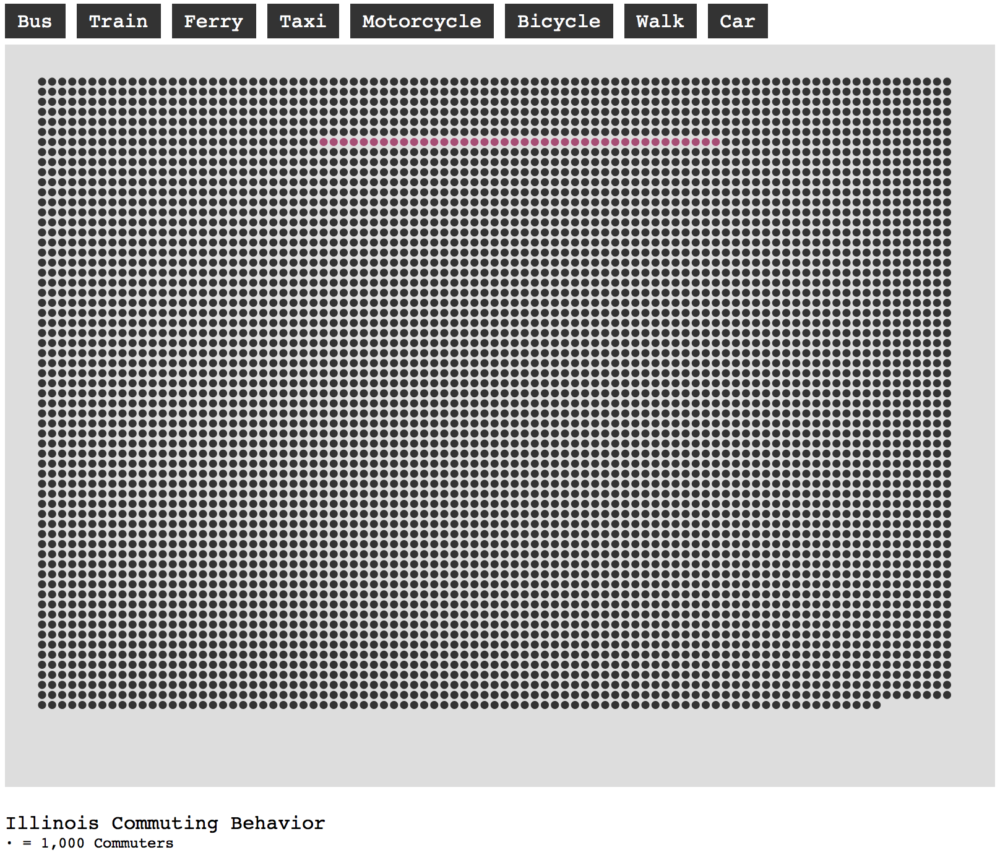

### Matrix Plots

This simple visualization pattern has recently come into data viz fashion, driven especially by 538's [Gun Deaths in America](https://fivethirtyeight.com/features/gun-deaths/) visualization.



-----

This example demonstrating commuting behavior uses a simple `array.forEach(function(obj))` loop to flatten the census object and convert Illinois's commuting behaviors histogram from this from the ACS...

```
[{"name":"Illinois","bus":231862,"train":320945,"ferry":404,"taxi":12092,"motorcycle":6103,"bicycle":39187,"walk":184984,"car":4926537}]
```

... to a flattened array where each 1,000 commuters becomes a single object in a new array...

```
[{"type":"bus"},{"type":"bus"},{"type":"bus"},{"type":"bus"},{"type":"bus"},{"type":"bus"},{"type":"bus"},{"type":"bus"},{"type":"bus"},{"type":"bus"},{"type":"bus"},{"type":"bus"},{"type":"bus"},{"type":"bus"},{"type":"bus"},{"type":"bus"},{"type":"bus"},
...
{"type":"train"},{"type":"train"},{"type":"train"},{"type":"train"},{"type":"train"},{"type":"train"},{"type":"train"},{"type":"train"},{"type":"train"},{"type":"train"},{"type":"train"},{"type":"train"},{"type":"train"},{"type":"train"},{"type":"train"},
...
{"type":"motorcycle"},{"type":"motorcycle"},{"type":"motorcycle"},{"type":"motorcycle"},{"type":"motorcycle"},{"type":"motorcycle"},{"type":"motorcycle"},{"type":"bicycle"},{"type":"bicycle"},{"type":"bicycle"},{"type":"bicycle"},{"type":"bicycle"},{"type":"bicycle"},{"type":"bicycle"},{"type":"bicycle"},{"type":"bicycle"},{"type":"bicycle"},{"type":"bicycle"},{"type":"bicycle"},{"type":"bicycle"},{"type":"bicycle"},{"type":"bicycle"},{"type":"bicycle"},{"type":"bicycle"},{"type":"bicycle"},{"type":"bicycle"},{"type":"bicycle"},{"type":"bicycle"},{"type":"bicycle"},
...
```

The end result is this visualization, with a matrix of entitities representing a subset of the population.



-----

The code is straighforward otherwise, with the exception of that the circles are drawn with 2 nested `for` loops and then *later* bound to the data through a dynamically assigned class name, rather than as they are drawn (which is the usual way -- with `.selectAll(...).data(...).enter()`). This can make code more efficient when dealing with simple datasets, though is inherently more fragile. The next example shows the alternate approach which is more robust at the cost of more math. 

```html
<html>
<head>
	<title>
		Illinois Commuting Behavior
	</title>

	<meta charset="utf-8">
	<style>
		.switch{
			padding-top: 5px;
			padding-bottom: 5px;
			padding-left: 10px;
			padding-right: 10px;
			background-color: #333;
			color:white;	
			text-align: center;
			margin-right:5px;
			display:inline;
			font-family: courier;
			box-sizing:border-box;
		}

		#controls {margin-bottom:10px;}

		#title{font-family: courier; margin-top:20px;}

		#subtitle{font-family: courier; font-size:12px;}
	</style>

</head>

<body>
	<div id="controls">
		<div id="bus" class="switch">Bus</div>
		<div id="train" class="switch">Train</div>
		<div id="ferry" class="switch">Ferry</div>
		<div id="taxi" class="switch">Taxi</div>
		<div id="motorcycle" class="switch">Motorcycle</div>
		<div id="bicycle" class="switch">Bicycle</div>
		<div id="walk" class="switch">Walk</div>
		<div id="car" class="switch">Car</div>
	</div>

	<script src="https://d3js.org/d3.v4.min.js"></script>
	<script src="https://d3js.org/d3-scale-chromatic.v1.min.js"></script>
	<script src="https://d3js.org/d3-geo-projection.v2.min.js"></script>

	<script>

		//display variables
		var width = 800;
		var height = 600;
		var margin = 30;

		//make an svg container 
		var svg = d3.select('body')
			.append('svg')
			.attr('height',height)
			.attr('width',width)
		;

		//rectangular background 
		var background = svg
			.append('rect')
			.attr('x',0)
			.attr('y',0)
			.attr('width',width)
			.attr('height',height)
			.attr('fill','#ddd')
		;

		//ask census for population statistics
	    d3.text('https://api.census.gov/data/2016/acs/acs5?get=NAME,B08301_011E,B08301_012E,B08301_013E,B08301_014E,B08301_015E,B08301_016E,B08301_017E,B08301_018E,B08301_019E,B08301_002E&for=state:17',function(census){

	    	//remove brackets from census response
	    	var noBrackets = census.replace(/[\[\]]+/g,'')

	    	//convert census into usable js object, with relevant data precomputed
	    	var censusDataset = d3.csvParse(noBrackets, function(d){
				return {
					name: d.NAME,
					bus: +d.B08301_011E + +d.B08301_012E,
					train: +d.B08301_013E + +d.B08301_014E,
					ferry: +d.B08301_015E,
					taxi: +d.B08301_016E,
					motorcycle: +d.B08301_017E,
					bicycle: +d.B08301_018E,
					walk: +d.B08301_019E,
					car: +d.B08301_002E
		      	};
	    	})

	    	//empty array to populate
			var flat = [];

			//iterate through census data and flatten the single object
	    	for (prop in censusDataset[0]){
	    		for(var i = 0; i < censusDataset[0][prop]/1000; i++){
	    			flat.push({ type: prop });
	    		}
	    	}

	    	//layout variables
	    	var size = 3.25;
	    	var spacing = 2.5;
	    	var columns = (width - (2*margin)) / (size*spacing);
	    	var rows = (height - (2*margin)) / (size*spacing);

	    	columns = Math.round(columns);
	    	rows = Math.round(rows) ;

	    	//build a bunch of circles
	    	for (var i = 0; i < rows; i++){
	    		for (var j = 0; j < columns; j++){
	    			svg.append('circle').attr('cy', ( (i%rows) * size * spacing) + margin).attr('cx', ( (j%columns) * size * spacing) + margin).attr('r',size).attr('class','dot').attr('fill','#333').attr('opacity',0);
	    		}
	    	}

	    	//grab the circles, and attach data to them and specific class names
	    	var dots = svg
	    			.selectAll('.dot')
	    			.data(flat)
					.attr('opacity',1)
					.attr('class', function(d){return "dot " + d.type})  
			;	

			//attach actions to buttons
			d3.selectAll('.switch')
				.on('click', function(d){
					var choice = "." + this.id;

					if (choice == ".bus"){
						var choiceColor = "#7B85EF";
					}
					else if (choice == ".train"){
						var choiceColor = "#F0F1F3";
					}
					else if (choice == ".ferry"){
						var choiceColor = "#1D4D64";
					}
					else if (choice == ".taxi"){
						var choiceColor = "#F5A82B";
					}
 					else if (choice == ".motorcycle"){
						var choiceColor = "#EC3323";
					}					
 					else if (choice == ".bicycle"){
						var choiceColor = "#B24575";
					}					
 					else if (choice == ".walk"){
						var choiceColor = "#528231";
					}					
 					else if (choice == ".car"){
						var choiceColor = "#966756";
					}					
					
					//reset dots
					d3.selectAll('.dot').transition().duration(500).attr('fill','#333');
					
					//highlight specific dots
					d3.selectAll(choice).transition().duration(750).attr('fill', choiceColor);
				})
				
			d3.select('body').append('div').text('Illinois Commuting Behavior').attr('id','title')
			d3.select('body').append('div').html('&middot = 1,000 Commuters').attr('id','subtitle')

	    })

	</script>
</body>
</html>
```

-----

Let's now convert this code to a more D3-standard version, and also draw [SVG icons](matrix-svg.md) instead of dots. 
