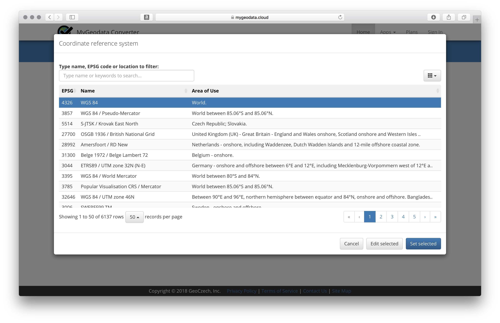
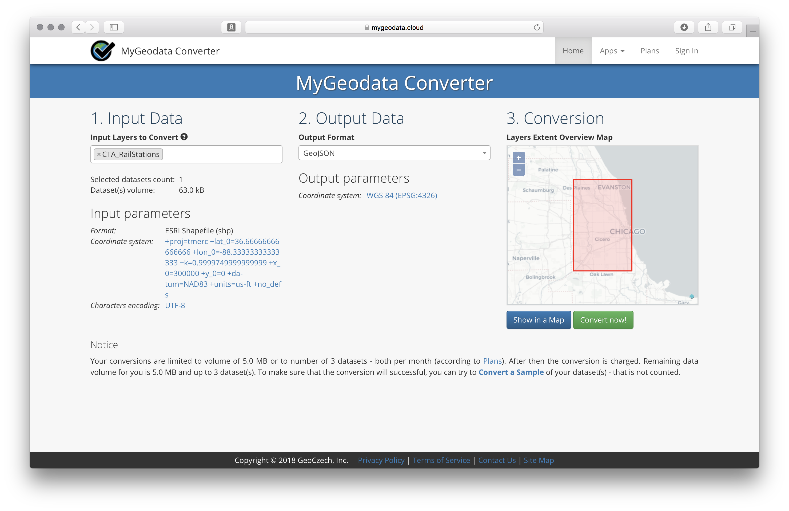
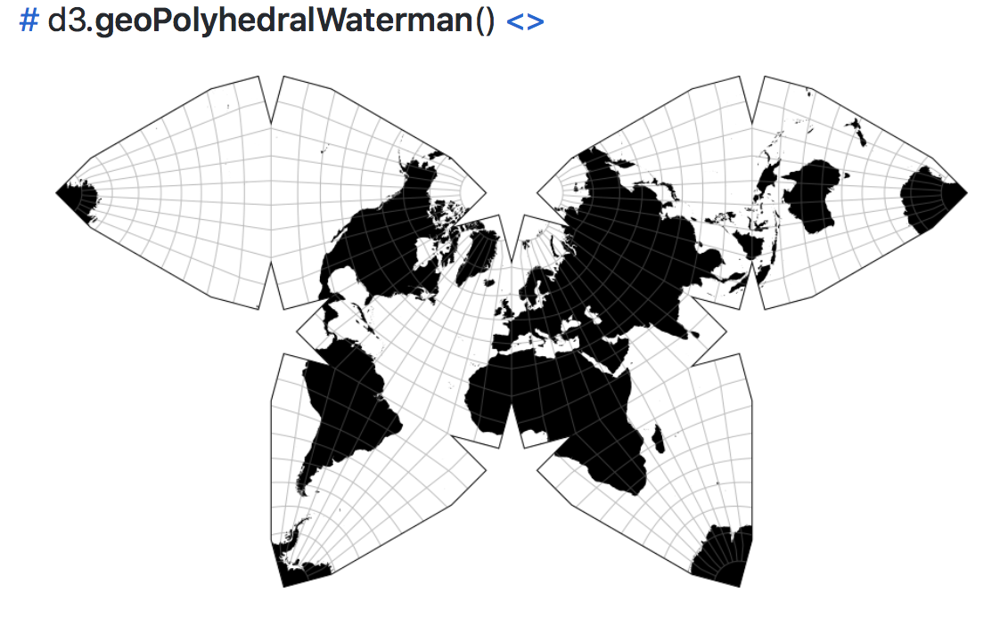
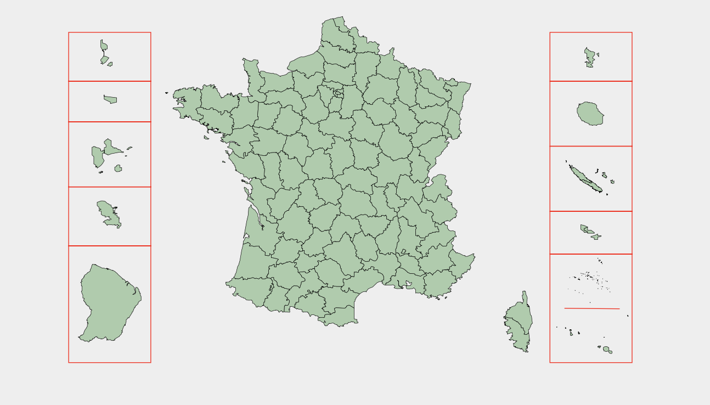

### Geocoding, Reprojection, State Planes, Unusual Projections, and Composite Projections

A bit of a grab-bag on assorted projection-related concepts and utilities.

----

##### Forward and Reverse Geocoding

Sometimes a dataset contains addresses or place names, rather than the longitude-latitude tuples that are what data visualization usually requires. The act of converting between human place names and longitude-latitude is called *geocoding*, and there are many utilities to do this work for us. Note, though, that this is an action that often [requires a few dollars](https://geocod.io) if a large number of coordinates or addresses needs to be converted at once or regularly. 

- [Forward Batch Geocoding](https://www.doogal.co.uk/BatchGeocoding.php) : Address / Place Name -> Longitude & Latitude
- [Reverse Batch Geocoding](https://www.doogal.co.uk/BatchReverseGeocoding.php) : Longitude & Latitude -> Address / Place Name

These tools have somehow avoided Google's normally punitive gaze, as they anonymously abuse the [Google Maps Geocoding API](https://developers.google.com/maps/documentation/geocoding/start) to make the appropriate conversions — and the Google Maps API is *definitely not free*. Perhaps they'll be shut down some day, but they have been running for years without issue. ¯\\_(ツ)_/¯ 

Beware that the Google API will massively slow down after about 300 lookups, so run large conversions in small batches. After 300 lookups, reload the page, and your speed will rebound.

----

##### Reprojection 

Sometimes, high resolution shapefiles implement specific unusual projections, so their internal coordinate systems don't match standard longitude-latitude coorindates. For example, [this shapefile of the Chicago transit system](https://catalog.data.gov/dataset/cta-l-rail-stations-shapefile) includes coordinates projected to the `NAD_1983_StatePlane_Illinois_East_FIPS_1201_Feet`. This means that the `[0,0]` coordinate of the geo-data is not in the Atlantic Ocean where the Prime Meridien and Equator intersect, but rather is in North-Eastern Illinois.

If we convert that shapefile to geoJSON and draw it with D3, it would overlap much of the world and not be drawn inside of Chicago as we would want it to be.

If you have a folder of shapefile assets, you will often find a file with the `.prj` extention. Opening this file in a text editor like Sublime will reveal what projection is being used. All sorts of official projections exist, many hyper-specific to some geographic region.

Should you encounter this common issue, a great utility — [MyGeoData Converter](https://mygeodata.cloud/converter/shp-to-latlong) — allows you to reproject all the coordinates to a more common (global) projection logic.

- Upload a zipped folder of shapefiles containing a .prj file.

- Select your desired `Output Format`, often `GeoJSON`
- Click on `(the same as input)` directly underneath
- Select `WGS 84`, the [World Geodetic System 1984 standard](https://en.wikipedia.org/wiki/World_Geodetic_System), used by basically everything including GPS systems, the UN for country boundary demarcations, and NASA for orbital calculations.

- Click 'Set Selected'

- Click the green 'Convert Now'

Beware that you only get 3 free conversions per month.

-----

##### State Plane Projections

The shapefile referenced above implemented a [State Plane](https://en.wikipedia.org/wiki/State_Plane_Coordinate_System) coordinate system, which are standardized projection logics designed to help government agencies produce more consistent maps with projection settings matched to each state and many areas of interest.

If you are making a map of a specific area, State Plane projections are a much more accurate place to start rather than just relying on AlbersUSA or Mercator for everything. The [GitHub user Noah Veltman](https://github.com/veltman) has provided a wonderful resource towards that effort — the [State Plane projections converted into D3 code presets](https://github.com/veltman/d3-stateplane). These code chunks projects the geo-data with precision for each state, and then rotates the projection to look at the center of the projected area.

Note that, if you have a shapefile that implements State Plane projections, you can't just match that projection in D3 with Veltman's projection presets. You still will need to reproject the coordinates first (as detailed above with MyGeoData Converter).

-----

##### Unusual Projections

Of course, just because some government agencies are forced to use State Plane projections doesn't mean our visualization must. Many different projections exist that exemplify different spatial properties: direction, area, orientation, and/or shape. In addition, some projections exist [just to be beautiful](https://www.jasondavies.com/maps/gingery/), ease 3d assembly from a [developable pattern](https://en.wikipedia.org/wiki/Dymaxion_map), or provide [bias-shattering and unexpected views of the world](https://en.wikipedia.org/wiki/South-up_map_orientation). The choice of projection can be one driven by a persuasive, or visual, goal.

[Jason Davies data visualization work](https://www.jasondavies.com) offers many great examples of unusual projections that attract viewers into examining and reconsidering the otherwise familiar contours of the Earth.

Explore how unusual projection might help you amplify data-driven stories by importing the [D3 Extended Geo Projections Library](https://github.com/d3/d3-geo-projection) and evaluating the different projections contained therein.

-----

##### Composite Projections

You may at some point need to show geo-data for countries like the USA that have distant territorial holdings. The [D3 Composite Projections Library](http://geoexamples.com/d3-composite-projections/) provides dedicated distorted projections, like AlbersUSA, for gathering those territories and projecting those countries into a single visualization with D3.

-----

Let's now convert this code to a more D3-standard version, and also draw [SVG icons](matrix-svg.md) instead of dots. 
