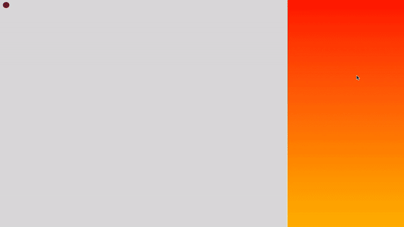

### Scroller

This example shows how to do programmatic action based on the scroll position of the browser, an emergent pattern in data viz design. But, a much more robust and rigorous approach is [detailed by Jim Vallandingham](http://vallandingham.me/scroller.html). He also demonstrates the [tabbed stepwise](http://vallandingham.me/stepper_steps.html), rather than scrolling, version of transitioning data visualization content. And, best of all, he has [compiled many examples](http://vallandingham.me/scroll_talk/examples/) of these pattern. [Pudding has a list of alternate JS libraries](https://pudding.cool/process/how-to-implement-scrollytelling/) which can be combined with D3 towards the same presentation goals that are worth exploring as well.



---

A `state` counter is used to ensure the same animations don't continually fire when within each scroll domain. Beware that the animations will interrupt each other mid-animation and not queue up with erratic scrolling, which is often not the desired behavior, so this code will work well only for scrolling presentations that fire transitions at distant intervals (this example triggers new transitions at 500px intervals, a reasonable minimum). Follow Jim Vallandingham's guides above for more predictable and controllable behaviors if you are heavily relying on this presentation pattern and need more precise and robust control based on scroll position. 

The code also shows how to programmatically scroll the window to a certain position (in this case the top of the page) — often termed *scrolljacking*, with a function inspired by [this gist](https://gist.github.com/jimkang/e318dfad9c798a456ded).

```html
<html>
<head>
	<title>
		Scroll Capture
	</title>

	<meta charset="utf-8">
	<style>
		#viz { 
			height:100vh; 
			width:70%;
			background-color:#ccc;
			position:fixed;
			float:left;
		}

		#scroller {
			height:4000px;
			width:29%;
			background: linear-gradient(to bottom, red,orange,yellow,green,blue,indigo,violet);
			float:right;
		}

		#scrolljack {
			position:fixed;
			background-color: black;
			color:white;
			cursor: pointer;
			font-family: courier;
			font-size: 10;
			padding:10px;
		}

		#target{
			text-align:right;
		}
	</style>

</head>

<body>
	
	<script src="https://d3js.org/d3.v4.min.js"></script>
	<script src="https://d3js.org/d3-scale-chromatic.v1.min.js"></script>

	<div id="viz"></div>
	<div id="target">Top of Page</div>
	<div id="scroller"></div>
	<div id="scrolljack">Back to Top</div>

	<script>

		//svg container
		var svg = d3.select('#viz')
			.append('svg')
			.attr('width', window.innerWidth * .7)
			.attr('height', window.innerHeight);
		
		//background
		var bg = svg.append('rect')
			.attr('x',0)
			.attr('y',0)
			.attr('width', window.innerWidth*.7)
			.attr('height',window.innerHeight)
			.attr('fill','#ddd');
		
		//add a circle
		svg.append('circle').attr('cx', 20).attr('cy', 60).attr('r', 10).attr('fill','black').attr('stroke-width',0).attr('stroke', 'white').attr('id','blob');

		//capture scroll position when scroll occurs
		d3.select(window)
			.on('scroll', function(){
				var top = window.pageYOffset;

				var state;

				//animation behaviors for different scroll positions
				if ((top > 0) && (top < 500) && (state !== 0)) {
					svg.select('#blob').transition().attr('fill','red');
					state = 0;
				 }

				else if ((top > 501) && (top < 1000) && (state !== 1)) {
					svg.select('#blob').transition().attr('cx',200).attr('fill','orange');
					state = 1;
				 }

				 else if ((top > 1001) && (top < 1500) && (state !== 2)) {
					svg.select('#blob').transition().attr('cy',400).attr('fill','yellow');
					state = 2;
				 }

				 else if ((top > 1501) && (top < 2000) && (state !== 3)) {
					svg.select('#blob').transition().attr('r',100).attr('fill','green').attr('stroke-width',0);
					state = 3;
				 }

				 else if ((top > 2001) && (top < 2500) && (state !== 4)) {
					svg.select('#blob').transition().attr('r',20).attr('fill', 'blue').attr('stroke-width', 10)
					state = 4;
				 }

				 else if ((top > 2501) && (top < 3000) && (state !== 5)) {
					svg.select('#blob').transition().attr('r',20).attr('stroke', 'indigo').attr('fill', 'white').attr('cx',300).attr('cy',300).attr('stroke-width',20)
					state = 5;
				 }

				else if ((top > 3001) && (top < 3500) && (state !== 6)) {
					svg.select('#blob').transition().attr('r',20).attr('stroke', 'indigo').attr('fill', 'violet').attr('cx',200).attr('cy',200).attr('stroke-width',0)
					state = 6;
				 }
		})

		d3.select('#scrolljack').on('click', function(){
			scrollTo(0,1000);
		})


		//what kind of animation to apply to the scroll animation
		var easingFn = d3.easeCubic;

		//scrolling function
		function scrollTo(toTop, time) {
			//find current scroll position
			var fromTop = document.body.scrollTop;
			//how far do we need to scroll the window
			var scrollDistance = toTop - fromTop;
			var scrolledTop = 0;

			//run a function in an async loop
			d3.timer(updateScrollTop);
			
			function updateScrollTop(elapsed) {
				//figure out what percent to scroll per time sample
				var portion = easingFn(elapsed * 1.0 / time);
				//figure out how many pixels to scroll per time sample
				var scrollChange = scrollDistance * portion;
				//scroll the body
				document.body.scrollTop = fromTop + scrollChange;
			    // Stop the timer by returning true if we've scrolled as far as requested.
			    if (scrollDistance < 0 && document.body.scrollTop <= toTop) {
			    	return true;
			    }
			    if (scrollDistance >= 0 && document.body.scrollTop >= toTop) {
			    	return true;
			    }
			    if (elapsed > time) {
			      // scroll is done, hopefully!
			      return true;
			  }
			}
		}

	</script>
</body>
</html>
```

-----

That's it! But there's [always tons more we can do](svg.md)! 