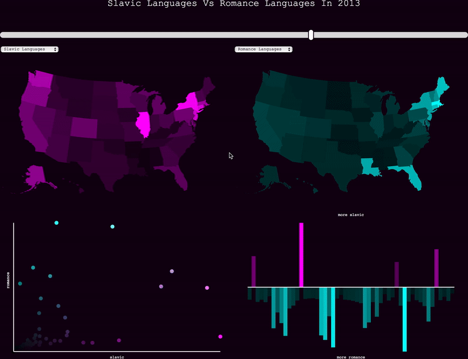

### Linked Visualizations

Often, it is desirable to have single input elements drive animations/transitions/filters in multiple discrete visualizations, keeping user selections aligned.

There are *many ways to do this*, involving matrix transpositions, complex d3 `map` interconnections, and other serial data transformations. But, let's examine a simpler techniques that relies just on CSS. 

In this example, all drawn elements in all of the different visualization are tagged with a classname based on the word 'state' and the state FIPS code. This is done at lines 238, 265, 295, and 369 for all of the different visual elements. Note that this geoJSON file is a weird one: the FIPS code for each state is encoded at `feature.id` rather than `feature.properties.id` where one might expect it.

```js
.attr('class', function(d){
	return 'bars ' + 'state' + d.id
})
```

This code, from the logic that draws the bar chart, adds classname `bar` and a unique name like `state01` for each bar. Similar code does the same for all the geo-paths in the right and left choropleths and the scatter plot dots.

We can then, on `click`, simply ask D3 to `.selectAll` of the items that share the same class name and highlight them! 

```js
.on('click',function(d){
	//reset all elements
	d3.selectAll('.states').transition().attr('stroke-width',0)
	d3.selectAll('.dots').transition().attr('stroke-width',0)
	d3.selectAll('.bars').transition().attr('stroke-width',0)

	var state = '.state' + d.id;

	d3.selectAll(state).transition().attr('stroke-width',2)
})
```

-----

This example also shows how to assemble your own custom color scales, both one- and two-dimensional! The Choropleths and Bar Chart use custom color scales to fill their visual elements. The scatterplot uses a bilinear gradient generating function to create a rectangular gradient space.

-----

Download all of the [assets](linked.zip).



-----

```html
<html>
<head>
	<style> 
		#container{
			width:1200px;
			margin-left:auto;
			margin-right:auto;
			background-color: #101;
		}

		#right-map{
			background-color: #101;
		}
		#left-map{
			background-color: #101;
		}
		
		.map-container{float:left;}

		select{
			border:0;
			font-family:courier new;
		}
		
		#slider {
   			-webkit-appearance: none;
    		width: 100%;
    		margin-left:auto;
    		margin-right:auto;
    		height: 15px;
    		border-radius:15px;   
   			background: #ddd;
    		outline: none;
    		opacity: 1;
    		margin-bottom: 20px;
    		margin-top:20px;
		}

		input[type=range]::-webkit-slider-thumb {
			-webkit-appearance: none;
			border: 2px solid #101;
			height: 30px;
	  		width: 15px;
			border-radius: 15px;
			background: #fff;
			cursor: pointer;
		}

		body{background-color: #101}

		text{
			fill:white; 
			font-family: courier;
			font-size: 10px;text-anchor:middle;
		}

		#mainTitle{
			color:white;
			text-transform: capitalize;
			font-family: courier new;
			font-size:24px;
			text-align:center;
			margin-top:20px;
		}

		#stateTitle{
			color:white;
			text-transform: capitalize;
			font-family: courier new;
			font-size:18px;
			text-align:center;
			margin-top:20px;
			height:20px;
		}

		.states, .dots, .bars {cursor:pointer;}
	</style>

	<title>
		Language Maps 
	</title>

</head>

<body>
	<div id="container">
		<div id="mainTitle">

		</div>
		<div id="stateTitle">

		</div>

		<div id="slider-container">
			<input type="range" min="2009" max="2015" value="2011" id="slider">
		</div>

		<div id="top-row">
		<div id="left-map" class="map-container">
			<div id="left-inputs">
				<select class="dropdowns" id="left-lang-list">
					<option value="romance">Romance Languages</option>
					<option value="germanic">Germanic Languages</option>
					<option value="slavic">Slavic Languages</option> 
					<option value="semitic">Semitic Languages</option>
					<option value="african">African Languages</option>					
				</select>
			</div>
		</div>

		<div id="right-map" class="map-container">
			<div id="right-inputs">
				<select class="dropdowns" id="right-lang-list">
					<option value="romance">Romance Languages</option>
					<option value="germanic" selected="selected">Germanic Languages</option>
					<option value="slavic">Slavic Languages</option> 
					<option value="semitic">Semitic Languages</option>
					<option value="african">African Languages</option>					
				</select>
			</div>
		</div>
	</div>
	<div id="bottom-row">
		<div id="left-scatter" class="map-container">
		</div>
		<div id="right-bar" class="map-container">
		</div>
	</div>
	</div>
	
	<script src="https://d3js.org/d3.v4.min.js"></script>
	<script src="https://d3js.org/d3-scale-chromatic.v1.min.js"></script>

	<script>

		//display variables
		var width = 600;
		var height = 400;
		var margin = 35;

	//LEFT MAP SETUP
		//make an svg container for map
		var leftSvg = d3.select('#left-map')
			.append('svg')
			.attr('height',height)
			.attr('width',width)
		;

		//rectangular background for map svg
		var leftBackground = leftSvg
			.append('rect')
			.attr('x',0)
			.attr('y',0)
			.attr('width',width)
			.attr('height',height)
			.attr('fill','#101')

		//append an svg group, into which we'll draw map stuff to keep our svg structure neat
   		var leftG = leftSvg.append('g');

	//RIGHT MAP SETUP
		//make an svg container for map
		var rightSvg = d3.select('#right-map')
			.append('svg')
			.attr('height',height)
			.attr('width',width)
		;

		//rectangular background for map svg
		var rightBackground = rightSvg
			.append('rect')
			.attr('x',0)
			.attr('y',0)
			.attr('width',width)
			.attr('height',height)
			.attr('fill','#101')

		//append an svg group, into which we'll draw map stuff to keep our svg structure neat
   		var rightG = rightSvg.append('g');


	//SCATTER SETUP
   		//make an svg container for scatter
		var scatterSvg = d3.select('#left-scatter')
			.append('svg')
			.attr('height',height)
			.attr('width',width)
		;

		//rectangular background for scatter plot
		var scatterBackground = scatterSvg
			.append('rect')
			.attr('x',0)
			.attr('y',0)
			.attr('width',width)
			.attr('height',height)
			.attr('fill','#101')
		;

	//BAR CHART SETUP
   		//make an svg container for bar
		var barSvg = d3.select('#right-bar')
			.append('svg')
			.attr('height',height)
			.attr('width',width)
		;

		//rectangular background for map svg
		var barBackground = barSvg
			.append('rect')
			.attr('x',0)
			.attr('y',0)
			.attr('width',width)
			.attr('height',height)
			.attr('fill','#101')
		;

	//DRAW MAP DEFAULTS
   		//both left and right maps use the same projection, so we only need one projection and path generator	
    	//set up map projection
		var proj = d3.geoAlbersUsa()
  			.scale(700)
  			.translate([width/2, height/2]);
  		;

		//set up path generator
	    var path = d3.geoPath()
	    	.projection(proj);

	    //load states geo-data
   		d3.json('us-states.json', function(err, geojson) {			
			//draw all of the geo regions in left map
			leftG.selectAll('.states')
				.data(geojson.features)
				.enter()
				.append("path")
				.attr("d", path)
				.attr("class", function(d){
					return 'states ' + 'state' + d.id
				})
				.attr('stroke-width',0)
				.attr('stroke','white')
				.attr('fill', 'black')
				.attr('stroke','white')
				//on click function is the same for all of the drawn elements
				.on('click',function(d){
					d3.selectAll('.states').transition().attr('stroke-width',0)
					d3.selectAll('.dots').transition().attr('stroke-width',0)
					d3.selectAll('.bars').transition().attr('stroke-width',0)

					var state = '.state' + d.id;
					d3.selectAll(state).transition().attr('stroke-width',2)
					
					d3.select("#stateTitle").text(d.properties.name);
					
				})
			;

			//draw all of the geo regions in the right map
			rightG.selectAll('.states')
				.data(geojson.features)
				.enter()
				.append("path")
				.attr("d", path)
				.attr("class", function(d){
					return 'states ' + 'state' + d.id
				})
				.attr('stroke-width',0)
				.attr('stroke','white')
				.attr('fill', 'black')
				.on('click',function(d){
					d3.selectAll('.states').transition().attr('stroke-width',0)
					d3.selectAll('.dots').transition().attr('stroke-width',0)
					d3.selectAll('.bars').transition().attr('stroke-width',0)

					var state = '.state' + d.id;
					d3.selectAll(state).transition().attr('stroke-width',2)

					d3.select("#stateTitle").text(d.properties.name);
				})

		//DRAW SCATTER PLOT DEFAULTS
			//draw default dummy dots
			scatterSvg
				.selectAll('.dots')
				.data(geojson.features)
				.enter()
				.append('circle')
				.attr('cx', 0)
				.attr('cy', 0)
				.attr('r',0)
				.attr('stroke','white')
				.attr('stroke-width',0)
				.attr('fill','red')
				.attr('class', function(d){
					return 'dots ' + 'state' + d.id
				})
				.on('click',function(d){
					d3.selectAll('.states').transition().attr('stroke-width',0)
					d3.selectAll('.dots').transition().attr('stroke-width',0)
					d3.selectAll('.bars').transition().attr('stroke-width',0)

					var state = '.state' + d.id;
					d3.selectAll(state).transition().attr('stroke-width',2)

					d3.select("#stateTitle").text(d.properties.name);

				})
			;

			//group for scatter plot axes and labels
			scatterG = scatterSvg.append('g');
			
			//scatter plot y axis
			scatterG
				.append('line')
				.attr('x1', margin)
				.attr('x2', width-margin)
				.attr('y1', height - margin)
				.attr('y2', height - margin)
				.attr('stroke','white')
				.attr('stroke-width', 2)
			;

			//scatter plot x axis
			scatterG
				.append('line')
				.attr('x1', margin)
				.attr('x2', margin)
				.attr('y1', margin )
				.attr('y2', height-margin)
				.attr('stroke','white')
				.attr('stroke-width', 2)
			;

			//scatter plot x axis label
			scatterG
				.append('text')
				.attr('x', (width-margin)/2 + margin/2)
				.attr('y',	height - (margin /2))
				.attr('id','xLabel')
				.text('')
			;

			//scatter plot y axis label			
			scatterSvg
				.append('text')
				.attr('x', margin/2)
				.attr('y',	(height-margin)/2 + margin/6)
				.attr('id','yLabel')
				.text('')
				.attr('transform' , 'rotate( 270 ' + margin/2 + "," + (height-margin) /2  + ')' )
			;

		//DRAW DIVERGING BAR CHART DEFAULTS
			//width for bars in bar chart
			barWidth = (width-(margin*2)) / (geojson.features).length;

			//draw default dummy bars
			barSvg
				.selectAll('.bars')
				.data(geojson.features)
				.enter()
				.append('rect')
				.attr('x', function(d,i){return barWidth * i + margin})
				.attr('y', height/2)
				.attr('width', barWidth)
				.attr('height', 0)
				.attr('class', function(d){
					return 'bars ' + 'state' + d.id
				})
				.attr('stroke','white')
				.attr('stroke-width',0)
				.on('click',function(d){
					d3.selectAll('.states').transition().attr('stroke-width',0)
					d3.selectAll('.dots').transition().attr('stroke-width',0)
					d3.selectAll('.bars').transition().attr('stroke-width',0)

					var state = '.state' + d.id;
					console.log(state)
					d3.selectAll(state).transition().attr('stroke-width',2)

					d3.select("#stateTitle").text(d.properties.name);
				})
			;

			//make svg group bar chart labels and axis
			barG = barSvg.append('g');

			barG.append('text').attr('x', width/2).attr('y',margin/2).text('').attr('id','barTopLabel');
			barG.append('text').attr('x', width/2).attr('y',height - margin/2).text('').attr('id','barBottomLabel');

			barG.append('line')
				.attr('x1', margin)
				.attr('x2', width-margin)
				.attr('y1', height/2)
				.attr('y2', height/2)
				.attr('stroke','white')
				.attr('stroke-width', 2)
			;

			


		// RUN DATA PULL AND VISUALIZATION FUNCTION WITH DEFAULT VALUES
			//this draws everything at their default values when the page loads
			update("romance", "germanic", 2011)


		// CONNECT INTERACTIVITY TO INPUT ELEMENTS
			//connect our dropdown menus to the update function
			d3.selectAll('.dropdowns')
				.on('change', function() {
					var leftLang = d3.select('#left-lang-list').property('value');
					var rightLang = d3.select('#right-lang-list').property('value');
					var year = d3.select('#slider').property("value");
					update(leftLang,rightLang,year);
			});

			//connect our year slider to the update function
			d3.selectAll('#slider')
				.on('input', function() {
					var leftLang = d3.select('#left-lang-list').property('value');
					var rightLang = d3.select('#right-lang-list').property('value');
					var year = d3.select('#slider').property("value");
					update(leftLang,rightLang,year);
			});


		// GET DATA AND UPDATE VISUAL ELEMENTS
			function update(leftLang,rightLang,year){

				//the ACS api endpoints changed minorly in 2015...
				if(year > 2014){
					var address = "https://api.census.gov/data/" + year + '/acs/acs5/?get=NAME,B01001_001E,B16001_003E,B16001_006E,B16001_009E,B16001_012E,B16001_015E,B16001_018E,B16001_021E,B16001_024E,B16001_027E,B16001_030E,B16001_033E,B16001_002E,B16001_036E,B16001_039E,B16001_042E,B16001_045E,B16001_048E,B16001_051E,B16001_054E,B16001_057E,B16001_060E,B16001_063E,B16001_066E,B16001_069E,B16001_072E,B16001_075E,B16001_078E,B16001_081E,B16001_084E,B16001_087E,B16001_090E,B16001_093E,B16001_096E,B16001_099E,B16001_102E,B16001_105E,B16001_108E,B16001_111E,B16001_114E&for=state:*'
				}
				//so slightly different URLs are necessary...
				else{
					var address = "https://api.census.gov/data/" + year + "/acs5?get=NAME,B01001_001E,B16001_003E,B16001_006E,B16001_009E,B16001_012E,B16001_015E,B16001_018E,B16001_021E,B16001_024E,B16001_027E,B16001_030E,B16001_033E,B16001_002E,B16001_036E,B16001_039E,B16001_042E,B16001_045E,B16001_048E,B16001_051E,B16001_054E,B16001_057E,B16001_060E,B16001_063E,B16001_066E,B16001_069E,B16001_072E,B16001_075E,B16001_078E,B16001_081E,B16001_084E,B16001_087E,B16001_090E,B16001_093E,B16001_096E,B16001_099E,B16001_102E,B16001_105E,B16001_108E,B16001_111E,B16001_114E&for=state:*"	
				}

				//ask census for data
			    d3.text(address,function(census){

			    	//remove brackets from census response
			    	var noBrackets = census.replace(/[\[\]]+/g,'')

			    	//convert census into usable js object, with relevant data precomputed
			    	var censusDataset = d3.csvParse(noBrackets, function(d){
						return {
							state: d.state,
							name: d.NAME,
							total: +d.B01001_001E,
							onlyEnglish: +d.B16001_002E,

							// language pseudo-families by geographic region
							romance: +d.B16001_006E + +d.B16001_009E + +d.B16001_012E + +d.B16001_015E,
							germanic: +d.B16001_018E + +d.B16001_021E,
							slavic: +d.B16001_033E + +d.B16001_036E,
							semitic: +d.B16001_108E + +d.B16001_111E,
							african: +d.B16001_114E
				      	};
			    	})

			    	//extents and scales for both maps
			    	var leftLangExtents = d3.extent(censusDataset, function(d){return d[leftLang] / d.total});
			    	var leftLangScale = d3.scalePow().exponent(.5).domain(leftLangExtents).range([0,1]);
			    	var rightLangExtents = d3.extent(censusDataset, function(d){return d[rightLang] / d.total})
					var rightLangScale = d3.scalePow().exponent(.5).domain(rightLangExtents).range([0,1]);
					
					//custom color scales from black to teal and black to magenta
					var leftColorScale = d3.scalePow().exponent(.5).domain(leftLangExtents).interpolate(d3.interpolateRgb).range([d3.rgb("#000"), d3.rgb('#f0f')]);
					var rightColorScale = d3.scalePow().exponent(.5).domain(rightLangExtents).interpolate(d3.interpolateRgb).range([d3.rgb("#000"), d3.rgb('#0ff')]);


			    	//expose census data by state FIPS codes
			    	var censusMap = d3.map(censusDataset,function(d){return d.state})

					//update all of the left map geo regions 
					leftG.selectAll('.states')
						.data(geojson.features)
						.transition()
						.attr('fill', function(d){
							var match = censusMap.get(d.id);
							return leftColorScale(match[leftLang] / match.total)
						})
					;

					//update all of the right map geo regions 
					rightG.selectAll('.states')
						.data(geojson.features)
						.transition()
						.attr('fill', function(d){
							var match = censusMap.get(d.id);
							return rightColorScale(match[rightLang] / match.total)
					;
					})


					//scales for positioning in scatter plot
					var scatterXScale = d3.scaleLinear().domain(leftLangExtents).range([margin,width-margin]);
					var scatterYScale = d3.scaleLinear().domain(rightLangExtents).range([height-margin, margin]);


					//this function returns *another* parameterized function for plotting a point in a 2 dimensional color field. The initial four inputs are effectively low x low y, low x high y, high x low y, high x high y. A function that returns another function is called a *closure*.
					function interpolateBilinear(c00, c01, c10, c11) {
						var i = d3.interpolateRgb(c00, c01),
						j = d3.interpolateRgb(c10, c11);

						return function(u, v) {
							return d3.interpolateRgb(i(u), j(u))(v);
						};
					}

					//we run the function defined above, with our four desired corners. 
					//bilinear(x,y) is now a function we can use, that plots an x,y coordinate within the 2-dimensional color field.
					var bilinear = interpolateBilinear("#000","#f0f","#0ff","#fff");

					//scales to plot values to their parameterized equivalents for the bilinear function.
					var colorXScale = d3.scaleLinear().domain(leftLangExtents).range([0,1]);
					var colorYScale = d3.scaleLinear().domain(rightLangExtents).range([0,1]);
					
					//update scatter dots positions and fills
					scatterSvg
						.selectAll('.dots')
						.data(geojson.features)
						.transition()
						.duration(1000)
						.attr('cx', function(d){
							var match = censusMap.get(d.id);
							return scatterXScale(match[leftLang] / match.total)
						})
						.attr('cy', function(d){
							var match = censusMap.get(d.id);
							return scatterYScale(match[rightLang] / match.total)
						})
						.attr('r',5)
						.attr('fill', function(d){
							var match = censusMap.get(d.id);
							return bilinear( 
								colorXScale(match[leftLang] / match.total) , 
								colorYScale(match[rightLang] / match.total)
								)
						})

					//update scatter labels
					scatterSvg
						.select('#xLabel')
						.text(leftLang)
					;
					
					scatterSvg
						.select('#yLabel')
						.text(rightLang)
					;

					//bar chart extents, data scales, and color scales
					var barExtents = d3.extent(censusDataset, function(d){return (d[leftLang] / d.total) - (d[rightLang] / d.total)});
					var barScaleLow = d3.scalePow().exponent(.5).domain([barExtents[0],0]).range([- (height - margin*2) / 2 , 0 ]);
					var barScaleHigh = d3.scalePow().exponent(.5).domain([0,barExtents[1]]).range([0, (height - margin*2) / 2 ]);

					//custom color scale! 
					//https://github.com/d3/d3-interpolate
					var barColorScaleLow = d3.scalePow().exponent(.5).domain([barExtents[0], 0]).interpolate(d3.interpolateRgb).range([d3.rgb("#0ff"), d3.rgb('#000')]);
					var barColorScaleHigh = d3.scalePow().exponent(.5).domain([0, barExtents[1]]).interpolate(d3.interpolateRgb).range([d3.rgb('#000'), d3.rgb('#f0f')]);
					
					//update bar heights and fills
					//I think the logic could be cleaned up here, but it works 	
					barSvg
						.selectAll('.bars')
						.data(geojson.features)
						.transition()
						.duration(1000)
						.attr('y', function(d){
							var match = censusMap.get(d.id);

							var barValue = (match[leftLang] / match.total) - (match[rightLang] / match.total) ;
							
							//this is the clunky part...
							if (barValue > 0){
							 	return (height / 2 ) - barScaleHigh(barValue);
							}
							else{ 
							 	return height / 2 ;
							}
						})
						.attr('height', function(d){
							var match = censusMap.get(d.id);

							var barValue = (match[leftLang] / match.total) - (match[rightLang] / match.total) ;

							//this is the clunky part...
							if (barValue > 0){
								console.log(barScaleHigh(barValue))
							 	return barScaleHigh(barValue);
							}
							else{ 
							 	return Math.abs(barScaleLow(barValue));
							}
						})
						.attr('fill', function(d){							
							var match = censusMap.get(d.id);
							var barValue = (match[leftLang] / match.total) - (match[rightLang] / match.total)

							if (barValue > 0){
								return barColorScaleHigh(barValue)
							}
							else{
								return barColorScaleLow(barValue)
							}
						})

						//update bar chart labels
						d3.select('#barTopLabel').text("more " + leftLang);
						d3.select('#barBottomLabel').text("more " + rightLang);

						//update marquee at top of page
						d3.select('#mainTitle').text(leftLang + " Languages vs " + rightLang + " Languages in " + year);
				})
			}
		})
	

	</script>
</body>

</html>
```

-----

Lots of code! Let's do something simpler but [maybe more visually useful](cartogram.md)?
