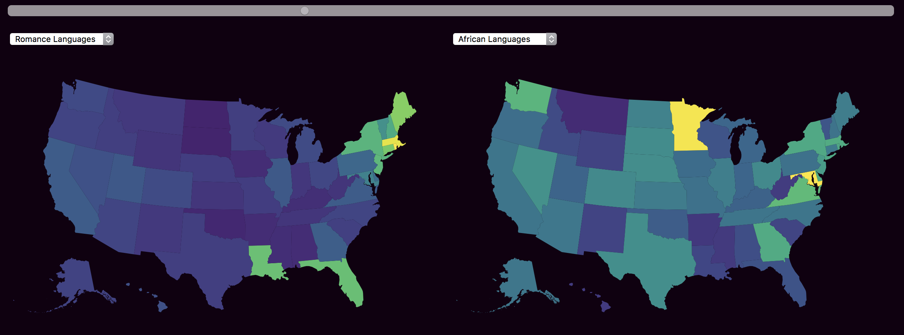

### Multiple Choropleths and Inputs

-----

##### Input Elements

To access user entries in HTML [`select`](https://www.w3schools.com/tags/tag_select.asp) and [`input`](https://www.w3schools.com/tags/tag_input.asp) elements, D3 first needs to select the element, and then access its `value` property. Other input elements are handled similarly.

```js

var sliderValue = d3.select('#slider-ID').property('value');
var dropdownValue = d3.select('#dropdown-ID').property('value');

```

-----

##### Complex Layouts and Multiple SVG Objects



After creating several positioned `<div>`s and input elements, this example draws different data based on user input into two different choropleths for user comparison. A shared time slider allows a viewer to manipulate the two choropleths together.

It also demonstrates a common D3 development pattern:

- Setup screen variables
- Draw static content (backgrounds, base maps, axes...)
- Draw default data to static content
- Connect interactivity to elements
- Define update function for interactivity

```html
<html>
<head>
	<style> 
		#container{
			width:1200px;
			margin-left:auto;
			margin-right:auto;
			background-color: #101;
		}

		#right-map{
			background-color: #101;
		}
		#left-map{
			background-color: #101;
		}
		
		.map-container{float:left;}

		#slider {
   			-webkit-appearance: none;
    		width: 100%;
    		margin-left:auto;
    		margin-right:auto;
    		height: 15px;
    		border-radius: 5px;   
   			background: #d3d3d3;
    		outline: none;
    		opacity: 0.7;
    		margin-bottom: 20px
		}

		body{background-color: #101}

	</style>

	<title>
		Language Maps 
	</title>

</head>

<body>
	<div id="container">
		<div id="slider-container">
			<input type="range" min="2009" max="2015" value="2009" id="slider">
		</div>

		<div id="left-map" class="map-container">
			<div id="left-inputs">
				<select class="dropdowns" id="left-lang-list">
					<option value="romance">Romance Languages</option>
					<option value="germanic">Germanic Languages</option>
					<option value="slavic">Slavic Languages</option> 
					<option value="semitic">Semitic Languages</option>
					<option value="african">African Languages</option>					
				</select>
			</div>
		</div>

		<div id="right-map" class="map-container">
			<div id="right-inputs">
				<select class="dropdowns" id="right-lang-list">
					<option value="romance">Romance Languages</option>
					<option value="germanic">Germanic Languages</option>
					<option value="slavic">Slavic Languages</option> 
					<option value="semitic">Semitic Languages</option>
					<option value="african">African Languages</option>					
				</select>
			</div>
		</div>
	</div>
	
	<script src="https://d3js.org/d3.v4.min.js"></script>
	<script src="https://d3js.org/d3-scale-chromatic.v1.min.js"></script>

	<script>

		//display variables
		var width = 600;
		var height = 400;

		//make an svg container for map
		var leftSvg = d3.select('#left-map')
			.append('svg')
			.attr('height',height)
			.attr('width',width)
		;

		//rectangular background for map svg
		var leftBackground = leftSvg
			.append('rect')
			.attr('x',0)
			.attr('y',0)
			.attr('width',width)
			.attr('height',height)
			.attr('fill','#101')

		//append an svg group, into which we'll draw map stuff to keep our svg structure neat
   		var leftG = leftSvg.append('g');

		//make an svg container for map
		var rightSvg = d3.select('#right-map')
			.append('svg')
			.attr('height',height)
			.attr('width',width)
		;

		//rectangular background for map svg
		var rightBackground = rightSvg
			.append('rect')
			.attr('x',0)
			.attr('y',0)
			.attr('width',width)
			.attr('height',height)
			.attr('fill','#101')

		//append an svg group, into which we'll draw map stuff to keep our svg structure neat
   		var rightG = rightSvg.append('g');
    	


   		//both maps use the same projection, so we only need one projection and path generator	
    	//set up map projection
		var proj = d3.geoAlbersUsa()
  			.scale(700)
  			.translate([width/2, height/2]);
  		;

		//set up path generator
	    var path = d3.geoPath()
	    	.projection(proj);

	    //load states geo-data
   		d3.json('us-states.json', function(err, geojson) {			
			//draw all of the map regions 
			leftG.selectAll('.states')
				.data(geojson.features)
				.enter()
				.append("path")
				.attr("d", path)
				.attr("class","states")
				.attr('stroke-width',0)
				.attr('stroke','white')
				.attr('fill', 'black')
				.attr('stroke','white')
			;

			//draw all of the map regions 
			rightG.selectAll('.states')
				.data(geojson.features)
				.enter()
				.append("path")
				.attr("d", path)
				.attr("class","states")
				.attr('stroke-width',0)
				.attr('stroke','white')
				.attr('fill', 'black')
				.attr('opacity',1)
				.attr('stroke','#BBDCF0')


			//this draws our maps at their default values when the page loads
			update("romance", "romance", 2009)

			//connect our dropdown menus to the update function
			d3.selectAll('.dropdowns')
				.on('change', function() {
					var leftLang = d3.select('#left-lang-list').property('value');
					var rightLang = d3.select('#right-lang-list').property('value');
					var year = d3.select('#slider').property("value");
					update(leftLang,rightLang,year);
			});

			//connect our year slider to the update function
			d3.selectAll('#slider')
				.on('input', function() {
					var leftLang = d3.select('#left-lang-list').property('value');
					var rightLang = d3.select('#right-lang-list').property('value');
					var year = d3.select('#slider').property("value");
					update(leftLang,rightLang,year);
			});


			//main choropleth logic for whenever the inputs are changed
			function update(leftLang,rightLang,year){

				//the ACS api enpoints changed minorly in 2015...
				if(year > 2014){
					var address = "https://api.census.gov/data/" + year + '/acs/acs5/?get=NAME,B01001_001E,B16001_003E,B16001_006E,B16001_009E,B16001_012E,B16001_015E,B16001_018E,B16001_021E,B16001_024E,B16001_027E,B16001_030E,B16001_033E,B16001_002E,B16001_036E,B16001_039E,B16001_042E,B16001_045E,B16001_048E,B16001_051E,B16001_054E,B16001_057E,B16001_060E,B16001_063E,B16001_066E,B16001_069E,B16001_072E,B16001_075E,B16001_078E,B16001_081E,B16001_084E,B16001_087E,B16001_090E,B16001_093E,B16001_096E,B16001_099E,B16001_102E,B16001_105E,B16001_108E,B16001_111E,B16001_114E&for=state:*'
				}
				else{
					var address = "https://api.census.gov/data/" + year + "/acs5?get=NAME,B01001_001E,B16001_003E,B16001_006E,B16001_009E,B16001_012E,B16001_015E,B16001_018E,B16001_021E,B16001_024E,B16001_027E,B16001_030E,B16001_033E,B16001_002E,B16001_036E,B16001_039E,B16001_042E,B16001_045E,B16001_048E,B16001_051E,B16001_054E,B16001_057E,B16001_060E,B16001_063E,B16001_066E,B16001_069E,B16001_072E,B16001_075E,B16001_078E,B16001_081E,B16001_084E,B16001_087E,B16001_090E,B16001_093E,B16001_096E,B16001_099E,B16001_102E,B16001_105E,B16001_108E,B16001_111E,B16001_114E&for=state:*"	
				}

				//ask census for data
			    d3.text(address,function(census){

			    	//remove brackets from census response
			    	var noBrackets = census.replace(/[\[\]]+/g,'')

			    	//convert census into usable js object, with relevant data precomputed
			    	var censusDataset = d3.csvParse(noBrackets, function(d){
						return {
							state: d.state,
							name: d.NAME,
							total: +d.B01001_001E,
							onlyEnglish: +d.B16001_002E,

							// language pseudo-families by geographic region
							romance: +d.B16001_006E + +d.B16001_009E + +d.B16001_012E + +d.B16001_015E,
							germanic: +d.B16001_018E + +d.B16001_021E,
							slavic: +d.B16001_033E + +d.B16001_036E,
							semitic: +d.B16001_108E + +d.B16001_111E,
							african: +d.B16001_114E
				      	};
			    	})

			    	//extents and scales for both maps
			    	var leftLangExtents = d3.extent(censusDataset, function(d){return d[leftLang] / d.total});
			    	var leftLangScale = d3.scalePow().exponent(.5).domain(leftLangExtents).range([0,1]);
			    	var rightLangExtents = d3.extent(censusDataset, function(d){return d[rightLang] / d.total})
					var rightLangScale = d3.scalePow().exponent(.5).domain(rightLangExtents).range([0,1]);

			    	//expose census data by state FIPS codes
			    	var censusMap = d3.map(censusDataset,function(d){return d.state})

					//update all of the map regions 
					leftG.selectAll('.states')
						.data(geojson.features)
						.transition()
						.attr('fill', function(d){
							var match = censusMap.get(d.id);
							return d3.interpolateViridis(leftLangScale(match[leftLang] / match.total))
						})
					;

					//update all of the map regions 
					rightG.selectAll('.states')
						.data(geojson.features)
						.transition()
						.attr('fill', function(d){
							var match = censusMap.get(d.id);
							return d3.interpolateViridis(rightLangScale(match[rightLang] / match.total))
					;
				})
			})
		}
	})
	

	</script>
</body>

</html>
```